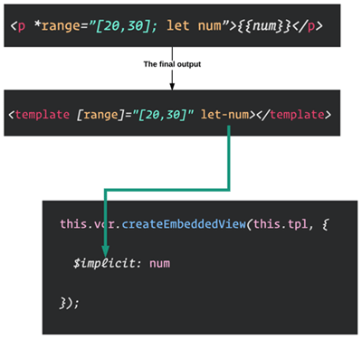

## 01. 自定义属性指令中的 ElementRef 与 Renderer 的作用

为了能够支持跨平台，`Angular` 通过抽象层封装了不同平台的差异，统一了 `API` 接口

如定义了抽象类 `Renderer` 、抽象类 `RootRenderer` 等。此外还定义了以下引用类型：`ElementRef`、`TemplateRef`、`ViewRef`、`ComponentRef` 和 `ViewContainerRef` 等


#### ElementRef 的作用

在应用层直接操作 `DOM`，就会造成应用层与渲染层之间强耦合，导致我们的应用无法运行在不同环境（比如 `Web Workers`）

通过 `ElementRef` 我们就可以封装不同平台下视图层中的 `native` 元素，最后借助于 `Angular` 提供的强大的依赖注入特性，我们就可以轻松地访问到 `native` 元素


#### ElementRef 的定义

```js
export class ElementRef {
  public nativeElement: any;
  constructor(nativeElement: any) {
    this.nativeElement = nativeElement;
  }
}
```

#### Renderer2 常用方法

要注意的是在 `Angular 4.x+` 版本，我们使用 `Renderer2` 替代 `Renderer`

```js
export abstract class Renderer2 {
  abstract createElement(name: string, namespace?: string|null): any;
  abstract createComment(value: string): any;
  abstract createText(value: string): any;
  abstract setAttribute(el: any, name: string, value: string, namespace?: string|null): void;
  abstract removeAttribute(el: any, name: string, namespace?: string|null): void;
  abstract addClass(el: any, name: string): void;
  abstract removeClass(el: any, name: string): void;
  abstract setStyle(el: any, style: string, value: any, flags?: RendererStyleFlags2): void;
  abstract removeStyle(el: any, style: string, flags?: RendererStyleFlags2): void;
  abstract setProperty(el: any, name: string, value: any): void;
  abstract setValue(node: any, value: string): void;
  abstract listen(target: 'window'|'document'|'body'|any, eventName: string, callback: (event: any) => boolean | void): () => void;
}
```


## 02. 自定义结构指令中的 TemplateRef 与 ViewContainerRef 的作用

#### TemplateRef

用于表示内嵌的 `template` 模板元素，通过 `TemplateRef` 实例，我们可以方便创建内嵌视图(`Embedded Views`)

```js
ngAfterViewInit() {
  let view = this.tpl.createEmbeddedView(null);
}
```

且可以轻松地访问到通过 `ElementRef` 封装后的 `nativeElement`

需要注意的是组件视图中的 `template` 模板元素，经过渲染后会被替换成 `comment` 元素

因为 `<template>` 模板元素，已经被 `Angular` 解析并封装成 `TemplateRef` 实例，通过 `TemplateRef` 实例，我们可以方便地创建内嵌视图(`Embedded View`)

#### ViewContainerRef

用于表示一个视图容器，可添加一个或多个视图

通过 `ViewContainerRef` 实例，我们可以基于 `TemplateRef` 实例创建内嵌视图，并能指定内嵌视图的插入位置

也可以方便对视图容器中已有的视图进行管理，简而言之，`ViewContainerRef` 的主要作用是创建和管理内嵌视图或组件视图


#### ViewRef 与 EmbeddedViewRef 之间的关系

`ViewRef` 用于表示 `Angular View`(视图)，视图是可视化的 `UI` 界面

```js
// @angular/core/src/linker/view_ref.d.ts
export declare abstract class ViewRef {
  destroyed: boolean;
  abstract onDestroy(callback: Function): any;
}
```

`EmbeddedViewRef` 继承于 `ViewRef`，用于表示 `<template>` 模板元素中定义的 `UI` 元素

```js
// @angular/core/src/linker/view_ref.d.ts
export declare abstract class EmbeddedViewRef<C> extends ViewRef {
  context: C;
  rootNodes: any[]; // 保存 <template> 模板中定义的元素
  abstract destroy(): void; // 用于销毁视图
}
```


## 03. 注入服务的两种方式的区别

一个简单的服务

```js
// 需要在当前使用的模块的 module 文件中进行配置服务
import {MailService} from "./mail.service";

@NgModule({
  ...
  providers: [MailService],
  bootstrap: [AppComponent]
})
export class AppModule { }

// 然后书写服务的具体逻辑，更新服务
import { Injectable } from '@angular/core';

@Injectable()
export class MailService {
  message: string  ='该消息来自MailService';
  constructor() { }
}

// 最后进行注入后使用服务
import { Component } from '@angular/core';
import {MailService} from "./mail.service";

@Component({
  selector: 'app-root',
  template: `
    <h3>{{title}}</h3>
    <div>
      <app-simple-form></app-simple-form>
      {{mailService.message}}
    </div>
  `
})

export class AppComponent {
  title = 'Hello, Angular';
  constructor(private mailService: MailService) {}
}
```

服务的注入方式除了使用 `constructor(private mailService: MailService)` 方式注入服务外

我们也可以使用 `Inject` 装饰器来注入 `MailService` 服务：

```js
import { Component, Inject } from '@angular/core'
import { MailService } from "./mail.service";

@Component({...})

export class AppComponent {
  constructor(@Inject(MailService) private mailService) {}
}
```

两者的区别如下：

* 对于 `Type` 类型(函数类型) 的对象，我们一般使用 `constructor(private mailService: MailService)` 方式进行注入

* 而 `Inject` 装饰器一般用来注入非 `Type` 类型的对象，如下所示

```js
@NgModule({
  ...
  providers: [
    MailService,
    { provide: 'apiUrl', baseUrl: 'http://...'}
  ]
})
```

使用

```js
@Component({
  selector: 'app-root',
  template: `...`
})

export class AppComponent {
  constructor(
    @Inject(MailService) private mailService,
    @Inject('apiUrl') private apiUrl
  ) {}
}
```

## 04. *ngFor

`*ngFor` 中的 `*` 号是语法糖，表示结构指令，该语法最终会转换成：

```html
<ng-template ngFor let-item [ngForOf]="items" let-i="index">
  ...
</ng-template>
```


## 05. :host

`:host` 表示选择宿主元素，比如以下组件

```js
import {Component, OnInit, Input, Output, EventEmitter} from '@angular/core';

@Component({
  selector: 'app-simple-form',
  template: `...`,
  styles: [`
   :host { margin: 10px; }
   input:focus { font-weight: bold;}
  `
  ]
})
export class SimpleFormComponent implements OnInit {
  @Input() message: string;
  @Output() update = new EventEmitter<{text: string}>();
  ngOnInit() {}
}
```

表示的即为 `AppComponent` 组件模板中的 `app-simple-form` 元素


## 06. 引入第三方库

若是需要引入第三方 `UI` 库，比如 `bootstrap`，可以在 `.angular-cli.json` 文件中

配置对应的样式文件地址，然后重启项目即可

```js
{
  "apps": {
     "styles": [
         "styles.css",
         "../node_modules/bootstrap/dist/css/bootstrap.min.css"
      ]
  }
}
```

## 07. [routerLink] 的参数是一个数组而不是一个字符串

```html
<a [routerLink]="['/]">首页</a>
<a [routerLink]="['/detail]">详情</a>
```

因为设定为数组以后可以在路由跳转的时候来传递一些数据过去


## 08. 在指令当中监听用户的输入

```js
import { Directive, HostBinding, Input, HostListener } from '@angular/core';

@Directive({
  selector: '[greet]'
})
export class TestDirective {

  // 这里需要注意，输入属性与指令名称需要一致
  // 因为监听的是指令上绑定的数据
  @Input() greet: string;
  @HostBinding() get innerHTML() {
    return this.greet;
  }

  @HostListener('click', ['$event'])
  onClick() {
    this.greet = 'heweeee';
  }
}
```

使用

```html
<!-- 需要注意，传递的是一个字符串 'Hello, world' -->
<h2 [appTest]="'Hello, world'">Hello, Angular</h2>
```

## 09. 利用 Attribute 装饰器，获取指令宿主元素上的自定义属性的值

在构造函数当中进行注入使用即可

```js
constructor(@Attribute('user') private user: string) {
  console.log(user);
}
```


## 10. Directive (指令) 与 Component (组件) 的关系

组件继承于指令，并扩展了与 `UI` 视图相关的属性，如 `template`、`styles`、`animations`、`encapsulation` 等

```js
// packages/core/src/metadata/directives.ts

export interface Directive {
   selector?: string;                // 用于定义组件在HTML代码中匹配的标签
   inputs?: string[];                // 指令的输入属性
   outputs?: string[];               // 指令的输出属性
   host?: {[key: string]: string};   // 绑定宿主的属性、事件等
   providers?: Provider[];           // 设置指令及其子指令可以用的服务
   exportAs?: string;                // 导出指令，使得可以在模板中调用
   queries?: {[key: string]: any};   // 设置指令的查询条件
}

export interface Component extends Directive {
   changeDetection?: ChangeDetectionStrategy;  // 指定组件使用的变化检测策略
   viewProviders?: Provider[];    // 设置组件及其子组件(不含ContentChildren)可以用的服务
   moduleId?: string;             // 包含该组件模块的 id，它被用于解析 模版和样式的相对路径
   templateUrl?: string;          // 为组件指定一个外部模板的URL地址
   template?: string;             // 为组件指定一个内联的模板
   styleUrls?: string[];          // 为组件指定一系列用于该组件的样式表文件
   styles?: string[];             // 为组件指定内联样式
   animations?: any[];            // 设置组件相关动画
   encapsulation?: ViewEncapsulation;    // 设置组件视图包装选项
   interpolation?: [string, string];     // 设置默认的插值运算符，默认是"{{"和"}}"
   entryComponents?: Array<Type<any>|any[]>;  // 设置需要被提前编译的组件
}
```

## 11. 双向绑定

需要使用 `ngModel` 指令，前提需要引入 `Forms` 模块

```js
[(ngModel)]="username"
```


## 12. Reactive Form 使用步骤

一个标准的 `Reactive Form`

```html
<form (ngSubmit)="save()" [formGroup]="signupForm">
  <div>
    <label>
      <span>用户名</span>
      <input type="text" name="userName"
        placeholder="请输入用户名"
        formControlName="userName">
    </label>
    <div *ngIf="signupForm.get('userName').touched && 
        signupForm.get('userName').hasError('required')">
            用户名是必填项
    </div>
    <div *ngIf="signupForm.get('userName').touched && 
        signupForm.get('userName').hasError('minlength')">
            用户名的长度必须大于3
    </div>
  </div>
  ...
  <button type="submit" [disabled]="signupForm.invalid">注册</button>
</form>
```

#### 导入 ReactiveFormsModule

```js
import { ReactiveFormsModule } from "@angular/forms";
```

#### 在 NgModule 的 imports 属性值对应的数组中，添加 ReactiveFormsModule

```js
@NgModule({
  imports: [
    BrowserModule,
    ReactiveFormModule
  ]
})
```

#### 绑定 form 元素的 formGroup 属性

```html
<form (ngSubmit)="save()" [formGroup]="signuoForm"></form>
```

#### 关联 input 元素对应的 FormControl 实例

```html
<input type="text" name="userName" placeholder="请输入用户名" 
  formControlName="userName">
```

#### 使用 FormGroup 和 FormBuilder

```js
signupForm: FormGroup; 

this.signupForm = new FormGroup({
  userName: new FormControl('', [Validators.required, Validators.minLength(3)]),
  email: new FormControl('', [Validators.required, Validators.email]),
  ...
});
```

使用 `FormBuilder` 简化操作，改写上面

```js
this.signupForm = this.fb.group({
  userName: [''],
  hasAddress: [{value: true, disabled: false}]
})
```


## 13. 在构造函数中是获取不到输入属性的值

在子组件的构造函数中，是**无法获取输入属性的值**，只能在 ngOnChanges 或 ngOnInit 钩子中获取到

因为子组件的构造函数会优先执行，当子组件输入属性变化时会自动调用 ngOnChanges 钩子，然后在调用 ngOnInit 钩子，所以在 ngOnInit 钩子内能获取到输入的属性


## 14. 在 ES6 或 TypeScript 中的 Class 是不会自动提升的

因为当 `class` 使用 `extends` 关键字实现继承的时候，不能确保所继承父类的有效性，可能导致一些无法预知的行为

详细见 [Angular 2 Forward Reference](https://segmentfault.com/a/1190000008626276)


## 15. 在 Root Component 中无法使用 ng-content

原因如下

* `<my-app></my-app>` 标签之间的信息是用来表明 `Angular` 的应用程序正在启动中

* `Angular` 编译器不会处理 `index.html` 文件中设置的绑定信息

  * 另外出于安全因素考虑，为了避免 `index.html` 中的 `{{}}` 插值，被服务端使用的模板引擎处理


## 16. 组件之间参数传递的几种方式

第一种：输入输出属性（装饰器）

```js
@Input() ...

@Output() change: EventEmitter<number> = new EventEmitter<number>();
```

第二种：模版变量

```html
<!-- 父组件 -->
<child-component #child></child-component>
<button (click)="child.name = 'zhangsan'">设置子组件名称</button>
```

第三种：`@ViewChild` 装饰器

```js
import { ChildComponent } from './child.component';

export class AppComponent {

  @ViewChild(ChildComponent)
  childCmp: ChildComponent;

  ngAfterViewInit() {
    this.childCmp.name = 'zhangsan';
  }
}
```


第四种：利用 `Subject`（基于 `rxjs`）

子组件利用服务发送数据流，父组件订阅流

```js
// message.service.ts
import { Injectable } from '@angular/core';
import {Observable} from 'rxjs/Observable';
import { Subject } from 'rxjs/Subject';

@Injectable()
export class MessageService {
    private subject = new Subject<any>();

    sendMessage(message: string) {
      this.subject.next({ text: message });
    }

    clearMessage() {
      this.subject.next();
    }

    getMessage(): Observable<any> {
      return this.subject.asObservable();
    }
}


// home.component.ts
import { Component } from '@angular/core';
import { MessageService } from './message.service';

@Component({
  selector: 'exe-home',
  template: `
  <div>
    <h1>Home</h1>
    <button (click)="sendMessage()">Send Message</button>
    <button (click)="clearMessage()">Clear Message</button>
  </div>`
})

export class HomeComponent {
  constructor(private messageService: MessageService) {}
  
  sendMessage(): void {
    this.messageService.sendMessage('Message from Home Component to App Component!');
  }

  clearMessage(): void {
    this.messageService.clearMessage();
  }
}


// app.component.ts
import { Component, OnDestroy } from '@angular/core';
import { Subscription } from 'rxjs/Subscription';
import { MessageService } from './message.service';

@Component({
  selector: 'my-app',
  template: `
  <div>
    <div *ngIf="message">{{message.text}}</div>
    <exe-home></exe-home>
  </div>
  `
})

export class AppComponent implements OnDestroy {
  message: any;
  subscription: Subscription;

  constructor(private messageService: MessageService) {
    this.subscription = this.messageService
      .getMessage().subscribe( message => { 
        this.message = message; 
      });
  }

  ngOnDestroy() {
    this.subscription.unsubscribe();
  }
}
```

其他：还可以使用 `evnetBus` 中转的方式，更多可见 [文档](https://angular.cn/guide/component-interaction#component-interaction)


## 17. 创建结构指令当中的 { $implicit: 'value' }

如下使用

```js
@Input()
  set range(value: number) {
    this.vcr.clear();
    this._range = this.generateRange(value[0], value[1]);
    this._range.forEach(num => {
      this.vcr.createEmbeddedView(this.tpl, {
        $implicit: num
      });
    });
  }
```

我们在调用 `createEmbeddedView()` 方法时，设置了第二个参数 `{ $implicit: num }`

`Angular` 为我们提供了 `let` 模板语法，允许在生成上下文时定义和传递上下文

这将允许我们引用 `*range="[20,30]; let num"` 模板中声明的变量

> 我们使用 `$implicit` 名称，因为我们不知道用户在使用这个指令时，会使用什么名字

简单来说就是在编译为 `ng-template` 之后，使用 `$implicit` 可以将上下文对象中的键设置为默认值

```js
vcRef.createEmbeddedView(template, { $implicit: 'value' })

// 比如模版如下
<ng-template let-foo> 
 {{ foo }}
</ng-template>

// 可以理解为
<ng-template let-foo="$implicit"> 
  {{ foo }}
</ng-template>

// 这样，foo 和 value 就是相等的了
```

如下图所示：

