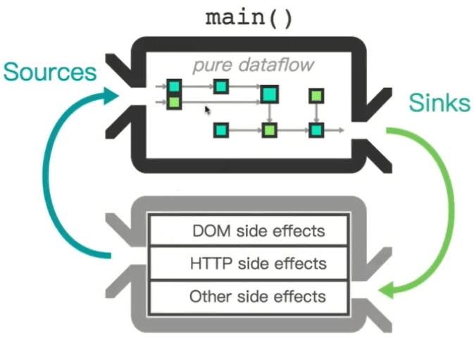

## Effect

`Effect` 是针对于外部的一些影响和改变，简单来说就是

同样一个 `action` 传递过来之后，可以在 `reducer` 当中去影响与 `UI` 相关的一些状态

但是有一些状态又与 `UI` 不相关，但是它是外部的一些变化，比如说与服务器之间的通讯，这些东西我们称之为 `Effect`

我们希望通过一个 `action` 流可以把 `reducer` 和 `effect` 统一管理起来，这也就是使用 `ngrx` 的好处，可以**把逻辑完全从组件当中剥离出来**



从 `action` 的角度来看，`action` 在 `reducer` 当中，接收到 `action` 信号以后，改变的是一个纯的数据流

还有的时候会接收到一个信号，它其实并不改变数据，它改变的是外部的状态，比如发送了一个 `http` 请求或者是做了一些 `DOM` 方面的更改

也就是说如果我们把 `action` 看成为一个流的话，那么对于和 `UI` 相关的数据的一些处理当成 `reducer`

而针对于 `UI` 相关状态之外的一些改变就叫做 `effect`，这样一来，我们的系统就分为 `reducer` 和 `effect`

也就是说，一个 `action` 出来之后，它可能会改变数据的状态，也可能会带来一些外部的影响，这些影响处理完之后，可能又会产生一个新的 `action`，这样循环往复，而且可以任意拼接

简单来说就是，对于某个 `effect`，我们在处理完毕以后希望它可以继续去处理另外的一个 `effect` 或者是处理某个状态

所以我们可以在它处理完毕以后，让其发射出另外一个 `action`，这样一来整个系统就可以形成一套非常灵活的处理逻辑的信息流

## 创建 Effect

首先创建一个执行文件，用来执行 `effect`

```js
// effects/index.ts
import { NgModule } from '@angular/core';
import { EffectsModule } from '@ngrx/effects'

@NgModule({
  // 有一个静态的 run() 方法
  // 可以把我们建立起来的 effects 全部 run 起来
  imports: [
    EffectsModule.run()
  ]
})

export class AppEffectsModule {}
```

然后来写具体的 `effect` 逻辑

```js
// effects/quote.effects.ts
import { Injectable } from '@angular/core';
import { Actions, toPayload, Effect } from '@ngrx/effects';
import { Observable } from 'rxjs/Observable';
import { Action } from '@ngrx/store';
import * as actions from '../actions/quote.action';
import { QuoteService } from '../service/quote.service';

@Injectable()
export class QuoteEffects {

  // 使用装饰器来进行标记
  // effect 也是一个流，并且其类型为 Action 的一个流
  @Effect()
  quote$: Observable<Action> = this.actions$  // -- ①
    // 是 Actions 流中的一个操作符（也是一个 Observable，但是里面定义了一些自己的操作符）
    .ofType(actions.ActionTypes.LOAD)  // -- ②
    // 取得 action，简写语法，等同于 .map(a => a.payload)
    .map(toPayload)
    // 这个 action 并不关心其 payload
    .switchMap(_ => this.service$.getQuote()  // -- ③
      // 成功的时候，发送一个成功的 action
      .map(q => new actions.LoadSuccessAction(q))  // -- ④
      // 如果失败，发射一个失败的 action
      .catch(err => Observable.of(new actions.LoadFailAction(JSON.stringify(err))))  // -- ⑤
    )

  constructor(
    private actions$: Actions,
    private service$: QuoteService
  ) {}
  
}
```

大致的逻辑如下

* 首先监听 `actions$` 这个流（①）

* 然后捕获到 `LOAD` 这个信号流（②）

* 然后调用 `service` 当中的 `getQuote()` 方法（③）

* 成功的时候继续发射一个加载成功的 `action`（④）

* 失败的时候发射一个加载失败的 `action`（⑤）

定义好 `effects` 之后，我们在组件当中调用 `service` 的步骤就可以去掉了，因为我们在 `effects` 当中已经进行处理了

使用 `effect` 以后可以看出，我们在处理完一个逻辑之后，可以将其转发到另外一个 `action` 上去，轻而易举的就可以实现逻辑的拼接