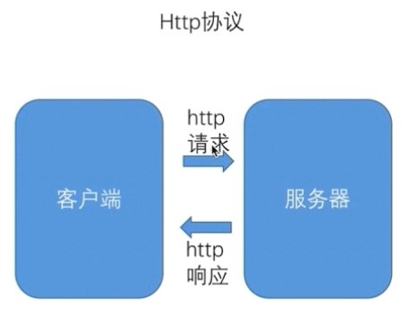
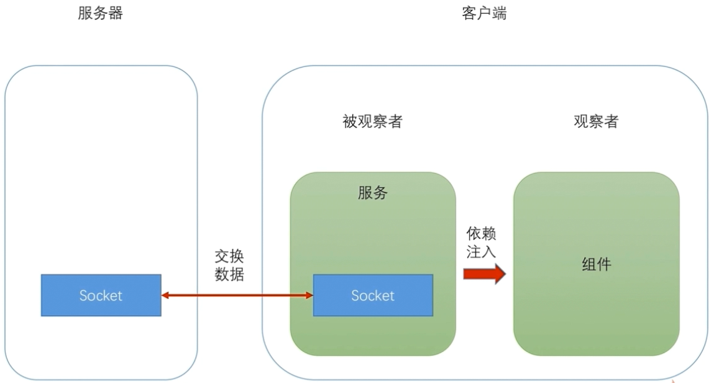

## WebSocket

#### 服务端配置

让 `TypeScript` 支持 `node`，新建一个 `tsconfig.json` 文件

```
{
  "compilerOptions": {                // 编译器的配置
    "target": "es5",                  // 目标是要把其编译成 es5 规范的脚本
    "module": "commonjs",             // 现在模块使用的规范是 commonjs 规范
    "emitDeclarationOnly": true,      // 这两个是与装饰器相关
    "experimentalDecorators": true,   // 意思为编译的时候是否保留装饰器的元数据
    "outDir": "build",                // 编译之后的出口目录
    "lib": ["es6"]                    // 指定开发的时候使用的是 es6 的语法
  },
  "exclude": [                        // 排除
    "node_modules"                    // 意思是编译的时候哪些文件需要排除掉
  ]
}
```

## WebSocket 通讯

主要分为三块，`WebSocket` 协议，创建 `WebSocket` 服务器，使用 `WebSocket` 协议通讯

#### WebSocket 协议

`WebSocket` 是一种低负载的二进制协议，主流浏览器都已经内置了对 `WebSocket` 的支持

常见的 `Http` 协议通讯流程如下



使用 `Http` 协议通讯的时候，客户端与服务器的连接在同一时间，数据传输的方向只能有一个

也就是说要么在发送数据，要么在接收响应数据，是不能同时即发送数据也接收响应的

而 `WebSocket` 协议允许在同一个连接中同时进行双方向的数据传递


`WebSocket` 协议是一个长连接协议，不需要在每次接收和发送数据的时候建立连接

所以 `WebSocket` 通讯时的延迟比 `Http` 较低，而且由于长连接的存在，不需要每次请求时都携带一些连接相关的信息

比如 `Http` 请求头上有一些就是连接相关的信息，但是在 `WebSocket` 中是不需要携带这些信息的


#### 一个简单的示例

整体流程如下图所示



在前台部分声明一个 `web-socket` 服务，里面声明两个方法，一个创建连接，一个发送信息

```js
// web-socket.service.ts
import { Injectable } from '@angular/core';
import { Observable } from 'rxjs/Observable';

@Injectable()
export class WebSocketService {

  ws: WebSocket;
  constructor() { }

  createObservableSocket(url: string, id: number): Observable<any> {
    this.ws = new WebSocket(url);
    // 定义一个流需要三件事
    // 1. 什么时候发射下一个元素
    // 2. 什么时候抛一个异常
    // 3. 什么时候发出流结束的信号
    // 这个对象要处理 websocket 接收到的消息来包装成一个流
    return new Observable(observable => {
      // 当 websocket 接收到一个消息的时候，流就需要发射下一个元素
      // 发射的元素为 ws 接收到的事件里面包含的数据
      this.ws.onmessage = (event) => observable.next(event.data);

      // 当 ws 出现问题的时候抛出一个异常
      this.ws.onerror = (event) => observable.error(event);

      // 当 ws 关闭的时候，发射出结束的信号
      this.ws.onclose = (event) => observable.complete();

      // 添加二个参数，接收一个 id
      // 当 websocket 连接打开的时候立即像服务器发送一个消息（id）
      this.ws.onopen = (event) => this.sendMessage({ productId: id});

    });
  }

  // 向服务器发送一个数据
  // 需要注意一点，在 websocket 协议当中 发送/接收 消息的时候，这个消息本身都应该是一个字符串
  // 所以在发送的时候需要转换一下（即 sendMessage 的参数类型为对象，但是发送的时候仍是字符串）
  sendMessage(message: any) {
    this.ws.send(JSON.stringify(message));
  }
}
```

然后在组件当中进行注入使用，声明一个按钮，点击后发送数据

```js
import { Component, OnInit } from '@angular/core';
import { WebSocketService } from '../../service/web-socket.service';

// ...

export class WebSocketComponent implements OnInit {

  constructor(private ws: WebSocketService) { }

  ngOnInit() {
    this.ws.createObservableSocket('ws://localhost:8001')
      .subscribe(
        v => { console.log(v); },
        err => { console.log(err); },
        () => { console.log(`Completed -`); },
      );
  }

  sendMessageToServer() {
    this.ws.sendMessage(`hello world`);
  }

}
```

后台就负责接收数据和发送数据，这里使用的是 `express`

```js
const express = require('express');
const ws = require('ws')
const app = express();

app.use('/', express.static(path.join(__dirname, '..', 'client')))

app.get('/api/stock', (req, res) => {
  let result = stocks;
  let params = req.query;

  if(params.nam){
    result = result.filter(stock => stock.name.indexOf(params.name) !== -1);
  }

  res.json(result);
});

app.get('/api/stock/:id', (req, res) => {
  res.json(stocks.find(stock => stock.id == req.params.id));
});

const server = app.listen(8086, 'localhost', () => {
  console.log('服务器已启动,地址是:http://localhost:8086');
});

var subscriptions = new Set<any>();

const wsServer = new Server({port: 8085});
wsServer.on("connection", websocket => {
  subscriptions.add(websocket);
});

var messageCount = 0;

setInterval(() => {
  subscriptions.forEach(ws => {
    if(ws.readyState === 1){
      ws.send(JSON.stringify({messageCount: messageCount++}));
    }else{
      subscriptions.delete(ws);
    }
  })
}, 2000);
```