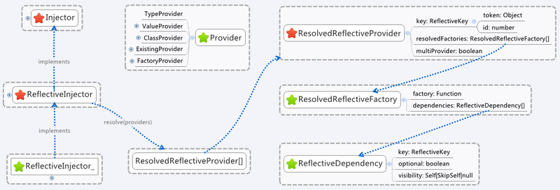
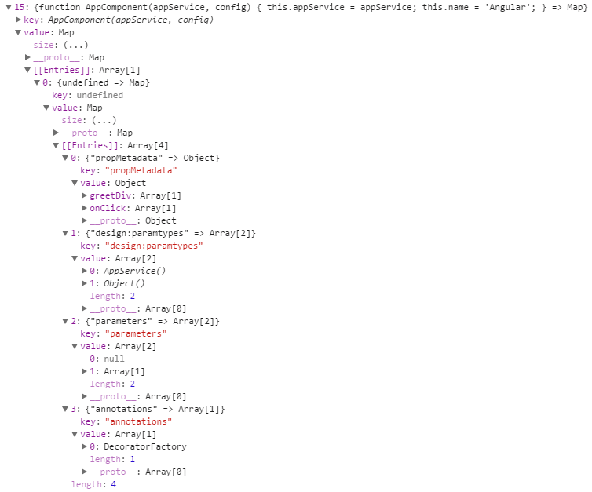

转自 [Angular 4.x Injector](https://segmentfault.com/a/1190000009283057)

原文写的不错，但是篇幅很长，内容很深，需要反复进行阅读，主要讲解的是 `Injector` 的源码实现和其中涉及到的一些方法

这里略作调整，整理为自己比较好理解的方式，详细可以参考原文

----


## 依赖注入

所谓 [依赖注入](https://zh.wikipedia.org/wiki/依赖注入)，本质是一种实现 [控制反转](https://zh.wikipedia.org/wiki/控制反转) 用于解决依赖性设计模式（详细可见对应的维基百科词条）

依赖注入允许程序设计遵从依赖倒置原则，调用者只需知道服务的接口，具体服务的查找和创建由注入器（`Injector`）负责处理并提供给调用者，这样就分离了服务和调用者的依赖，符合低耦合的程序设计原则

依赖注入中包含三种角色：调用者、服务和注入器（`Injector`），在 `Angular` 中 `Injector`（注入器） 用来管理服务对象的创建和获取

下面一个一个来看


## Injector 抽象类

定义方式如下

```ts
// angular2\packages\core\src\di\injector.ts
export abstract class Injector {
  static THROW_IF_NOT_FOUND = _THROW_IF_NOT_FOUND;
  static NULL: Injector = new _NullInjector();

  /**
   * 定义了一个 get() 抽象方法，该方法用于根据给定的 Token 从注入器中获取相应的对象
   * 如果没有找到相应的对象，将返回 notFoundValue 设置的值
   * 若 notFoundValue 的值与 _THROW_IF_NOT_FOUND 相等，则会抛出异常
   */
  abstract get<T>(token: Type<T> | InjectionToken<T>, notFoundValue?: T): T;
}

const _THROW_IF_NOT_FOUND = new Object();
```

需要注意的是，每个 `Injector` 抽象类的子类都必须实现该方法，在 `Angular` 当中常见的有 `_NullInjector` 和 `ReflectiveInjector` 两个


## _NullInjector 类

`_NullInjector` 类的实例用于表示空的注入器

```ts
// angular2\packages\core\src\di\injector.ts
class _NullInjector implements Injector {

  // 实现 get() 方法
  get(token: any, notFoundValue: any = _THROW_IF_NOT_FOUND): any {
    if (notFoundValue === _THROW_IF_NOT_FOUND) {
      throw new Error('No provider for ${stringify(token)}!');
    }
    return notFoundValue;
  }
}
```


## ReflectiveInjector 抽象类

`ReflectiveInjector` 表示一个依赖注入的容器，用于实例化对象和解析依赖，下面是常见的使用方式

```ts
@Injectable()
class Engine { }

@Injectable()
class Car {
  constructor(public engine: Engine) { }
}

// 调用 ReflectiveInjector 抽象类的 resolveAndCreate() 方法来创建注入器
var injector = ReflectiveInjector.resolveAndCreate([Car, Engine]);

// 然后调用注入器的 get() 方法，获得 Token 对应的对象
var car = injector.get(Car);

expect(car instanceof Car).toBe(true);
expect(car.engine instanceof Engine).toBe(true);
```

其中的 `resolveAndCreate()` 方法定义如下

```ts
// 通过调用 resolve() 和 fromResolvedProviders() 方法来创建 ReflectiveInjector 对象（返回的是该对象）
static resolveAndCreate(providers: Provider[], parent ?: Injector): ReflectiveInjector {
  const ResolvedReflectiveProviders = ReflectiveInjector.resolve(providers);
  return ReflectiveInjector.fromResolvedProviders(ResolvedReflectiveProviders, parent);
}
```

`ReflectiveInjector` 除了 `resolveAndCreate()` 静态方法外，还有两个常见的

* `resolve()` - 解析 `Provider` 列表为 `ResolvedReflectiveProvider` 列表

* `fromResolvedProviders()` - 基于 `ResolvedReflectiveProvider` 列表创建 `ReflectiveInjector` 对象


## resolve()

该静态方法用于把 `Provider` 数组解析为 `ResolvedReflectiveProvider` 数组

```ts
static resolve(providers: Provider[]): ResolvedReflectiveProvider[] {
  return resolveReflectiveProviders(providers);
}
```

下面是使用示例

```ts
@Injectable()
class Engine { }

@Injectable()
class Car {
  constructor(public engine: Engine) { }
}

var providers = ReflectiveInjector.resolve([Car, [[Engine]]]);
expect(providers.length).toEqual(2);

expect(providers[0] instanceof ResolvedReflectiveProvider).toBe(true);
expect(providers[0].key.displayName).toBe("Car");
expect(providers[1].key.displayName).toBe("Engine");
```

`resolve()` 的流程解析如下图所示




#### 上图中的 Provider 类型

也就是我们平常使用的 `useClass`，`useValue` 等等

```ts
export type Provider =
  TypeProvider | ValueProvider | ClassProvider | ExistingProvider | FactoryProvider | any[];

// ApiService
export interface TypeProvider extends Type<any> { }

// { provide: ApiService, useClass: ApiService } => 可以简写为 ApiService,
export interface ClassProvider {
  // 用于设置与依赖对象关联的 Token 值，Token 值可能是 Type、InjectionToken、OpaqueToken 的实例或字符串
  provide: any;
  useClass: Type<any>;
  // 用于标识是否 multiple providers，若是 multiple 类型，则返回与 Token 关联的依赖对象列表
  multi?: boolean;
}

// { provide: 'API_URL', useValue: 'http://my.api.com/v1' }
export interface ValueProvider {
  provide: any;
  useValue: any;
  multi?: boolean;
}

// { provide: 'ApiServiceAlias', useExisting: ApiService }  
export interface ExistingProvider {
  provide: any;
  useExisting: any;
  multi?: boolean;
}

// { provide: APP_INITIALIZER, useFactory: configFactory, deps: [AppConfig], multi: true }
export interface FactoryProvider {
  provide: any;
  useFactory: Function;
  deps?: any[]; // 用于设置工厂函数的依赖对象
  multi?: boolean;
}
```


#### 上图中的 ResolvedReflectiveProvider 接口

```ts
export interface ResolvedReflectiveProvider {
  // 唯一的对象，用来从 ReflectiveInjector 中获取对象
  key: ReflectiveKey;
  // 工厂函数用于创建 key 相关的依赖对象 
  resolvedFactories: ResolvedReflectiveFactory[];
  // 标识当前的 provider 是否为 multi-provider
  multiProvider: boolean;
}
```


#### 上图中的 ResolvedReflectiveFactory 类

```ts
export class ResolvedReflectiveFactory {
  constructor(
    public factory: Function,
    public dependencies: ReflectiveDependency[]
  ) { }
}
```


#### 上图中的 ReflectiveDependency 类

```ts
export class ReflectiveDependency {
  constructor(
    public key: ReflectiveKey,
    public optional: boolean,
    public visibility: Self | SkipSelf | null
  ) { }

  static fromKey(key: ReflectiveKey): ReflectiveDependency {
    return new ReflectiveDependency(key, false, null);
  }
}
```


#### 上图中的 ReflectiveDependency 类中包含的 ReflectiveKey 类

`ReflectiveKey` 对象中包含两个属性：系统范围内唯一的 `id` 和 `token`

系统范围内唯一的 `id` 可以允许注入器以更高效的方式存储已创建的对象

另外我们不能手动的创建 `ReflectiveKey`，而是当 `ReflectiveInjector` 对象解析 `providers` 的时候会自动创建 `ReflectiveKey` 对象

```ts
export class ReflectiveKey {
  constructor(
    public token: Object, 
    public id: number
  ) {
    if (!token) {
      throw new Error('Token must be defined!');
    }
  }

  // 返回序列化的 token
  get displayName(): string { return stringify(this.token); }

  // 获取 token 对应的 ReflectiveKey
  static get(token: Object): ReflectiveKey {
    return _globalKeyRegistry.get(resolveForwardRef(token));
  }

  // 获取系统中已注册 ReflectiveKey 的个数
  static get numberOfKeys(): number { return _globalKeyRegistry.numberOfKeys; }
}

const _globalKeyRegistry = new KeyRegistry(); // 创建 Key 仓库

export class KeyRegistry {
  private _allKeys = new Map<Object, ReflectiveKey>();

  get(token: Object): ReflectiveKey {

    // 若 token 是 ReflectiveKey 类的实例，则直接返回
    if (token instanceof ReflectiveKey) return token;

    // 若 _allKeys 对象中包含 token 属性，则返回 token 对应的 ReflectiveKey 对象
    if (this._allKeys.has(token)) {
      return this._allKeys.get(token)!;
    }

    // 否则创建一个新的 ReflectiveKey 对象，并保存到 _allKeys 对象中
    const newKey = new ReflectiveKey(token, ReflectiveKey.numberOfKeys);
    this._allKeys.set(token, newKey);
    return newKey;
  }

  // 获取已保存 ReflectiveKey 的个数
  get numberOfKeys(): number { return this._allKeys.size; }
}
```

看完了 `resolve()` 在使用场景当中涉及到的一些方法，再来看看 `resolve()` 方法内部的具体实现中的 `resolveReflectiveProviders()` 方法

```ts
static resolve(providers: Provider[]): ResolvedReflectiveProvider[] {
  return resolveReflectiveProviders(providers);
}

// -----------------------

export function resolveReflectiveProviders(providers: Provider[]): ResolvedReflectiveProvider[] {
  const normalized = _normalizeProviders(providers, []);                                 // 步骤一
  const resolved = normalized.map(resolveReflectiveProvider);                            // 步骤二
  const resolvedProviderMap = mergeResolvedReflectiveProviders(resolved, new Map());     // 步骤三
  return Array.from(resolvedProviderMap.values());                                       // 步骤四
}
```


#### 步骤一，规范化 Provider

```ts
const normalized = _normalizeProviders(providers, []);

// 规范化 Providers
function _normalizeProviders(providers: Provider[], res: Provider[]): Provider[] {
  providers.forEach(b => {
    // providers: [Type] => providers: [{provide: Type, useClass: Type }]
    if (b instanceof Type) {
      res.push({ provide: b, useClass: b });
    } else if (b && typeof b == 'object' && (b as any).provide !== undefined) {
      res.push(b as NormalizedProvider);

    // 若 b 是数组，则递归调用 _normalizeProviders() 方法
    } else if (b instanceof Array) {
      _normalizeProviders(b, res);
    } else {
      throw invalidProviderError(b);
    }
  });
  return res;
}

interface NormalizedProvider extends TypeProvider, ValueProvider, ClassProvider,
  ExistingProvider, FactoryProvider { }
```


#### 步骤二，转化 NormalizedProvider 为 ResolvedReflectiveProvider

```ts
// normalized 为规范化后的 provider
const resolved = normalized.map(resolveReflectiveProvider);

// 解析 NormalizedProvider 为 ResolvedReflectiveProvider
function resolveReflectiveProvider(provider: NormalizedProvider): ResolvedReflectiveProvider {
  return new ResolvedReflectiveProvider_(
    ReflectiveKey.get(provider.provide),
    [resolveReflectiveFactory(provider)],
    provider.multi || false
  );
}

// 用于创建已解析的 Provider 实例
export class ResolvedReflectiveProvider_ implements ResolvedReflectiveProvider {
  constructor(
    public key: ReflectiveKey,
    public resolvedFactories: ResolvedReflectiveFactory[],
    public multiProvider: boolean
  ) { }

  get resolvedFactory(): ResolvedReflectiveFactory { return this.resolvedFactories[0]; }
}

// 解析 NormalizedProvider 对象，创建 ResolvedReflectiveFactory 对象
function resolveReflectiveFactory(provider: NormalizedProvider): ResolvedReflectiveFactory {
  let factoryFn: Function;
  let resolvedDeps: ReflectiveDependency[];
  if (provider.useClass) {
    // { provide: ApiService, useClass: ApiService } 
    const useClass = resolveForwardRef(provider.useClass);
    factoryFn = reflector.factory(useClass);
    resolvedDeps = _dependenciesFor(useClass);
  } else if (provider.useExisting) {
    // { provide: 'ApiServiceAlias', useExisting: ApiService } 
    factoryFn = (aliasInstance: any) => aliasInstance;
    resolvedDeps = [ReflectiveDependency.fromKey(ReflectiveKey.get(provider.useExisting))];
  } else if (provider.useFactory) {
    // { provide: APP_INITIALIZER, useFactory: configFactory, deps: [AppConfig], multi: true }
    factoryFn = provider.useFactory;
    resolvedDeps = constructDependencies(provider.useFactory, provider.deps);
  } else {
    // { provide: 'API_URL', useValue: 'http://my.api.com/v1' }
    factoryFn = () => provider.useValue;
    // const _EMPTY_LIST: any[] = [];
    resolvedDeps = _EMPTY_LIST;
  }
  return new ResolvedReflectiveFactory(factoryFn, resolvedDeps);
}
```


#### 步骤三，合并已解析的 Provider

```ts
const resolvedProviderMap = mergeResolvedReflectiveProviders(resolved, new Map());

export function mergeResolvedReflectiveProviders(
  providers: ResolvedReflectiveProvider[],
  normalizedProvidersMap: Map<number, ResolvedReflectiveProvider>
): Map<number, ResolvedReflectiveProvider> {
  for (let i = 0; i < providers.length; i++) {
    const provider = providers[i];
    // 从 normalizedProvidersMap 对象中获取 key.id 对应的 ResolvedReflectiveProvider 对象
    const existing = normalizedProvidersMap.get(provider.key.id);
    if (existing) {
      // 如果当前的 provider 不是 multi provider，则抛出异常
      if (provider.multiProvider !== existing.multiProvider) {
        throw mixingMultiProvidersWithRegularProvidersError(existing, provider);
      }
      // 如果当前的 provider 是 multi provider
      // 则把当前 provider 的 resolvedFactories 列表中的每一项添加到已存在的 provider 对象的 resolvedFactories 列表中
      if (provider.multiProvider) {
        for (let j = 0; j < provider.resolvedFactories.length; j++) {
          existing.resolvedFactories.push(provider.resolvedFactories[j]);
        }
      } else {
        // 如果当前的 provider 不是 multi provider，则覆盖已存在的 provider
        normalizedProvidersMap.set(provider.key.id, provider);
      }
    } else {
      let resolvedProvider: ResolvedReflectiveProvider;
      // 如果当前的 provider 是 multi provider，则创建一个新的 ResolvedReflectiveProvider 对象
      if (provider.multiProvider) {
        resolvedProvider = new ResolvedReflectiveProvider_(
          provider.key, provider.resolvedFactories.slice(), provider.multiProvider
        );
      } else {
        resolvedProvider = provider;
      }
      // 在 normalizedProvidersMap 中保存已解析的 ResolvedReflectiveProvider 对象
      normalizedProvidersMap.set(provider.key.id, resolvedProvider);
    }
  }
  return normalizedProvidersMap;
}
```


#### 步骤四，生成 ResolvedReflectiveProvider[]

```ts
// 基于 resolvedProviderMap 的 values，创建 ResolvedReflectiveProvider[]
Array.from(resolvedProviderMap.values());

/**
 * 基于一个类似数组或可迭代对象创建一个新的数组实例
 * 
 * arrayLike  转换成真实数组的类数组对象或可遍历对象
 * mapFn（可选） 如果指定了该参数，则最后生成的数组会经过该函数的加工处理后再返回
 * thisArg（可选） 执行 mapFn 函数时 this 的值
 */
Array.from(arrayLike[, mapFn[, thisArg]])
```


看完了 `resolve()` 方法的实现，我们再来看看另外一个静态方法 `fromResolvedProviders()`


## fromResolvedProviders()

先来看看使用方式

```ts
@Injectable()
class Engine { }

@Injectable()
class Car {
  constructor(public engine: Engine) { }
}

var providers = ReflectiveInjector.resolve([Car, Engine]);
var injector = ReflectiveInjector.fromResolvedProviders(providers);
expect(injector.get(Car) instanceof Car).toBe(true);
```

其实该方法用于基于已经解析的 `providers` 来创建注入器

```ts
static fromResolvedProviders(
  providers: ResolvedReflectiveProvider[],
  parent ?: Injector
): ReflectiveInjector {
  return new ReflectiveInjector_(providers, parent);
}
```

下面来着重的看一下 `ReflectiveInjector_` 这个类


#### ReflectiveInjector_ 类上的属性

```ts
// 构造次数
_constructionCounter: number = 0;

// ResolvedReflectiveProvider 列表
public _providers: ResolvedReflectiveProvider[];

// 父级注入器
public _parent: Injector | null;

// ReflectiveKey id 列表
keyIds: number[];

// 依赖对象列表
objs: any[];
```


#### 构造函数

```ts
export class ReflectiveInjector_ implements ReflectiveInjector {
  constructor(
    _providers: ResolvedReflectiveProvider[], 
    _parent?: Injector
  ) {
    this._providers = _providers;
    // 设置父级注入器
    this._parent = _parent || null;

    const len = _providers.length;

    this.keyIds = new Array(len);
    this.objs = new Array(len);

    // 初始化 keyIds 列表和 objs 对象列表
    for (let i = 0; i < len; i++) {
      this.keyIds[i] = _providers[i].key.id;
      this.objs[i] = UNDEFINED;
    }
  }
}

const UNDEFINED = new Object();
```


#### 类的方法

`ReflectiveInjector_` 类中的方法比较多，我们只看一些比较重要的，主要分为以下几类

* 用于创建 `ReflectiveInjector` 注入器

* 用于获取对象

* 用于创建对象

* 用于获取工厂函数依赖对象

下面一个一个来看


#### 用于创建 ReflectiveInjector 注入器

```ts
// 基于 Provider 列表并创建子注入器
resolveAndCreateChild(providers: Provider[]): ReflectiveInjector {
  const ResolvedReflectiveProviders = ReflectiveInjector.resolve(providers);
  return this.createChildFromResolved(ResolvedReflectiveProviders);
}

// 基于已解析的 ResolvedReflectiveProvider 列表，创建子注入器
createChildFromResolved(providers: ResolvedReflectiveProvider[]): ReflectiveInjector {
  const inj = new ReflectiveInjector_(providers);
  inj._parent = this;
  return inj;
}
```


#### 用于获取对象

```ts
// 获取当前注入器的父级注入器
get parent(): Injector | null { return this._parent; }

// 获取 token 对应的依赖对象
get(token: any, notFoundValue: any = THROW_IF_NOT_FOUND): any {
  return this._getByKey(ReflectiveKey.get(token), null, notFoundValue);
}

// 根据 ReflectiveKey 及 visibility 可见性，获取对应的依赖对象
private _getByKey(key: ReflectiveKey, visibility: Self | SkipSelf | null, notFoundValue: any): any {
  // const INJECTOR_KEY = ReflectiveKey.get(Injector); 
  if (key === INJECTOR_KEY) {
    return this;
  }

  // 判断该依赖对象是否使用 @Self 装饰器定义，表示从本级注入器获取依赖对象
  if (visibility instanceof Self) {
    return this._getByKeySelf(key, notFoundValue);

  } else {
    // 使用默认的方式获取依赖对象
    return this._getByKeyDefault(key, notFoundValue, visibility);
  }
}

// 从本级注入器获取依赖对象
_getByKeySelf(key: ReflectiveKey, notFoundValue: any): any {
  const obj = this._getObjByKeyId(key.id);
  return (obj !== UNDEFINED) ? obj : this._throwOrNull(key, notFoundValue);
}

// 使用默认的方式获取依赖对象
_getByKeyDefault(
  key: ReflectiveKey, 
  notFoundValue: any,
  visibility: Self | SkipSelf | null
): any {
  let inj: Injector | null;

  // 判断该依赖对象是否使用 @SkipSelf 装饰器定义，表示不从本级注入器获取依赖对象
  if (visibility instanceof SkipSelf) {
    inj = this._parent;
  } else {
    inj = this;
  }

  // 从本级注入器获取依赖对象，若本级获取不到，则从父级注入器中查找
  while (inj instanceof ReflectiveInjector_) {
    const inj_ = <ReflectiveInjector_>inj;
    const obj = inj_._getObjByKeyId(key.id);
    if (obj !== UNDEFINED) return obj;
    inj = inj_._parent;
  }
  if (inj !== null) {
    return inj.get(key.token, notFoundValue);
  } else {
    return this._throwOrNull(key, notFoundValue);
  }
}

// 获取 keyId 对应的对象，如依赖对象未创建，则调用 _new() 方法创建一个，然后保存到
// this.objs 对象列表中
private _getObjByKeyId(keyId: number): any {
  for (let i = 0; i < this.keyIds.length; i++) {
    if (this.keyIds[i] === keyId) {
      // const UNDEFINED = new Object();
      if (this.objs[i] === UNDEFINED) {
        this.objs[i] = this._new(this._providers[i]);
      }
      return this.objs[i];
    }
  }
  return UNDEFINED;
}
```


#### 用于创建对象

```ts
// 创建依赖对象
_new(provider: ResolvedReflectiveProvider): any {
  //  判断是否存在循环依赖
  if (this._constructionCounter++ > this._getMaxNumberOfObjects()) {
    throw cyclicDependencyError(this, provider.key);
  }
  return this._instantiateProvider(provider);
}

// 获取最大的对象个数
private _getMaxNumberOfObjects(): number { return this.objs.length; }

// 根据已解析的 provider 创建依赖对象
// 若是 multi provider 则，循环创建 multi provider 对象
private _instantiateProvider(provider: ResolvedReflectiveProvider): any {
  if (provider.multiProvider) {
    const res = new Array(provider.resolvedFactories.length);
    for (let i = 0; i < provider.resolvedFactories.length; ++i) {
      res[i] = this._instantiate(provider, provider.resolvedFactories[i]);
    }
    return res;
  } else {
    return this._instantiate(provider, provider.resolvedFactories[0]);
  }
}

// 根据已解析的 provider 和已解析的工厂创建依赖对象
private _instantiate(
  provider: ResolvedReflectiveProvider,
  ResolvedReflectiveFactory: ResolvedReflectiveFactory): any {
  // 获取对象工厂函数
  const factory = ResolvedReflectiveFactory.factory;

  // 获取工厂函数所依赖的对象列表
  let deps: any[];
  try {
    deps = ResolvedReflectiveFactory.dependencies
      .map(dep => this._getByReflectiveDependency(dep));
  } catch (e) {
    if (e.addKey) {
      e.addKey(this, provider.key);
    }
    throw e;
  }

  // 调用对象工厂函数创建依赖对象
  let obj: any;
  try {
    obj = factory(...deps);
  } catch (e) {
    throw instantiationError(this, e, e.stack, provider.key);
  }
  return obj;
}
```


#### 用于获取工厂函数依赖对象

```ts
// 若通过 @Optional 装饰器定义该依赖对象，表示该依赖对象是可选的，当获取不到时返回 null
private _getByReflectiveDependency(dep: ReflectiveDependency): any {
  return this._getByKey(dep.key, dep.visibility, dep.optional ? null : THROW_IF_NOT_FOUND);
}
```


#### 小小总结

其实 `Angular DI` 最核心的内容是如何创建依赖对象

在 `Angular` 中我们通过使用工厂函数，来创建依赖对象，工厂函数的输入参数是依赖对象列表，输出结果是对应的依赖对象

因此接下来我们将着重介绍如何创建工厂函数和如何创建依赖对象，但在之前，我们还得先介绍一下 `Angular Metadata`（元数据） 的相关内容


## Angular Metadata（元数据）

在 `Angular` 中 `Metadata` 主要分为以下几种类型

* `annotations`

* `design: paramtypes`

* `propMetadata`

* `parameters`

需要注意的是，其中 `design: paramtypes` 和 `parameters metadata` 类型主要用于实现依赖注入


`Angular` 使用第三方库 `core-js` 提供的 `Reflect API` 来实现对 `Metadata` 信息的存储与读取


#### Metadata 信息的存储

我们以类装饰器为例，如 `@Component()`、`@NgModule()`

```ts
// angular2/packages/core/src/util/decorators.ts
export function makeDecorator(
  name: string,
  props: { [name: string]: any },
  parentClass?: any,
  chainFn?: (fn: Function) => void): (...args: any[]) => (cls: any) => any {
  //...
  const TypeDecorator: TypeDecorator = <TypeDecorator>function TypeDecorator(cls: Type<any>) {
    const annotations = Reflect.getOwnMetadata('annotations', cls) || [];
    annotations.push(annotationInstance);
    // 保存 annotations metadata 信息
    Reflect.defineMetadata('annotations', annotations, cls);
    return cls;
  };
}  
```

`Reflect.defineMetadata()` 方法用来保存定义的 `Metadata` 信息，相应的 `Metadata` 信息是保存在 `window['__core-js_shared__']` 对象的 `metadata` 属性中

可以直接在控制台输入 `window['__core-js_shared__']` 查看该对象的内部信息




#### Metadata 信息的读取

`Angular` 中通过 `ReflectorReader` 抽象类，定义了读取 `Metadata` 信息相关的抽象方法

```ts
export abstract class ReflectorReader {
  abstract parameters(typeOrFunc: /*Type*/ any): any[][];
  abstract annotations(typeOrFunc: /*Type*/ any): any[];
  abstract propMetadata(typeOrFunc: /*Type*/ any): { [key: string]: any[] };
  abstract importUri(typeOrFunc: /*Type*/ any): string | null;
  abstract resourceUri(typeOrFunc: /*Type*/ any): string;
  abstract resolveIdentifier(name: string, moduleUrl: string, members: string[], runtime: any): any;
  abstract resolveEnum(identifier: any, name: string): any;
}
```

上述抽象方法的具体实现类是 `Reflector` 类

```ts
// angular2/packages/core/src/reflection/reflector.ts
export class Reflector extends ReflectorReader {
  constructor(public reflectionCapabilities: PlatformReflectionCapabilities) {
    super();
  }
  //...
  factory(type: Type<any>): Function { return this.reflectionCapabilities.factory(type); }

  parameters(typeOrFunc: Type<any>): any[][] {
    return this.reflectionCapabilities.parameters(typeOrFunc);
  }

  annotations(typeOrFunc: Type<any>): any[] {
    return this.reflectionCapabilities.annotations(typeOrFunc);
  }

  propMetadata(typeOrFunc: Type<any>): { [key: string]: any[] } {
    return this.reflectionCapabilities.propMetadata(typeOrFunc);
  }
}
```


## 创建依赖对象

#### 创建 ResolvedReflectiveFactory

之前有提到，这里在复述一下

```ts
// 解析 NormalizedProvider 对象，创建 ResolvedReflectiveFactory 对象
function resolveReflectiveFactory(provider: NormalizedProvider): ResolvedReflectiveFactory {
  let factoryFn: Function;
  let resolvedDeps: ReflectiveDependency[];
  if (provider.useClass) {
    // useClass
    // { provide: ApiService, useClass: ApiService }
    const useClass = resolveForwardRef(provider.useClass);
    factoryFn = reflector.factory(useClass);
    resolvedDeps = _dependenciesFor(useClass);
  } else if (provider.useExisting) {
    // { provide: 'ApiServiceAlias', useExisting: ApiService } 
    factoryFn = (aliasInstance: any) => aliasInstance;
    resolvedDeps = [ReflectiveDependency
      .fromKey(ReflectiveKey.get(provider.useExisting))];
  } else if (provider.useFactory) {
    // { provide: APP_INITIALIZER, useFactory: configFactory, deps: [AppConfig], multi: true }
    factoryFn = provider.useFactory;
    resolvedDeps = constructDependencies(provider.useFactory, provider.deps);
  } else {
    // { provide: 'API_URL', useValue: 'http://my.api.com/v1' }
    factoryFn = () => provider.useValue;
    // const _EMPTY_LIST: any[] = [];
    resolvedDeps = _EMPTY_LIST;
  }
  return new ResolvedReflectiveFactory(factoryFn, resolvedDeps);
}
```


#### useClass

```ts
// { provide: ApiService, useClass: ApiService } 
const useClass = resolveForwardRef(provider.useClass);
factoryFn = reflector.factory(useClass);
resolvedDeps = _dependenciesFor(useClass);
```

设置工厂函数

```ts
// 获取通过 forwardRef() 方法定义的类
const useClass = resolveForwardRef(provider.useClass);
factoryFn = reflector.factory(useClass);

// reflector.factory() 方法
factory<T>(t: Type<T>): (args: any[]) => T {
  return(...args: any[]) => new t(...args);
}
```

设置依赖对象列表

```ts
// 解析类中的依赖对象
function _dependenciesFor(typeOrFunc: any): ReflectiveDependency[] {
  // 获取 design:paramtypes 和 paramters 保存的 metadata 信息
  const params = reflector.parameters(typeOrFunc);
  if (!params) return [];
  if (params.some(p => p == null)) {
    throw noAnnotationError(typeOrFunc, params);
  }
  return params.map(p => _extractToken(typeOrFunc, p, params));
}

// 创建 ReflectiveDependency 对象
function _extractToken(typeOrFunc: any, metadata: any[] | any, params: any[][]): ReflectiveDependency {
  let token: any = null;
  let optional = false;

  if (!Array.isArray(metadata)) {
    // Inject: InjectDecorator = makeParamDecorator('Inject', [['token', undefined]]);
    if (metadata instanceof Inject) {
      return _createDependency(metadata['token'], optional, null);
    } else {
      return _createDependency(metadata, optional, null);
    }
  }

  let visibility: Self | SkipSelf | null = null;

  // 遍历 metadata 数组，设置 token、optional（可选的）、visibility（可见性）的值
  for (let i = 0; i < metadata.length; ++i) {
    const paramMetadata = metadata[i];

    if (paramMetadata instanceof Type) {
      token = paramMetadata;

    } else if (paramMetadata instanceof Inject) {
      token = paramMetadata['token'];

    } else if (paramMetadata instanceof Optional) {
      optional = true;

    } else if (paramMetadata instanceof Self ||
      paramMetadata instanceof SkipSelf) {
      visibility = paramMetadata;
    } else if (paramMetadata instanceof InjectionToken) {
      token = paramMetadata;
    }
  }

  // 获取通过 forwardRef() 方法定义的类
  token = resolveForwardRef(token);

  if (token != null) {
    return _createDependency(token, optional, visibility);
  } else {
    throw noAnnotationError(typeOrFunc, params);
  }
}

// 创建 ReflectiveDependency 对象
function _createDependency(
  token: any,        // 依赖对象关联的 token
  optional: boolean, // 是否是可选的
  visibility: Self | SkipSelf | null): ReflectiveDependency {
  return new ReflectiveDependency(
    ReflectiveKey.get(token),
    optional,
    visibility
  );
}
```


#### useExisting

```ts
// { provide: 'ApiServiceAlias', useExisting: ApiService } 
factoryFn = (aliasInstance: any) => aliasInstance;
resolvedDeps = [ReflectiveDependency.fromKey(ReflectiveKey.get(provider.useExisting))];
```

设置工厂函数

```ts
factoryFn = (aliasInstance: any) => aliasInstance;
```

设置依赖对象列表

```ts
// { provide: 'ApiServiceAlias', useExisting: ApiService } 
resolvedDeps = [ReflectiveDependency.fromKey(ReflectiveKey.get(provider.useExisting))];

export class ReflectiveDependency {
  constructor(
    public key: ReflectiveKey,
    public optional: boolean,
    public visibility: Self | SkipSelf | null) { }

  static fromKey(key: ReflectiveKey): ReflectiveDependency {
    return new ReflectiveDependency(key, false, null);
  }
}
```


#### useFactory

```ts
// { provide: APP_INITIALIZER, useFactory: configFactory, deps: [AppConfig], multi: true }
factoryFn = provider.useFactory;
resolvedDeps = constructDependencies(provider.useFactory, provider.deps);
```

设置工厂函数

```ts
factoryFn = provider.useFactory;
```

设置依赖对象列表

```ts
resolvedDeps = constructDependencies(provider.useFactory, provider.deps);

// 构造ReflectiveDependency[]列表
export function constructDependencies(typeOrFunc: any, dependencies?: any[]): ReflectiveDependency[] {
  if (!dependencies) {
    return _dependenciesFor(typeOrFunc);
  } else {
    const params: any[][] = dependencies.map(t => [t]);
    return dependencies.map(t => _extractToken(typeOrFunc, t, params));
  }
}
```


#### useValue

```ts
// { provide: 'API_URL', useValue: 'http://my.api.com/v1' }
factoryFn = () => provider.useValue;
resolvedDeps = _EMPTY_LIST; // const _EMPTY_LIST: any[] = [];
```

设置工厂函数

```ts
factoryFn = () => provider.useValue;
```

设置依赖对象列表

```ts
resolvedDeps = _EMPTY_LIST; // const _EMPTY_LIST: any[] = [];
```

