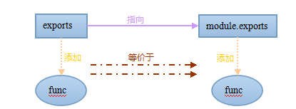
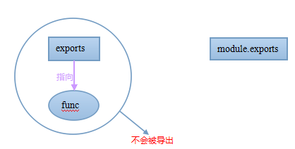

很多时候，你会看到，在 `Node` 环境中，有两种方法可以在一个模块中输出变量：

#### 方法一：对 `module.exports` 赋值

```js
module.exports = {
  hello: hello,
  index: index
}
```

#### 方法二：直接使用 `exports`

```js
exports.hello = hello;
```

针对方法二，但是你不可以直接对 `exports` 赋值

```js
exports = {
  hello: hello,
  index: index
}
```

代码虽然可以执行，但是模块并没有输出任何变量

这里就要提起 `require()` 这个方法了，但是在深入了解之前我们可以先看一下官方 `API` 的一个经典的例子，把 `require` 方法简化成了下面这个函数

```js
function require(...) {
  // ...  
  function (module, exports) {
    // Your module code here  
    exports = some_func;        // re-assigns exports, exports is no longer  
    // a shortcut, and nothing is exported.  
    module.exports = some_func; // makes your module export 0  
  } (module, module.exports);
  return module;
}  
```


通过观察传入进去的参数，我们可以看到 `exports = module.exports`，所以说，一开始这两个东西是指向同一个对象实例的（实际上是同一个变量，并且初始化为空对象 `{}` ），如下图所示：


如果直接添加一个方法，比如 `exports.fn = func`，那么由于 `exports` 指向 `module.exports`，由于复制引用的关系，相当于 `module.exports` 也添加了同样的方法，类似下图



```js
// 在 exports 上添加了一个方法，module.exports 也添加了同样的方法，因为它们指向了同样的对象实例  
exports.fn = function () { 
  console.log("hello world!");
}

module.exports.fn(); // hello world! 
```

如果给 `exports` 直接赋值，比如这里 `exports = some_func`，那么 `exports` 的指向就变了，但最后导出的是 `module`，因此，`exports` 指向的方法或者今后在 `exports` 上添加的方法都不会影响到 `module.exports`，因此不会被导出




引用官方 `API` 的一句话

> As a guideline, if the relationship between exports and module.exports seems like magic to you, ignore exports and only use module.exports.

所以还是建议尽量使用 `module.exports`


但是在有的时候，比如我们要输出的是一个函数或者数组，那么，只能给 `module.exports` 赋值

```js
module.exports = function () { return "foo"; };
```

给 `exports` 赋值是无效的，因为赋值后，`module.exports` 仍然是空对象 `{}` （因为最后导出的是 `module`）


小结：

* 如果要输出一个键值对象 `{}`，可以利用 `exports` 这个已存在的空对象 `{}`，并继续在上面添加新的键值

* 如果要输出一个函数或数组，必须直接对 `module.exports` 对象赋值

所以我们可以得出结论：直接对 `module.exports` 赋值，可以应对任何情况

```js
module.exports = {
  foo: function () { return "foo"; }
};
```

或者：

```js
module.exports = function () { return "foo"; };
```

总之，尽量使用 `module.exports` 来输出模块变量


