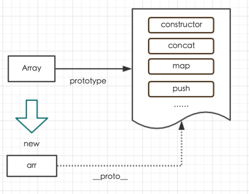
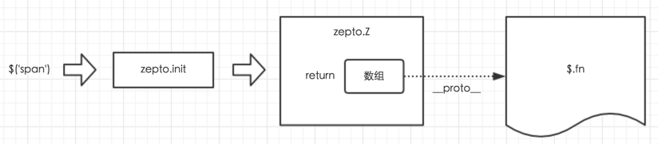
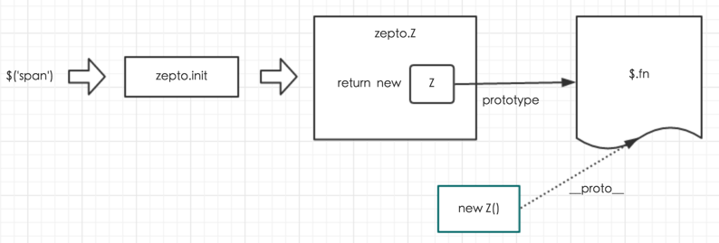

最近看了 [zepto 设计和源码分析](http://www.imooc.com/learn/745) ，耳目一新，作者没有老套的去讲各个方法怎么实现的，能做些什么

而是讲了许多为什么源码要这样去设计，这样设计有什么好处，也分享了一些自己的看源码心得

一口气看完，收货良多，不光了解了 `Zepto` 的设计理念，同时也重温了 `JavaScript` 原型链的一些相关知识，在此记录一些笔记和涉及到的一些知识点

同时也感谢作者分享了加注版本的 `zepto` 源码，这样读起来也轻松不少，地址见：[zepto-core-1.1.6 源码注视](http://www.kancloud.cn/wangfupeng/zepto-design-srouce/173692)


## 大体结构

看了以后会发现，这一类库的最外层的设计都是大同小异的

```js
var Zepto = (function () {

  var $, zepto = {}

  // ... ...
  // 一些判断方法，初始化操作

  zepto.init = function (selector, context) {

    // ...

    return zepto.Z(dom, selector)
  }


  $ = function (selector, context) {
    return zepto.init(selector, context)
  }

  // ... ...
  // 一些挂载在 $ 上的方法，比如 $.each，$.map 等

  // 这里是一些挂载在 $.fn 上的方法 $.fn = {...}

  zepto.Z.prototype = $.fn

  // ...

  return $

})()

window.Zepto = Zepto
window.$ === undefined && (window.$ = Zepto)
```

首先，`Zepto` 是一个自执行的匿名函数（`IIFE`），最后挂载在 `window` 对象身上，`window.Zepto` 和 `window.$` 都赋值给了 `Zepto` 这个变量

当我们平时在使用的时候，比如 `$('div')`，依次会按照以下顺序来执行

```js
$ = function(selector, context){
  return zepto.init(selector, context)
}

===>

zepto.init = function(selector, context) {

  // ...

  return zepto.Z(dom, selector)
}

===>

zepto.Z = function(dom, selector) {
  dom = dom || []
  dom.__proto__ = $.fn
  dom.selector = selector || ''
  return dom
}
```

接下来，我们分步来看


## zepto.init

查看源码可以发现，其实 `$` 也是一个函数（同理也可得知 `Zepto` 也是一个函数）

```js
$ = function(selector, context){
  return zepto.init(selector, context)
}
```

它本身并没没有做什么具体的操作，而是直接返回了一个函数 `zepto.init(selector, context)`

查看源码可知，`init` 函数中添加了一系列判断来梳理 `selector` 参数的各种可能，然后根据不同条件下对 `dom` 变量进行赋值，最终，它将通过 `selector` 一起传递给 `zepto.Z` 函数并返回值

我们一条一条的来看

```js
zepto.init = function (selector, context) {

  var dom
  // 如果 selector 为空（null，undefined...），即 $() 那么就直接返回一个空的 Zepto 对象
  if (!selector) return zepto.Z()

  // 参数是 String 的情况（$('p')，$('<div>')）
  else if (typeof selector == 'string') {

    // 字符串的情况，一般有两种：
    // 第一，一段 html 代码，旨在通过 zepto 生成 dom 对象
    // 第二，一段查询字符串，旨在通过 zepto 查找 dom 对象
    // 将查询结果存储到 dom 变量中

    // 先剔除掉两边的空格
    selector = selector.trim()

    // fragmentRE = /^\s*<(\w+|!)[^>]*>/
    // 取出 html 代码中第一个 html 标签（或注释），如取出 <p>123</p><h1>345</h1> 中的 <p>
    if (selector[0] == '<' && fragmentRE.test(selector))

      // 第一，RegExp.$1 取出来的就是第一个标签名称，即正则中 (\w+|!) 对应的内容
      // 第二，此时的 context 应该传入的是 css 属性对象（这里会产生歧义，老版的不会传入 context）
      dom = zepto.fragment(selector, RegExp.$1, context), selector = null

    // 如果 selector 不是 html 字符串标签，并且 context 有值，则从 context 中查找
    else if (context !== undefined) return $(context).find(selector)

    // 除了以上情况，就从整个 document 执行 qsa 的查找
    // qsa 就是 document.querySelectAll
    else dom = zepto.qsa(document, selector)
  }

  // 如果是函数，则放在 dom ready 时执行
  // 即 $(document).ready(function(){ ... })
  else if (isFunction(selector)) return $(document).ready(selector)

  // 如果传入的参数本身就已经是 zepto 对象，则直接返回
  else if (zepto.isZ(selector)) return selector

  else {

    // compact 函数，剔除数组中 == null（undefined） 的元素
    if (isArray(selector)) dom = compact(selector)

    // 如果传入的是 object，直接强制塞进一个数组
    else if (isObject(selector)) dom = [selector], selector = null


    // 从此往下，和上文 selector 是字符串的情况处理相同


    // fragmentRE.test 即判断字符串是否是 html 标签开头（即是否是 html fragement）
    else if (fragmentRE.test(selector))

      // 此时，context 也是属性集合，不是容器（这里会产生歧义，老版的不会传入 context）
      // 然后清空 selector 不妨碍下面的判断
      dom = zepto.fragment(selector.trim(), RegExp.$1, context), selector = null

    else if (context !== undefined) return $(context).find(selector)

    else dom = zepto.qsa(document, selector)
  }

  // 最后通过 zepto.Z 创建了对象
  // 这里的 dom 其实就是一个数组
  return zepto.Z(dom, selector)
}
```

最后 `init` 函数的结构梳理如下：

```js
zepto.init = function (selector, context) {

  var dom

  // 分情况对 dom 赋值：
  // 1. selector 为空
  // 2. selector 是字符串，其中又分好几种情况
  // 3. selector 是函数
  // 4. 其他情况，例如 selector 是数组、对象等

  // 最后返回
  return zepto.Z(dom, selector)

}
```


## zepto.Z

先来看看之前的 `zepto.Z` 的实现：

```js
zepto.Z = function (dom, selector) {

  // 首先，dom 是一个数组
  dom = dom || []

  // 然后把它的隐式原型（__proto__）赋值给 $.fn
  dom.__proto__ = $.fn

  dom.selector = selector || ''

  return dom

}
```

首先需要明确，每一个函数，都有一个 `prototype` 的属性，同时又有一个 `constructor` 属性，指向该函数自身，如下图所示：


所有通过函数 `new` 出来的对象，都有一个 `__proto__`（隐式原型）指向这个函数的 `prototype`（显式原型）

```js
var arr = [];  // 相当于 new Array()
arr.__proto__ === Array.prototype;  // true 
```



所以当你想要使用一个对象（或者一个数组）的某个功能时：

* 如果该对象本身具有这个功能，则直接使用

* 如果该对象本身没有这个功能，则去 `__proto__` 中找（即构造函数的原型链上）


这就是为何数组会有 `concat`、`push` 等方法，因为这些方法都存在于 `Array.prototype` 中

这也就解释了为什么 `Zepto` 取得的元素数组（`$('p')` 返回的是一个元素数组）上会有类似 `addClass` 等方法了，原因就是 `__proto__` 肯定是被修改过的，而不仅仅是 `Array.prototype`

这样再去看上面的 `zepto.Z` 函数就很明了了

新版的 `zepto.Z` 函数如下：

```js
function Z(dom, selector) {
  var i, len = dom ? dom.length : 0
  for (i = 0; i < len; i++) this[i] = dom[i]
  this.length = len
  this.selector = selector || ''
}

zepto.Z = function (dom, selector) {
  return new Z(dom, selector)
}

$.fn = {
  // ...
}

zepto.Z.prototype = Z.prototype = $.fn
```

相较于老版，新版的 `zepto.Z` 函数直接将构造函数的原型修改了，即 `Z.prototype = $.fn`

经过这样一改，构造函数再 `new` 出来的对象的隐式原型 `__proto__` 自然就指向了 `$.fn`，而这时返回的是一个**对象数组**，相对于之前的单纯数组，本质上更灵活一些


## 两者区别如下

之前的 `zepto.Z` 函数




现在的 `zepto.Z` 函数




`Zepto` 整体的设计就是以上这些了，明白了 `__proto__`（隐式原型）和 `prototype`（显式原型）再来看的话就会清晰不少

其他各个函数，方法的实现，就慢慢去读源码来摸索认识了

