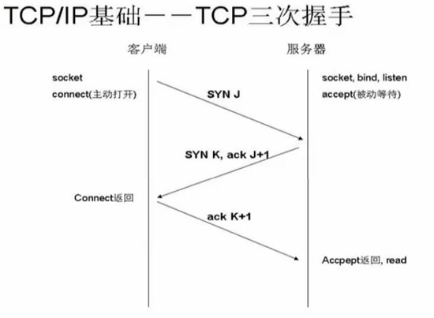

## HTTP 与 TCP


## TCP 连接

手机等一些移动设备，能够使用联网功能是因为手机**底层**实现了 `TCP/IP` 协议，可以使手机终端通过无线网络建立 `TCP` 连接

`TCP` 协议可以对上层网络提供接口，使上层网络数据的传输建立在"无差别"的网络之上

在具体介绍之前，先来弄清一些基本概念

* `SYN`（`synchronous`）是 `TCP/IP` 建立连接时使用的握手信号，表示建立连接

* `FIN` 表示关闭连接

* `ACK`（`Acknowledgement`）既确认字符，在数据通信中，接收站发给发送站的一种传输类控制字符，表示发来的数据已确认接收无误，表示响应

* `LISTEN` 表示服务器端的某个 `SOCKET` 处于监听状态，可以接受连接了

* `MIME`类型 在把输出结果传送到浏览器上的时候，浏览器必须启动适当的应用程序来处理这个输出文档

  * 这可以通过多种类型 `MIME`（多功能网际邮件扩充协议）来完成，在 `HTTP` 中，`MIME` 类型被定义在 `Content-Type header` 中


`URL` 统一资源定位符（`URL`）也被称为网页地址，是因特网上标准的资源的地址，现在几乎所有的 `URI` 都是 `URL`，如下所示

```js                      
 协议      ip 地址      资源的具体位置
  |          |              |
  |          |              |
-----  ----------------  -------
HTTP://192.168.1.1:8888/index.html
```

* 第一部分是协议（或称为服务方式）

* 第二部分是存有该资源的主机 `IP` 地址（有时也包括端口号）

* 第三部分是主机资源的具体位置（如目录和文件名等）

* 第一部分和第三部分之间用 `'：//'` 符号隔开，第二部分和第三部分用 `'/'` 符号分隔，第一部分和第二部分是不可缺少的，第三部分有时也可以省略


## TCP 三层握手

我们要和服务端连接 `TCP` 连接，需要通过三次连接，包括：**请求**，**确认**，**建立连接**，即传说中的"三次握手协议"





* 第一次握手：客户端发送 `syn` 包`（syn = j）`到服务器，并进入 `SYN_SEND` 状态，等待服务器确认

* 第二次握手：服务器收到 `syn` 包，必须确认客户的 `SYN（ack = j + 1）`，同时自己也发送一个 `SYN` 包`（syn = k）`，即 `SYN + ACK` 包，此时服务器进入 `SYN_RECV` 状态

* 第三次握手：客户端收到服务器的 `SYN ＋ ACK` 包，向服务器发送确认包 `ACK（ack=k+1）`，此包发送完毕，客户端和服务器进入 `ESTABLISHED` 状态，完成三次握手


**握手过程中传送的包里不包含数据**，三次握手完毕后，客户端与服务器才正式开始传送数据

理想状态下，`TCP` 连接一旦建立，在通信双方中的任何一方主动关闭连接之前，`TCP` 连接都将被一直保持下去

但是由于 `TCP` 连接是全双工的，所以每个方向都必须单独进行关闭，这原则是当一方完成它的数据发送任务后就能发送一个 `FIN` 来终止这个方向的连接

收到一个 `FIN` 只意味着这一方向上没有数据流动，一个 `TCP` 连接在收到一个 `FIN` 后仍能发送数据，首先进行关闭的一方将执行主动关闭，而另一方执行被动关闭


## TCP 四次挥手

断开连接时服务器和客户端均可以主动发起断开 `TCP` 连接的请求，断开过程需要经过"四次挥手"


* 第一次挥手：`TCP` 客户端发送一个 `FIN`，用来关闭客户到服务器的数据传送

* 第二次挥手：服务器收到这个 `FIN`，它发回一个 `ACK`，确认序号为收到的序号加 `1`，和 `SYN` 一样，一个 `FIN` 将占用一个序号

* 第三次挥手：服务器关闭客户端的连接，发送一个 `FIN` 给客户端

* 第四次挥手：客户端发回 `ACK` 报文确认，并将确认序号设置为收到序号加 `1`


那么这里就会有一个问题了，为什么建立连接协议是三次握手，而关闭连接却是四次握手呢？

这是因为服务端的 `LISTEN` 状态下的 `SOCKET` 当收到 `SYN` 报文的建连请求后，它可以把 `ACK` 和 `SYN`（`ACK` 起应答作用，而 `SYN` 起同步作用）放在一个报文里来发送

但关闭连接时，当收到对方的 `FIN` 报文通知时，它仅仅表示对方没有数据发送给你了，但未必你所有的数据都全部发送给对方了，所以你可以未必会马上会关闭 `SOCKET`

也即你可能还需要发送一些数据给对方之后，再发送 `FIN` 报文给对方来表示你同意现在可以关闭连接了，所以它这里的 `ACK` 报文和 `FIN` 报文多数情况下都是分开发送的


## HTTP 协议

`HTTP` 协议即**超文本传送协议**(`Hypertext Transfer Protocol`)，定义了浏览器怎样向万维网服务器请求万维网文档，以及服务器怎样把文档传送给浏览器

从层次的角度看，`HTTP` 是面向（`transaction-oriented`）应用层协议，它是万维网上能够可靠地交换文件（包括文本，声音，图像等各种多媒体文件）的重要基础，也是 `Web` 联网的基础，也是手机联网常用的协议之一，`HTTP` 协议是建立在 `TCP` 协议之上的一种应用


#### 工作流程

一次 `HTTP` 操作称为一个**事务**，其工作过程可分为**四步**

* 1）首先客户机与服务器需要建立连接，只要单击某个超级链接，`HTTP` 的工作开始

* 2）建立连接后，客户机发送一个请求给服务器，请求方式的格式为：统一资源标识符（`URL`）、协议版本号、后边是 `MIME` 信息包括请求装饰符、客户机信息和可能的内容

* 3）服务器接到请求后，给予相应的响应信息，其格式为一个状态行，包括信息的协议版本号、一个成功或错误的代码，后边是 `MIME` 信息包含服务器信息、实体信息和可能的内容

* 4）客户端接收服务器所返回的信息通过浏览器显示在用户的显示屏上，然后客户机与服务器断开连接


如果在以上过程中的某一步出现错误，那么产生错误的信息将返回到客户端，由显示屏输出，对于用户来说，这些过程是由 `HTTP` 自己完成的，用户只要用鼠标点击，等待信息显示就可以了

这样就限制了使用 `HTTP` 协议，无法实现在客户端没有发起请求的时候，服务器将消息推送给客户端

需要注意的是：`HTTP` 协议是一个无状态的协议，同一个客户端的这次请求和上次请求是没有对应关系


`HTTP` 连接最显著的特点是客户端发送的每次请求都需要服务器回送响应（**永远都是客户端发送请求，服务器回送响应**），在请求结束后，会主动释放连接

从建立连接到关闭连接的过程称为"一次连接"

* 1）在 `HTTP 1.0` 中，客户端的每次请求都要求建立一次单独的连接，在处理完本次请求后，就自动释放连接

* 2）在 `HTTP 1.1` 中则可以在一次连接中处理多个请求，并且多个请求可以重叠进行，不需要等待一个请求结束后再发送下一个请求


由于 `HTTP` 在每次请求结束后都会主动释放连接，因此 `HTTP` 连接是一种"短连接"，要保持客户端程序的在线状态，需要不断地向服务器发起连接请求

通常的做法是即使不需要获得任何数据，客户端也保持每隔一段固定的时间向服务器发送一次"保持连接"的请求，服务器在收到该请求后对客户端进行回复，表明知道客户端"在线"

若服务器长时间无法收到客户端的请求，则认为客户端"下线"，若客户端长时间无法收到服务器的回复，则认为网络已经断开


## socket 

网络上的两个程序通过一个双向的通信连接实现数据的交换，这个连接的一端称为一个 `socket`

套接字（`socket`）是通信的基石，是支持 `TCP/IP` 协议的网络通信的基本操作单元，它是网络通信过程中端点的抽象表示，包含进行网络通信必须的五种信息

* 连接使用的协议

* 本地主机的 `IP` 地址

* 本地进程的协议端口

* 远地主机的 `IP` 地址

* 远地进程的协议端口


应用层通过传输层进行数据通信时，`TCP` 会遇到同时为多个应用程序进程提供并发服务的问题，多个 `TCP` 连接或多个应用程序进程可能需要通过同一个 `TCP` 协议端口传输数据

为了区别不同的应用程序进程和连接，许多计算机操作系统为应用程序与 `TCP／IP` 协议交互提供了套接字(`Socket`)接口，应用层可以和传输层通过 `Socket` 接口，区分来自不同应用程序进程或网络连接的通信，实现数据传输的并发服务


#### 建立 socket 连接

建立 `Socket` 连接至少需要一对套接字，其中一个运行于客户端，称为 `ClientSocket`，另一个运行于服务器端，称为 `ServerSocket`

套接字之间的连接过程分为三个步骤：**服务器监听**，**客户端请求**，**连接确认**


* 服务器监听：服务器端套接字并不定位具体的客户端套接字，而是处于等待连接的状态，实时监控网络状态，等待客户端的连接请求

* 客户端请求：指客户端的套接字提出连接请求，要连接的目标是服务器端的套接字，为此，客户端的套接字必须首先描述它要连接的服务器的套接字，指出服务器端套接字的地址和端口号，然后就向服务器端套接字提出连接请求

* 连接确认：当服务器端套接字监听到或者说接收到客户端套接字的连接请求时，就响应客户端套接字的请求，建立一个新的线程，把服务器端套接字的描述发给客户 端，一旦客户端确认了此描述，双方就正式建立连接，而服务器端套接字继续处于监听状态，继续接收其他客户端套接字的连接请求


#### SOCKET 连接与 TCP 连接

创建 `Socket` 连接时，可以指定使用的传输层协议，`Socket` 可以支持不同的传输层协议（`TCP` 或 `UDP`（用户数据报协议，与 `TCP` 协议一样用于处理数据包，是一种无连接的协议））

当使用 `TCP` 协议进行连接时，该 `Socket` 连接就是一个 `TCP` 连接


#### Socket 连接与 HTTP 连接

由于通常情况下 `Socket` 连接就是 `TCP` 连接，因此 `Socket` 连接一旦建立，通信双方即可开始相互发送数据内容，直到双方连接断开

但在实际网络应用中，客户端到服务器之间的通信往往需要穿越多个中间节点，例如路由器、网关、防火墙等，大部分防火墙默认会关闭长时间处于非活跃状态的连接而导 致 `Socket` 连接断连，因此需要通过轮询告诉网络，该连接处于活跃状态

而 `HTTP` 连接使用的是"**请求—响应**"的方式，不仅在请求时需要先建立连接，而且需要客户端向服务器发出请求后，服务器端才能回复数据

很多情况下，需要服务器端主动向客户端推送数据，保持客户端与服务器数据的实时与同步

此时若双方建立的是 `Socket` 连接，服务器就可以直接将数据传送给客户端，若双方建立的是 `HTTP` 连接，则服务器需要等到客户端发送一次请求后才能将数据传回给客户端，因此，客户端定时向服务器端发送连接请求，不仅可以保持在线，同时也是在"询问"服务器是否有新的数据，如果有就将数据传给客户端

## 总结

* `HTTP` 是要基于 `TCP` 连接基础上的，简单的说，`TCP` 就是单纯建立连接，不涉及任何我们需要请求的实际数据，简单的传输，`HTTP` 是用来收发数据，即实际应用上来的

  * `TCP` 是**底层通讯协议**，定义的是 **数据传输和连接方式的规范**

  * `HTTP` 是**应用层协议**，定义的是 **传输数据的内容的规范**

* `HTTP` 协议中的数据是利用 `TCP` 协议传输的，所以支持 `HTTP` 也就一定支持 `TCP`

* `HTTP` 支持的是 `www` 服务，而 `TCP/IP` 是协议，它是 `Internet` 国际互联网络的基础，`TCP/IP` 是网络中使用的基本的通信协议

* `TCP/IP` 实际上是一组协议，它包括上百个各种功能的协议，如：远程登录、文件传输和电子邮件等，而 `TCP` 协议和 `IP` 协议是保证数据完整传输的两个基本的重要协议，通常说 `TCP/IP` 是 `Internet` 协议族，而不单单是 `TCP` 和 `IP`


## 扩展：HTTP 响应码信息


* `HTTP` 状态返回代码 `1xx`（临时响应） 表示临时响应并需要请求者继续执行操作的状态代码

  * 100   （继续） 请求者应当继续提出请求，服务器返回此代码表示已收到请求的第一部分，正在等待其余部分 

  * 101   （切换协议） 请求者已要求服务器切换协议，服务器已确认并准备切换


* `HTTP` 状态返回代码 `2xx` （成功） 表示成功处理了请求的状态代码


  * 200   （成功）  服务器已成功处理了请求， 通常，这表示服务器提供了请求的网页

  * 201   （已创建）  请求成功并且服务器创建了新的资源

  * 202   （已接受）  服务器已接受请求，但尚未处理

  * 203   （非授权信息）  服务器已成功处理了请求，但返回的信息可能来自另一来源

  * 204   （无内容）  服务器成功处理了请求，但没有返回任何内容

  * 205   （重置内容） 服务器成功处理了请求，但没有返回任何内容

  * 206   （部分内容）  服务器成功处理了部分 `GET` 请求


* `HTTP` 状态返回代码 `3xx` （重定向） 表示要完成请求，需要进一步操作， 通常，这些状态代码用来重定向

  * 300   （多种选择）  针对请求，服务器可执行多种操作， 服务器可根据请求者 (`user agent`) 选择一项操作，或提供操作列表供请求者选择

  * 301   （永久移动）  请求的网页已永久移动到新位置， 服务器返回此响应（对 `GET` 或 `HEAD` 请求的响应）时，会自动将请求者转到新位置

  * 302   （临时移动）  服务器目前从不同位置的网页响应请求，但请求者应继续使用原有位置来进行以后的请求

  * 303   （查看其他位置） 请求者应当对不同的位置使用单独的 `GET` 请求来检索响应时，服务器返回此代码

  * 304   （未修改） 自从上次请求后，请求的网页未修改过， 服务器返回此响应时，不会返回网页内容

  * 305   （使用代理） 请求者只能使用代理访问请求的网页， 如果服务器返回此响应，还表示请求者应使用代理

  * 307   （临时重定向）  服务器目前从不同位置的网页响应请求，但请求者应继续使用原有位置来进行以后的请求


* `HTTP` 状态返回代码 `4xx`（请求错误） 这些状态代码表示请求可能出错，妨碍了服务器的处理

  * 400   （错误请求） 服务器不理解请求的语法

  * 401   （未授权） 请求要求身份验证， 对于需要登录的网页，服务器可能返回此响应

  * 403   （禁止） 服务器拒绝请求

  * 404   （未找到） 服务器找不到请求的网页

  * 405   （方法禁用） 禁用请求中指定的方法

  * 406   （不接受） 无法使用请求的内容特性响应请求的网页

  * 407   （需要代理授权） 此状态代码与 `401`（未授权）类似，但指定请求者应当授权使用代理

  * 408   （请求超时）  服务器等候请求时发生超时

  * 409   （冲突）  服务器在完成请求时发生冲突， 服务器必须在响应中包含有关冲突的信息

  * 410   （已删除）  如果请求的资源已永久删除，服务器就会返回此响应

  * 411   （需要有效长度） 服务器不接受不含有效内容长度标头字段的请求

  * 412   （未满足前提条件） 服务器未满足请求者在请求中设置的其中一个前提条件

  * 413   （请求实体过大） 服务器无法处理请求，因为请求实体过大，超出服务器的处理能力

  * 414   （请求的 URI 过长） 请求的 `URI`（通常为网址）过长，服务器无法处理

  * 415   （不支持的媒体类型） 请求的格式不受请求页面的支持

  * 416   （请求范围不符合要求） 如果页面无法提供请求的范围，则服务器会返回此状态代码

  * 417   （未满足期望值） 服务器未满足"期望"请求标头字段的要求


* `HTTP` 状态返回代码 `5xx`（服务器错误） 这些状态代码表示服务器在尝试处理请求时发生内部错误， 这些错误可能是服务器本身的错误，而不是请求出错

  * 500   （服务器内部错误）  服务器遇到错误，无法完成请求

  * 501   （尚未实施） 服务器不具备完成请求的功能， 例如，服务器无法识别请求方法时可能会返回此代码

  * 502   （错误网关） 服务器作为网关或代理，从上游服务器收到无效响应

  * 503   （服务不可用） 服务器目前无法使用（由于超载或停机维护）， 通常，这只是暂时状态

  * 504   （网关超时）  服务器作为网关或代理，但是没有及时从上游服务器收到请求

  * 505   （`HTTP` 版本不受支持） 服务器不支持请求中所用的 `HTTP` 协议版本

