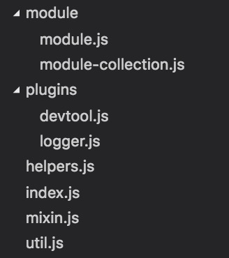

一篇系列文章，整理记录一下对于 `Vuex` 源码研究的一些相关笔记

[第一部分：框架核心流程](https://github.com/heptaluan/blog/blob/master/backups/vue/08.md)

[第二部分：初始化装载与注入](https://github.com/heptaluan/blog/blob/master/backups/vue/09.md)

[第三部分：Store](https://github.com/heptaluan/blog/blob/master/backups/vue/10.md)

[第四部分：installModule, resetStoreVM, plugins](https://github.com/heptaluan/blog/blob/master/backups/vue/11.md)

[第五部分：源码整体汇总](https://github.com/heptaluan/blog/blob/master/backups/vue/12.md)

----

#### 大致流程如下图所示

`Vuex` 为 `Vue Components` 建立起了一个完整的生态圈，包括开发中的 `API` 调用一环，围绕这个生态圈，简要介绍一下各模块在核心流程中的主要功能：

* `Vue Components`：`Vue` 组件，`HTML` 页面上，负责接收用户操作等交互行为，执行 `dispatch` 方法触发对应 `action` 进行回应

* `dispatch`：操作行为触发方法，是唯一能执行 `action` 的方法

* `actions`：操作行为处理模块，负责处理 `Vue Components` 接收到的所有交互行为，包含 同步/异步 操作，支持多个同名方法，按照注册的顺序依次触发，向后台 `API` 请求的操作就在这个模块中进行，包括触发其他 `action` 以及提交 `mutation` 的操作，该模块提供了 `Promise` 的封装，以支持 `action` 的链式触发

* `commit`：状态改变提交操作方法，对 `mutation` 进行提交，是唯一能执行 `mutation` 的方法

* `mutations`：状态改变操作方法，是 `Vuex` 修改 `state` 的唯一推荐方法，其他修改方式在严格模式下将会报错，该方法只能进行同步操作，且方法名只能全局唯一，操作之中会有一些 `hook` 暴露出来，以进行 `state` 的监控等

* `state`：页面状态管理容器对象，集中存储 `Vue components` 中 `data` 对象的零散数据，全局唯一，以进行统一的状态管理，页面显示所需的数据从该对象中进行读取，利用 `Vue` 的细粒度数据响应机制来进行高效的状态更新

* `getters`：`state` 对象读取方法，图中没有单独列出该模块，应该被包含在了 `render` 中，`Vue Components` 通过该方法读取全局 `state` 对象

总结如下：

`Vue` 组件接收交互行为，调用 `dispatch` 方法触发 `action` 相关处理，若页面状态需要改变，则调用 `commit` 方法提交 `mutation` 修改 `state`，通过 `getters` 获取到 `state` 新值，重新渲染 `Vue Components`，界面随之更新

## 目录结构

* `module`：提供 `module` 对象与 `module` 对象树的创建功能

* `plugins`：提供开发辅助插件，如 "时光穿梭" 功能，`state` 修改的日志记录功能等

* `helpers.js`：提供 `action`、`mutations` 以及 getters 的查找 `API`

* `index.js`：是源码主入口文件，提供 `store` 的各 `module` 构建安装

* `mixin.js`：提供了 `store` 在 Vue 实例上的装载注入

* `util.js`：提供了工具方法如 `find`、`deepCopy`、`forEachValue` 以及 `assert` 等方法

