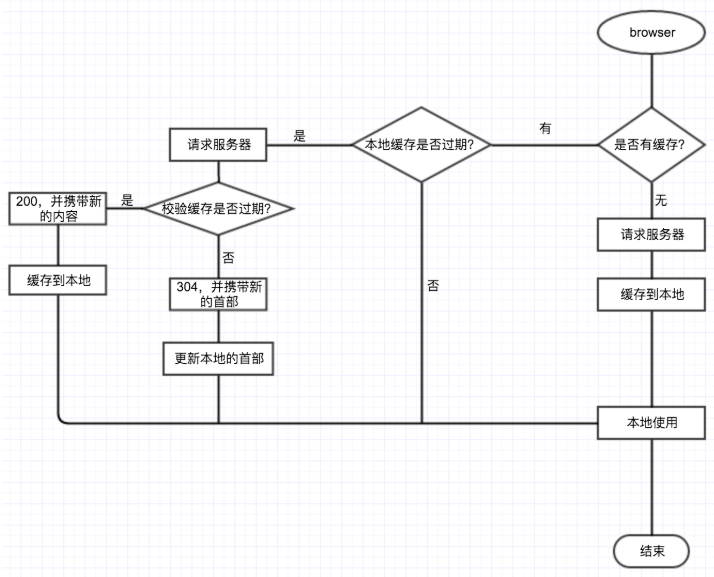

## HTTP 缓存机制

先来简单说一下 `Web` 缓存，所谓 `Web` 缓存，是一种保存 `Web` 资源副本并在下次请求时直接使用该副本的技术

`Web` 缓存可以分为这几种，浏览器缓存、`CDN` 缓存、服务器缓存、数据库数据缓存

因为可能会直接使用副本免于重新发送请求或者仅仅确认资源没变无需重新传输资源实体

`Web` 缓存可以减少延迟加快网页打开速度、重复利用资源减少网络带宽消耗、降低请求次数或者减少传输内容从而减轻服务器压力，


## 缓存的流程

简单来说，浏览器在请求一个资源时，使用缓存的流程大概如下，

* 首先浏览器会判断，这个资源是否有缓存，没有的话，正常请求

* 如果有缓存的话，浏览会判断缓存是否过期，如果缓存没有过期，则直接使用，此时就是 `200（from cache）`，通过上次缓存留下的 `cache-control`，`max-age` 和 `Expires`（需要注意的是，`cache-control` 的优先级高于 `Expires`，下面会详细介绍）

* 如果浏览器的缓存过期了，它会请求服务器，服务器会校验缓存的数据是否真的发生了更改

  * 如果服务器端发现数据没有变，就会返回一个 `304` 告诉浏览器，你请求的数据 `"Not Modified"`，可以继续用缓存，同时浏览器会更新缓存首部的过期时间等信息
  
  * 这里浏览器发起请求时，会用到上次缓存首部的 `Last-Modified/E-tag`
  
    * 具体做法是取出上次缓存的 `Last-Modified` 的值，放在本次请求 `header` 的 `If-Modified-Since` 中
    
    * 取出上次缓存的 `E-tag` 的值，放在本次请求 `header` 中的 `If-None-Match` 中
    
    * 服务器会据此判断资源是否发生过修改，浏览器中的缓存是否依然可用

* 如果服务器端修改了上次缓存的内容，则直接返回 `200`，并携带新的内容




## 强缓存和协商缓存

浏览器 `HTTP` 缓存可以分为**强缓存**和**协商缓存**，强缓存和协商缓存最大也是最根本的区别是

强缓存命中的话不会发请求到服务器（比如 `chrome` 中的 `200 from memory cache`）

协商缓存一定会发请求到服务器，通过资源的请求首部字段验证资源是否命中协商缓存，如果协商缓存命中，服务器会将这个请求返回

但是不会返回这个资源的实体，而是通知客户端可以从缓存中加载这个资源（`304 not modified`）

所以上图可以简单的调整为


而浏览器 `HTTP` 缓存由 `HTTP` 报文的首部字段决定


浏览器对于请求资源，拥有一系列成熟的缓存策略

按照发生的时间顺序分别为存储策略，过期策略，协商策略，其中存储策略在收到响应后应用，过期策略和协商策略则在发送请求前应用

下面表格表示的就是 `http header` 中与缓存有关的 `key`

|`key`|	描述|	存储策略|	过期策略|	协商策略|
|-|-|-|-|-|
|`Pragma`|`http1.0` 字段，指定缓存机制|✔️|✔️||
|`Cache-Control`|指定缓存机制，覆盖其它设置|✔️|||
|`Expires`|`http1.0` 字段，指定缓存的过期时间||✔️||
|`Last-Modified`|资源最后一次的修改时间|||✔️|
|`ETag`|唯一标识请求资源的字符串|||✔️|

而缓存协商策略用于重新验证缓存资源是否有效，有关的 `key` 如下

|key|	描述|
|-|-|
|`If-Modified-Since`|	缓存校验字段，值为资源最后一次的修改时间，即上次收到的 `Last-Modified` 值|
|`If-Unmodified-Since`|	同上，处理方式与之相反|
|`If-Match`|	缓存校验字段，值为唯一标识请求资源的字符串，即上次收到的 `ETag` 值|
|`If-None-Match`|	同上，处理方式与之相反|


下面就按控制强缓存的字段按优先级介绍


## Pragma 

`Pragma` 是 `HTTP/1.1` 之前版本遗留的通用首部字段，仅作为于 `HTTP/1.0` 的向后兼容而使用

虽然它是一个通用首部，但是它在响应报文中时的行为没有规范，依赖于浏览器的实现

`RFC` 中该字段只有 `no-cache` 一个可选值，会通知浏览器不直接使用缓存，要求向服务器发请求校验新鲜度，因为它优先级最高，**当存在时一定不会命中强缓存**


## Cache-Control

`Cache-Control` 是一个通用首部字段，也是 `HTTP/1.1` 控制浏览器缓存的主流字段，和浏览器缓存相关的是如下几个响应指令


|指令|	参数|	说明|
|-|-|-|
|`private`|	无|	表明响应只能被单个用户缓存，不能作为共享缓存（即代理服务器不能缓存它）|
|`public`|	可省略|	表明响应可以被任何对象（包括：发送请求的客户端，代理服务器，等等）缓存|
|`no-cache`|	可省略|	缓存前必需确认其有效性|
|`no-store`|	无|	不缓存请求或响应的任何内容|
|`max-age=[s]`|	必需|	响应的最大值|

#### max-age（单位为 s）

设置缓存的存在时间，相对于发送请求的时间，只有响应报文首部设置 `Cache-Control` 为非 `0` 的 `max-age` 或者设置了大于请求日期的 `Expires`才有可能命中强缓存

当满足这个条件，同时响应报文首部中 `Cache-Control` 不存在 `no-cache`、`no-store` 且请求报文首部不存在 `Pragma` 字段，才会真正命中强缓存


#### no-cache 

表示请求必须先与服务器确认缓存的有效性，如果有效才能使用缓存（协商缓存），无论是响应报文首部还是请求报文首部出现这个字段均一定不会命中强缓存

`Chrome` 硬性重新加载（`Command + shift + R`）会在请求的首部加上 `Pragma：no-cache` 和 `Cache-Control：no-cache`

#### no-store

表示禁止浏览器以及所有中间缓存存储任何版本的返回响应，一定不会出现强缓存和协商缓存，适合个人隐私数据或者经济类数据

#### public

表明响应可以被浏览器、`CDN` 等等缓存

#### private

响应只作为私有的缓存，不能被 `CDN` 等缓存，如果要求 `HTTP` 认证，响应会自动设置为 `private`


## Expires

`Expires` 是一个响应首部字段，它指定了一个日期/时间，在这个时间/日期之前，`HTTP` 缓存被认为是有效的

无效的日期比如 `0`，表示这个资源已经过期了，如果同时设置了 `Cache-Control` 响应首部字段的 `max-age`

则 `Expires` 会被忽略，它也是 `HTTP/1.1` 之前版本遗留的通用首部字段，仅作为于 `HTTP/1.0` 的向后兼容而使用


下面再来看看控制协商缓存的字段


## Last-Modified / If-Modified-Since

`If-Modified-Since` 是一个请求首部字段，并且只能用在 `GET` 或者 `HEAD` 请求中

`Last-Modified` 是一个响应首部字段，包含服务器认定的资源作出修改的日期及时间

当带着 `If-Modified-Since` 头访问服务器请求资源时，服务器会检查 `Last-Modified`

如果 `Last-Modified` 的时间早于或等于 `If-Modified-Since` 则会返回一个不带主体的 `304` 响应，否则将重新返回资源

需要注意的是，如果 `HTTP/1.1` 缓存或服务器收到的请求既带有 `If-Modified-Since`，又带有 `etag` 实体标签条件首部

那么只有这两个条件都满足时，才能返回 `304 NotModified` 响应

语法格式如下

```console
If-Modified-Since: <day-name>, <day> <month> <year> <hour>:<minute>:<second> GMT

Last-Modified: <day-name>, <day> <month> <year> <hour>:<minute>:<second> GMT
```


## ETag / If-None-Match

`ETag` 是一个响应首部字段，它是根据实体内容生成的一段 `hash` 字符串，标识资源的状态，由服务端产生

`If-None-Match` 是一个条件式的请求首部，如果请求资源时在请求首部加上这个字段，值为之前服务器端返回的资源上的 `ETag`

则当且仅当服务器上没有任何资源的 `ETag` 属性值与这个首部中列出的时候，服务器才会返回带有所请求资源实体的 `200` 响应

否则服务器会返回不带实体的 `304` 响应，`ETag` 优先级比 `Last-Modified` 高，同时存在时会以 `ETag` 为准

语法格式如下

```console
If-None-Match: <etag_value>

If-None-Match: <etag_value>, <etag_value>, …

If-None-Match: *
```

`ETag` 属性之间的比较采用的是弱比较算法，即两个文件除了每个比特都相同外，内容一致也可以认为是相同的

例如，如果两个页面仅仅在页脚的生成时间有所不同，就可以认为二者是相同的

因为 `ETag` 的特性，所以相较于 `Last-Modified` 有一些优势

* 某些情况下服务器无法获取资源的最后修改时间

* 资源的最后修改时间变了但是内容没变，使用 `ETag` 可以正确缓存

* 如果资源修改非常频繁，在秒以下的时间进行修改，`Last-Modified` 只能精确到秒


## 整体流程


## 优先级

若同时存在各种缓存头时，各缓存头优先级及生效情况如下

* 强缓存和对比缓存同时存在，如果强缓存还在生效期则强制缓存覆盖对比缓存，对比缓存不生效

  * 如果强缓存不在有效期，对比缓存生效，即：强缓存优先级 > 对比缓存优先级

* `pragma`，和 `cache-control` 类似，前者是 `http1.0` 内容，后者是 `http1.1` 内容

  * 并且 `pragma` 优先级 > `cache-control` 优先级，不过前者目前基本不使用

* 强缓存 `expires` 和 `cache-control` 同时存在时，则 `cache-control` 会覆盖 `expires`

  * `expires` 无论有没有过期都无效，即 `cache-control` 优先级 > `expires` 优先级

* 对比缓存 `Etag` 和 `Last-Modified` 同时存在时，则 `Etag` 会覆盖 `Last-Modified`

  * `Last-Modified` 不会生效，即 `ETag`优先级 > `Last-Modified` 优先级

针对于一般的项目，由于 `css` 和 `js` 在打包时加了 `md5` 值，建议直接使用强缓存，并且 `expires` 和 `cache-control` 同时使用，建议设置时长为 `7` 天较为妥当，图片文件由于没有加 `md5` 值，建议采用对比缓存，`html` 文件也建议采用对比缓存


#### 浏览器的不同表现

需要注意的是，当我们不设置 `cache-control`，只设置对比缓存，在不同浏览器下会有不同的表现

`chrome` 会直接从本地缓存获取，其他会请求服务器返回 `304`，这时候有两种方式让他们的响应一致

* 设置 `cache-control: public, max-age=0;`，这里的 `public` 是关键

  * 因为默认值是 `private`，表示其他代理都不要缓存，只有服务器缓存，而 `max-age` 又为 `0`
  
  * 所以每次都会发起 `200` 的请求，设置 `public` 的意思就是允许其他各级代理缓存资源，因此如果资源没改变会返回 `304`

* 直接设置 `max-age = 1000`，即是一秒之后内容过期，目的是触发浏览器缓存，也能达到想要 `304` 的效果


## 如何让浏览器不缓存静态资源


实际上，工作中很多场景都需要避免浏览器缓存，除了浏览器隐私模式，请求时想要禁用缓存

还可以设置请求头: `Cache-Control: no-cache, no-store, must-revalidate`

当然，还有一种常用做法，即给请求的资源增加一个版本号，比如

```html
<link rel="stylesheet" type="text/css" href="../css/style.css?version=2.1.1"/>
```

这样做的好处就是你可以自由控制什么时候加载最新的资源

不仅如此，`HTML` 也可以禁用缓存，即在页面的 `<head>` 节点中加入 `<meta>` 标签

```html
<meta http-equiv="Cache-Control" content="no-cache，no-store，must-revalidate"/>
```

上述虽能禁用缓存，但只有部分浏览器支持，而且由于代理不解析 `HTML` 文档，故代理服务器也不支持这种方式


## 总结

`Expires / Cache-Control` 用来设置缓存时间，即资源有效时间（状态码 `200（from cache）`），可避免请求发送到服务器

`Last-Modified / ETag` 用来判断资源是否被修改了（状态码 `304（not change）`），可避免传输相同的资源内容，造成带宽和时间的浪费

#### 使用原则

需要兼容 `HTTP1.0` 的时候需要使用 `Expires`，不然可以考虑直接使用 `Cache-Control`

需要处理一秒内多次修改的情况，或者其他 `Last-Modified` 处理不了的情况，才使用 `ETag`，否则使用 `Last-- Modified`

对于所有可缓存资源，需要指定一个 `Expires` 或 `Cache-Control`，同时指定 `Last-Modified` 或者 `Etag`

可以通过标识文件版本名、加长缓存时间的方式来减少 `304` 响应
