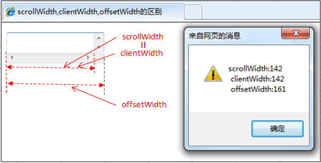

## 使用 new 的时候发生了什么

使用 ```new``` 来调用函数，或者说发生构造函数调用时，会自动执行下面的操作

1. 创建（或者说构造）一个全新的对象，可以简单的理解为一个空对象 `{}`

2. 这个新对象会被执行 [[原型]] 连接

3. 这个新对象会绑定到函数调用的 ```this```（简单来说就是将自己的上下文设置为这个 `{}`，即 this 表示为这个对象）

4. 如果函数没有返回其他对象，那么 ```new``` 表达式中的函数调用会自动返回这个新对象

```js
function foo(a) {
    this.a = a;
}
 
var bar = new foo(2);
console.log(bar.a); // 2
```

使用 ```new``` 来调用 ```foo(..)``` 时，我们会构造一个新对象并把它绑定到 ```foo(..)``` 调用中的 ```this``` 上


#### 关于函数的返回值

如果一个构造函数不写 `return` 语句，则系统会自动帮你返回一个对象，但是如果写了 `return` 语句，则

* 如果 `return` 的是一个基本类型的值（比如 `string`，`number`），则会忽略这个 `return`，该返回什么还是返回什么，但是会阻止构造函数接下来的执行

* 如果 `return` 了一个引用类型，则原有的 `return` 会被覆盖


## scrollWidth，clientWidth 和 offsetWidth

#### JavaScript

```js
document.body.clientWidth      // 返回对象内容的可视区的长度（不包括边框，边距或滚动条），会随对象显示大小的变化而改变

document.body.clientHeight     // 返回对象内容的可视区的高度（不包括边框，边距或滚动条），会随对象显示大小的变化而改变

document.body.offsetWidth      // 对象整体的实际长度（包括边框和填充），会随对象显示大小的变化而改变

document.body.offsetHeight     // 对象整体的实际高度（包括边框和填充），会随对象显示大小的变化而改变

document.body.scrollWidth      // 对象的实际内容的长度（不包括边线宽度），会随对象中内容超过可视区后而变大

document.body.scrollHeight     // 对象的实际内容的高度（不包括边线宽度），会随对象中内容超过可视区后而变大

----

document.body.scrollTop        // 页面滚动条向下拉动的距离

document.body.scrollLeft       // 页面滚动条向左拉动的距离

obj.offsetTop                  // 元素的上外缘距离最近采用定位父元素内壁的距离，如果父元素中没有采用定位的
                               // 则是获取上外边缘距离文档内壁的距离，即距离页面文档顶部距离，不会因为滚动条的改变而改变

obj.offsetLeft                 // 同 offsetTop 一样，只是方位不同

----

// 下面几个是用的比较少的
window.screen.width            // 屏幕分辨率的宽度

window.screen.height           // 屏幕分辨率的高度

window.screen.availWidth       // 显示器工作区宽度（除去任务栏的距离）

window.screen.availHeight      // 显示器工作区高度（除去任务栏的距离）
```


#### jQuery

```js
width();                       // 设置或返回被选元素的宽度
 
height();                      // 设置或返回被选元素的高度

$(window).height()             // 浏览器当前窗口可视区域高度

$(document).height()           // 浏览器当前窗口文档对象高度也就是页面整体高度

$(document.body).width()       // 浏览器当前窗口文档 body 的宽度
 
$(window).scrollTop()          // 垂直滚动的距离 即当前滚动的地方的窗口顶端到整个页面顶端的距离
                               // 与 $(document).scrollTop() 一致，但是 $(window).scrollTop() 被所有浏览器支持
 
$(window).scrollLeft()         // 这是获取水平滚动条的距离

----

// 返回偏移坐标
$(selector).offset();

top: $(selector).offset().top;

left: $(selector).offset().left;

----

// 两个用的较少的方法 
$(document.body).outerHeight(true)   // 浏览器当前窗口文档 body 的总高度 包括 border padding margin（对可见和隐藏元素均有效）

$(document.body).outerWidth(true)    // 浏览器当前窗口文档 body 的总宽度 包括 border padding margin（对可见和隐藏元素均有效）
```


#### 一些比较常用的方法

#### 可视区高度

获取元素到浏览器顶端的距离，根据页面滚动，这个值是一直在变化的

```js
obj.offsetTop - document.body.scrollTop
```


#### 判断页面是否在顶部

```js
document.body.scrollTop == 0
```

#### 判断页面是否在底部

```js
$(document).height() == $(window).height() + $(window).scrollTop()

即

$(window).scrollTop() >= $(document).height() - $(window).height()
```


#### innerHeight(value)


```js
innerHeight  // 高度＋补白

outerHeight  // 高度＋补白＋边框，参数为 true 时为 高度＋补白＋边框＋边距
```

`value` 参数可以是一个字符串（数字加单位）或者是一个数字，如果这个 `value` 参数只提供一个数字，`jQuery` 会自动加上像素单位（`px`）

如果只提供一个字符串，任何有效的 `CSS` 尺寸都可以为高度赋值（就像 `100px`，`50%`，或者 `auto`）

注意在现代浏览器中，`CSS` 高度属性不包含 `padding`，`border` 或者 `margin`， 除非 `box-sizing` 属性被应用


#### 兼容问题

`document.body.scrollTop` 有兼容问题，可以使用

```js
var top = document.body.scrollTop || document.documentElement.scrollTop;
```


#### scrollWidth，clientWidth 和 offsetWidth 区别

分为两种情况

#### 第一种情况

元素内无内容或者内容不超过可视区，滚动不出现或不可用的情况下

* `scrollWidth = clientWidth`，两者皆为内容可视区的宽度

* `offsetWidth` 为元素的实际宽度



#### 第二种情况

元素的内容超过可视区，滚动条出现和可用的情况下

* `scrollWidth > clientWidth`

* `scrollWidth` 为实际内容的宽度

* `clientWidth` 是内容可视区的宽度

* `offsetWidth` 是元素的实际宽度


#### Event 对象的五种坐标


```js
clientX 和 clientY    // 相对于浏览器（可视区，左上角0，0）的坐标

screenX 和 screenY    // 相对于设备屏幕左上角（0，0）的坐标

offsetX 和 offsetY    // 相对于事件源左上角（0，0）的坐标
 
pageX 和 pageY        // 相对于整个网页左上角（0，0）的坐标，但它不会随着滚动条而变动

X 和 Y                // 本来是 IE 属性，相对于用 CSS 动态定位的最内层包容元素
```


## parseInt

使用的时候建议始终添加**第二个参数**来指定进制，比如

```js
parseInt(123, 10)  // 返回 123
```

#### 如果是整数，返回其本身

```js
parseInt(123, 10)  // 返回 123
```

#### 如果是浮点数，返回整数部分

```js
parseInt(123.123, 10)   // 返回 123
```


#### 如果是字符串

* 如果字符串第一个非空字符前面含有空格，则忽略空格，直接从第一个非空字符开始解析

```js
parseInt(" 1234", 10)   // 返回 1234
```

* 如果第一个非空字符不是数字或者符号，则返回 ```NaN```

```js
parseInt("df2bc", 10)  // 返回 NaN
```

* 如果第一个非空字符是数字，则继续解析直至解析完毕或者**遇到第一个非数字符号**为止

```js
parseInt("123abc", 10)  // 返回 123
```


## 数组常用的方法和其返回值

#### 会改变调用它们的对象自身的值（不会返回新数组）

```js
Array.prototype.copyWithin()  // 在数组内部，将一段元素序列拷贝到另一段元素序列上，覆盖原有的值

Array.prototype.fill()        // 将数组中指定区间的所有元素的值，都替换成某个固定的值

Array.prototype.pop()         // 删除数组的最后一个元素，并返回这个元素

Array.prototype.push()        // 在数组的末尾增加一个或多个元素，并返回数组的新长度

Array.prototype.reverse()     // 颠倒数组中元素的排列顺序，即原先的第一个变为最后一个，原先的最后一个变为第一个

Array.prototype.shift()       // 删除数组的第一个元素，并返回这个元素

Array.prototype.sort()        // 对数组元素进行排序，并返回当前数组

Array.prototype.splice()      // 在任意的位置给数组添加或删除任意个元素

Array.prototype.unshift()     // 在数组的开头增加一个或多个元素，并返回数组的新长度
```

#### 不会改变调用它们的对象的值（返回一个新的数组或者返回一个其它的期望值）

```js
Array.prototype.concat()          // 返回一个由当前数组和其它若干个数组或者若干个非数组值组合而成的新数组

Array.prototype.includes()        // 判断当前数组是否包含某指定的值，如果是返回 true，否则返回 false

Array.prototype.join()            // 连接所有数组元素组成一个字符串

Array.prototype.slice()           // 抽取当前数组中的一段元素组合成一个新数组

Array.prototype.toString()        // 返回一个由所有数组元素组合而成的字符串，遮蔽了原型链上的 Object.prototype.toString() 方法

Array.prototype.toLocaleString()  // 返回一个由所有数组元素组合而成的本地化后的字符串，遮蔽了原型链上的 Object.prototype.toLocaleString() 方法

Array.prototype.indexOf()         // 返回数组中第一个与指定值相等的元素的索引，如果找不到这样的元素，则返回 -1

Array.prototype.lastIndexOf()     // 返回数组中最后一个（从右边数第一个）与指定值相等的元素的索引，如果找不到这样的元素，则返回 -1

// 一个非标准的
Array.prototype.toSource()        // 返回一个表示当前数组字面量的字符串，遮蔽了原型链上的 Object.prototype.toSource() 方法

// 还有两个方法可以返回新数组

Array.from()    // 从类数组或者迭代对象（iterable object）中创建一个新的数组实例

Array.of()      // 创建一个有可变数量的参数的新的数组实例，无论参数有多少数量，而且可以是任意类型
```


## clientWidth, offsetWidth, scrollWidth

```js
document.body.clientWidth      // 返回对象内容的可视区的长度（不包括边框，边距或滚动条），会随对象显示大小的变化而改变
 
document.body.offsetWidth      // 对象整体的实际长度（包括边框和填充），会随对象显示大小的变化而改变
 
document.body.scrollWidth      // 对象的实际内容的长度（不包括边线宽度），会随对象中内容超过可视区后而变大
 
----
 
document.body.scrollTop        // 页面滚动条向下拉动的距离
 
document.body.scrollLeft       // 页面滚动条向左拉动的距离
 
obj.offsetTop                  // 元素的上外缘距离最近采用定位父元素内壁的距离，如果父元素中没有采用定位的
                               // 则是获取上外边缘距离文档内壁的距离，即距离页面文档顶部距离，不会因为滚动条的改变而改变
 
obj.offsetLeft                 // 同 offsetTop 一样，只是方位不同
 
----
 
// 下面几个是用的比较少的
window.screen.width            // 屏幕分辨率的宽度
 
window.screen.availWidth       // 显示器工作区宽度（除去任务栏的距离）
```

两个兼容函数

```js
// 返回视口的大小，部分移动设备浏览器对 innerWidth 的兼容性不好
// 需要使用 document.documentElement.clientWidth 或者 document.body.clientWidth 来兼容（混杂模式下对 document.documentElement.clientWidth 不支持）
// 使用方法 getViewPort().width
function getViewPort () {
  // 浏览器嗅探，混杂模式
  if(document.compatMode == "BackCompat") {
    return {
      width: document.body.clientWidth,
      height: document.body.clientHeight
    };
  } else {
    return {
      width: document.documentElement.clientWidth,
      height: document.documentElement.clientHeight
    };
  }
}


// 获得文档的大小（区别与视口），与上面类似
function getDocumentPort () {
  if(document.compatMode == "BackCompat") {
    return {
      width: document.body.scrollWidth,
      height: document.body.scrollHeight
    };
  } else {
    return {
      width: Math.max(document.documentElement.scrollWidth,document.documentElement.clientWidth),
      height: Math.max(document.documentElement.scrollHeight,document.documentElement.clientHeight)
    }
  }
}
```


## 自由变量到作用域链

所谓自由变量，指的是在当前作用域中未声明的变量，会去到**创建这个函数的作用域中去取值，而不是简简单单的上一级（注意，是创建，不是调用）**，这就是所谓的静态作用域

```js
var x = 100;

function foo() {
  console.log(x);
}

function bar(fn) {
  var x = 200;

  (function () {
    fn();  // 100
  })()
}

bar(foo);
```

如果没有找到，则继续往上找，一直到全局作用域为止，如果还没有找到，那就是不存在了，这个过程可以称之为**作用域链**


#### 上下文环境和作用域的关系

* 上下文环境：可以理解为一个抽象的东西，程序执行前，会生成全局上下文环境，函数在调用的时候会创建函数上下文环境

* 作用域：**除了全局作用域，只有函数才能创建作用域（ES6 之前）**，创建一个函数就创建了一个作用域，无论你调不调用，函数只要创建了，它就有独立的作用域

* 两者的区别在于：一个作用域可能没有（函数没被调用），也可能存在过（调用完成，上下文环境被摧毁），也有可能同时存在多个（闭包）上下文环境

一个简单的小例子：

```js
var x = 100;

function fn (x) {
    return function () {
        console.log(x);
    }
}

var f1 = fn(5);
var f2 = fn(10);

f1();  // 5
f2();  // 10
```


## ES6 的一些新方法

#### let 命令

* 只要块级作用域内存在 `let` 命令，它所声明的变量就 "绑定"（`binding`）这个区域，不再受外部的影响

* `typeof` 不再是一个百分比安全的操作（如果一个变量根本没有被声明，使用 `typeof` 反而不会报错）

* `function bar(x = y, y = 2) {}` （`y` 没有声明，所以会报错）

* 不允许重复声明

* 块级作用域的出现，使得立即执行函数表达式（`IIFE`）不再必要了

* 建议避免在块级作用域内声明函数。如果确实需要，也应该写成函数表达式，而不是函数声明语句

* 允许声明函数的规则，只在使用大括号的情况下成立，如果没有使用大括号，就会报错

* 在 `ES6` 浏览器中（只对 `ES6` 的浏览器实现有效，其他环境的实现不用遵守，还是将块级作用域的函数声明当作 `let` 处理）

 * 允许在块级作用域内声明函数

 * 函数声明类似于 `var`，即会提升到全局作用域或函数作用域的头部

 * 同时，函数声明还会提升到所在的块级作用域的头部

```js
// 不报错
"use strict";
if (true) {
  function f() { }
}

// 报错
"use strict";
if (true)
  function f() { }
```

#### const 命令

* 声明一个只读常量，一旦声明，常量的值就不能改变，而且必须立即初始化，不能留到以后在赋值

* `const foo = {};`

 * 常量 `foo` 储存的是一个地址，这个地址指向一个对象。不可变的只是这个地址，即不能把 `foo` 指向另一个地址，但对象本身是可变的，所以依然可以为其添加新属性。

* 与 `let` 命令相似之处：

 * 只能在声明所在的块级作用域内有效

 * 声明的常量也是不提升，同样存在暂时性死区，只能在声明的位置后面使用

 * 不可重复声明


#### 字符串的扩展

* 添加了遍历器接口，使得字符串可以被 `for...of` 循环遍历

* 添加了三个用于查询字符串位置的函数：

 * `includes()`： 返回布尔值，表示是否找到了参数字符串

 * `startsWith()`： 返回布尔值，表示参数字符串是否在源字符串的头部

 * `endsWith()`： 返回布尔值，表示参数字符串是否在源字符串的尾部

以上三个方法都支持第二个参数，表示开始搜索的位置，不同之处在于 `endsWith` 针对前 `n` 个字符，而其他两个方法针对从第 `n` 个位置直到字符串结束。

* `repeat()` 方法返回一个新字符串，表示将原字符串重复 `n` 次

 * 如果是小数，则会被取整（`2.2 => 2`, `2.9 => 2`）

 * 如果是负数（小于-1）或者 `Infinity`，则会报错

 * 如果是 `0` 到 `-1` 之间的小数，则等同于 `0`，因为会先进行取整运算（`NaN` 也等同于 `0`）

 * 如果参数是字符串，则会先转换为数字（`"3" => 3`, `"na" => ""`）

* 新增了模版字符串

```js
$("#result").append(`
    There are <b> ${basket.count} </b> items
    in your basket, <em> ${basket.onSale} </em>
    are on sale!`
);
```

 * 如果在模板字符串中需要使用反引号，则前面要用反斜杠转义（``\`Hello\` World!``）

 * 如果使用模板字符串表示多行字符串，所有的空格和缩进都会被保留在输出之中

 * 如果想去掉模版字符串开头和结尾处的换行，可以使用 `trim` 方法消除它

 * 如果大括号内部是一个字符串，将会原样输出（`Hello ${"World}` => "Hello World"）

 * 模板字符串中也可以嵌入变量以及调用函数，比如 `${user.name}`，`${fn()}`


#### 对象的扩展

* 允许直接写入变量和函数，作为对象的属性和方法，这时，属性名为变量名，属性值为变量的值

```js
var foo = "bar";
var baz = {foo};
baz;  // {foo: "bar"}
```

* 方法也可以简写 `method () {return "hello"}`

* 可以用于函数的返回值：

```js
function getPoint () {
  var x = 1;
  var y = 2;
  return {x, y};
}

getPoint();  // {x: 1, y: 2}
```

* 新增属性名表达式 `obj["a" + "bc"] = 123;`

 * 表达式也可以用于定义方法名

* 属性名表达式与简洁表示法，不能同时使用，否则会报错

* 特别注意：属性名表达式如果是一个对象，默认情况下会自动将对象转为字符串 `[object, Object]`

```js
const myObject = {
  [keyA]: "valueA",
  [keyB]: "valueB"
};

// [keyB] 会把 [keyA] 覆盖掉，而 myObject 最后只有一个 [object Object] 属性
```

#### 数值的扩展

* `parseInt()` 和 `parseFloat()` 移植到了 `Number` 对象上面 （`Number.parseInt("1*34")  // 12`）

* `Number.isInteger()` 用来判断一个值是否为整数（在 `JavaScript` 内部，整数和浮点数是同样的储存方法，所以 `3` 和 `3.0` 被视为同一个值）

`Math` 对象扩展：

* `Math.trunc()` 方法用于去除一个数的小数部分，返回整数部分

 * 对于非数值，内部会先使用 `Number` 方法将其先转为数值

 * 对于空值和无法截取整数的值，返回 `NaN`

* `Math.sign()` 方法用来判断一个数到底是正数，负数，还是零，会返回五种值：

 * 参数为正数，返回 `+1`

 * 参数为负数，返回 `-1`

 * 参数为 `0`，返回 `0`

 * 参数为 `-0`，返回 `-0`

 * 其他值，返回 `NaN`

* `Math.cbrt()` 方法用于计算一个数的立方根

* `Math.hypot()` 返回所有参数的 平方和 的 平方根 

```js 
Math.hypot(3, 4);  // 5（3 的平方 + 4 的平方 等于 5 的平方）
```


#### 数组的扩展

* `Array.from()` 将 类似数组的对象（`array-like-object`） 和 可遍历（`iterable`）的对象（包括 `ES6` 新增的数据结构 `Set` 和 `Map`）转为 **真正的数组**

 * 接受的第二个参数，作用类似于数组的 `map` 方法，用来对每个元素进行处理，将处理后的结果放入返回的数组

 * 如果 `Array.from()` 没有参数，就返回一个**空数组**

* `Array.of()` 用于将一组值，转换为数组（因为在 `ES5` 中，参数个数的不同，会导致 `Array()` 的行为有差异）

* `find()` 方法，用于找出第一个符合条件的数组成员，参数是一个回调函数，所有数组成员依次执行该回调函数，直到找出第一个返回值为 `true` 的成员，并返回，如果没有找到符合条件的成员，则返回 `undefined`

 * 回调函数可以接受三个参数，依次为 当前的值、当前的位置 和 原数组

* `findIndex()` 方法的用法与 `find()` 方法非常相似，返回第一个符合条件的数组成员的位置，如果所有成员都不符合条件，则返回 `-1`

 * `find()` 方法和 `findIndex()` 方法都可以发现 `NaN`，弥补了数组的 `indexOf` 方法的不足

* `fill()` 方法使用给定值，填充一个数组

 * 需要注意的是，数组中已有的元素，会被全部抹去

 * 可以指定第二个和第三个参数，用于指定填充的起始位置和结束位置

* 提供了三个新的方法来用于遍历数组，它们都返回一个遍历器对象，可以用 `for...of` 循环进行遍历（如果不使用 `for...of` 循环，可以手动调用遍历器对象的 `next()` 方法，进行遍历）

 * `keys()` 是对**键名**的遍历

 * `values()` 是对**键值**的遍历

 * `entries()` 是对**键值对**的遍历

* `Array.prototype.includes` 方法返回一个布尔值，表示某个数组是否包含给定的值，与字符串的 `includes` 方法类似

 * 第二个参数表示搜索的起始位置，默认为 `0`。如果第二个参数为负数，则表示倒数的位置，如果这时它大于数组长度（比如第二个参数为 `-4`，但数组长度为 `3`），则会重置为从 `0` 开始

`Map` 和 `Set` 数据结构有一个 `has` 方法，需要注意与 `includes` 区分

* `Map` 结构的 `has` 方法，是用来查找**键名**的，比如 `Map.prototype.has(key)`、`WeakMap.prototype.has(key)`、`Reflect.has(target, propertyKey)`

* `Set` 结构的 `has` 方法，是用来查找**值**的，比如 `Set.prototype.has(value)`、`WeakSet.prototype.has(value)`


#### 解构

```js
// 属于"模式匹配"，只要等号两边的模式相同，左边的变量就会被赋予对应的值
var [a, b, c] = [1, 2, 3]
```

* 如果解构不成功，变量的值就等于 `undefined`

* 如果等号右边不是数组（不是可遍历的解构，不具有 `Iterator` 接口），那么将会报错（`number`，`string`，`false`，`NaN`，`undefined`，`null`，`{ }` 等）

* 只要某种数据具有 `Iterator` 接口，都可以采用数组形式的解构赋值

* 解构赋值允许指定默认值（内部使用的是严格相等运算符 `===`）

* 默认值可以引用解构赋值的其他变量，但该变量必须已经声明

* 对象的解构

```js
var { foo, bar } = { foo: "aaa", bar: "bbb" }
```

* 对象的属性没有次序，变量必须与属性同名，才能取到正确的值

```js
let foo;
({ foo } = { foo: 1 }); // success

let baz;
({ bar: baz } = { bar: 1 }); // success
```

上例中的圆括号是必须的，否则会报错，因为解析器会将起首的大括号，理解成一个代码块，而不是赋值语句


#### 字符串的解构

字符串也可以解构赋值，这是因为此时，字符串被转换成了一个类似数组的对象


#### 数值和布尔值的解构

解构赋值的时候，如果等号右边是数值和布尔值，则会先转为对象

规则是，只要等号右边的值不是对象，就先将其转为对象，由于 `undefined` 和 `null` 无法转为对象，所以对它们进行解构赋值，都会报错


#### 函数相关

* 在 `ES6` 中，允许函数的参数设置默认值，即直接写在参数定义的后面（函数参数的默认值）

 * 参数变量是默认声明的，所以不能使用 `let` 或者 `const` 再次声明

 * 指定了默认值以后，函数的 `length` 属性，将返回没有指定默认值的参数个数，也就是说，指定了默认值以后，`length` 属性将失效（length属性的含义是，该函数预期传入的参数个数，某个参数指定默认值以后，预期传入的参数个数就不包括这个参数了）

* 如果设置了默认值的参数不是尾参数（即设置默认值的不是最后一个参数），那么 `length` 属性也不再计入后面的参数了

* 如果参数默认值是一个变量，则该变量所处的作用域，与其他变量的作用域规则是一样的，即先是当前函数的作用域，然后才是全局作用域

* 用于将一个数组转为用都好分隔的参数序列（`console.log(...[1, 2, 3])`）

* 在 ES5 中，如果将一个匿名函数赋值给一个变量，其 `name` 属性，会返回空字符串，而 ES6 中修正了这个问题，会返回实际的函数名

 * `Function` 构造函数返回的函数实例，`name` 属性的值为 `anonymous`

 * `bind` 返回的函数，`name` 属性会加上 `bound` 前缀

* 如果箭头函数的代码块部分多于一条语句，就要使用大括号将它们括起来，并且使用 `return` 语句返回

```js
var sum = (num1, num2) => { return num1 + num2; }
```

* 由于大括号被解释为代码块，所以如果箭头函数直接返回一个对象，必须在对象外面加上括号

```js
var getTempItem = id => ({ id: id, name: "Temp" });
```

* 箭头函数的使用注意点

 * 函数体内的 `this` 对象，就是定义时所在的对象，而不是使用时所在的对象（例如在 `Vue` 的实例属性或回调函数中就不建议使用箭头函数，因为箭头函数绑定父上下文，所以 `this` 不会像预想的一样是 Vue 实例，而是对应方法未被定义）

 * 不可以当作构造函数，也就是说，不可以使用 `new` 命令，否则会抛出一个错误

 * 不可以使用 `arguments` 对象，该对象在函数体内不存在。如果要用，可以用 `Rest` 参数代替

 * 不可以使用 `yield` 命令，因此箭头函数不能用作 `Generator` 函数

 * 需要特别注意的是：`this` 对象的指向是可变的，但是在箭头函数中，它是固定的

 * 箭头函数中的 `this` 指向的固定化，并不是因为箭头函数内部有绑定 `this` 的机制，实际原因是箭头函数根本没有自己的 `this`，导致内部的 `this` 就是外层代码块的 `this`（正式因为它没有 `this`，所以也就不能用作构造函数）


#### Symbol

`ES6` 引入了一种新的原始数据类型 `Symbol`，表示独一无二的值，它是 `JavaScript` 第七种数据类型

```js
// 变量 s 就是一个独一无二的值
let s = Symbol();

// typeof 运算符的结果，表明变量 s 是 Symbol 数据类型，而不是字符串之类的其他类型
typeof s
// "symbol"
```


## 关于 'use strict'

严格模式是 `ECMAScript 5` 中的一项新特征，允许你把一段程序或功能放置在 `'strict'` 工作环境中，这种严格上下文环境防止某些行为被采取并引发更多的异常

严格的模式有助于几个方面

* 它捕获了一些常见的编码错误，抛出异常

* 它阻止，或抛出错误，当相对'不安全'的行为被采用（例如获取全局对象）

* 它禁用那些混淆的或者考虑不周的特征

```js
// 非严格的代码...

(function () {
  'use strict';

  // 严格定义你的库...
})();

// 非严格的代码
```


## 检测是否有元素被隐藏

```js
// 检查 display: [none | block], 忽略 visible: [true | false]
$(element).is(":visible");

// 匹配的是隐藏的所有元素
$('element:hidden')

// 匹配所有可见的元素
$('element:visible')
```


## 鼠标长按事件

只要长按时间到达 `1000` 毫秒，无论是否弹起鼠标，都会触发，反之如果不到 `1000` 毫秒，鼠标弹起的时候会结束

```js
// 申明全局变量
var timeStart, timeEnd, time;

// 获取此刻时间
function getTimeNow() {
  var now = new Date();
  return now.getTime();
}

// 鼠标按下时触发
function holdDown() {
  // 获取鼠标按下时的时间
  timeStart = getTimeNow();

  // setInterval 会每 100 毫秒执行一次，也就是每 100 毫秒获取一次时间
  time = setInterval(function () {
    timeEnd = getTimeNow();

    // 如果此时检测到的时间与第一次获取的时间差有 1000 毫秒
    if (timeEnd - timeStart > 1000) {
      // 便不再继续重复此函数 （clearInterval 取消周期性执行）
      clearInterval(time);
      // 字体变红
      // 一些逻辑
    }
  }, 100);
}

function holdUp() {
  // 如果按下时间不到 1000 毫秒便弹起
  clearInterval(time);
}
```


## 如何快速判断 DOM 元素位于 viewport 以外

```js
ele.getBoundingClientRect().top > window.innerHeight  // 元素在当前屏下面

ele.getBoundingClientRect().bottom < 0                // 元素在当前屏上面
```


## TS 当中报错 Property 'style' does not exist on type 'Element'

这个问题一般会在 `TS` 当中使用 `document.querySelector` 去获取元素的时候发生

根据规范可知（[MDN Element 规范](https://developer.mozilla.org/en-US/docs/Web/API/Element)），`Element` 接口确实没有 `style` 属性

如果不是用来操作 `SVG` 元素，而是仅仅使用 `TS` 的话，可以像下面这样操作

```js
(document.querySelector('xxx') as HTMLElement).style.color = 'red';
```


## table 表单中的 .rows 属性

如下

```js
var tr = cartTable.children[1].rows;
```

为表单元素特有的属性，存放节点所有的 `tr` 元素，操作的话可以使用如下方式

```js
price += tr[i].cells[4].innerHTML
```

> `cells` 也是 表单元素特有的属性，里面存放的是这个表格没一行下面的所有的单元格，也就是 `td` 元素，也就是说这一行下面所有的 `td`


## offsetLeft 与 style.left 的区别

`offsetLeft` 获取的是相对于父对象的左边距

`left` 获取或设置相对于 具有定位属性（`position` 定义为 `relative`）的父对象的左边距

如果父 `div` 的 `position` 定义为 `relative`，子 `div` 的 `position` 定义为 `absolute`

那么子 `div` 的 `style.left` 的值是相对于父 `div` 的值，这同 `offsetLeft` 是相同的，区别在于

* `style.left` 返回的是字符串，如 `28px`，`offsetLeft` 返回的是数值 `28`，如果需要对取得的值进行计算，还用 `offsetLeft` 比较方便

* `style.left` 是读写的，`offsetLeft` 是只读的，所以要改变 `div` 的位置，只能修改 `style.left`

* `style.left` 的值需要事先定义，否则取到的值为空，而且必须要定义在 `html` 里,如果定义在 `css` 里，`style.left` 的值仍然为空

`offsetLeft` 则仍然能够取到，无需事先定义 `div` 的位置


## 如何判断鼠标滚动方向和绑定鼠标滚轮事件

#### 绑定鼠标滚轮事件

`js` 事件有很多需要兼容的地方，鼠标滚轮事件也有额外的差异吗，包括 `IE6` 浏览器在内的都适用 `mouseWheel`，而只有火狐浏览器使用`DOMMouseScroll`

#### 如何判断鼠标滚动方向

其他浏览器通过 `wheeldalta` 属性来判断，但是火狐浏览器没有这个属性，可以通过`detal`这个属性来判断

开发中发现每次向下滚动的时候，`wheeldalta`都是`-120`，但是`detail`却是`3`，火狐浏览器方向判断的数值正负与其他浏览器是相反的

```js
div.on('mousewheel DOMMouseScroll', function(e){
  var delta = e.originalEvent.wheelDelta || -e.originalEvent.detail;
  // do someing
});
```

关于火狐浏览器： [firefox的event.detail](https://segmentfault.com/q/1010000003986369)


## JavaScript 判断滚动条方向

```js
$(document).ready(function () {

  // 设置参照物与比较物
  var p = 0,t = 0;

  $(window).scroll(function (e) {

    // 默认相对滚动条顶部的偏移
    p = $(this).scrollTop();
    
    // 下滚
    if( t <= p ){  
      $('.header').hide();
    }
                
    // 上滚
    else{  
      $('.header').show();
    }

    // 关于这句的解释 见下方
    setTimeout(function(){t = p;}, 0);    
  });

});
```


## setTimeout(function(){}, 0) 

`JavaScript` 是单线程执行的，也就是无法同时执行多段代码，当某一段代码正在执行的时候，所有后续的任务都必须等待，形成一个队列，一旦当前任务执行完毕，再从队列中取出下一个任务，这也常被称为 "阻塞式执行"

假如当前 `JavaScript` 进程正在执行一段很耗时的代码，此时发生了一次鼠标点击，那么事件处理程序就被阻塞，用户也无法立即看到反馈，事件处理程序会被放入任务队列，直到前面的代码结束以后才会开始执行

如果代码中设定了一个 `setTimeout` 那么浏览器便会在合适的时间，将代码插入任务队列，如果这个时间设为 `0`，就代表立即插入队列，但不是立即执行，仍然要等待前面代码执行完毕，所以 `setTimeout` 并不能保证执行的时间，是否及时执行取决于 `JavaScript` 线程是拥挤还是空闲

更多见 [JavaScript 下的 setTimeout(fn, 0) 意味着什么？](http://www.cnblogs.com/silin6/p/4333999.html)


## Reflect.apply(myFunction, myObject, args) 和 myFunction.apply(myObject, args)

基本上它们是等价的，但是有一点区别，就是在参数是 `null` 或者 `undefined` 的情况下有所不同

`Function.prototype.apply` 将调用没有参数的函数，而 `Reflect.apply` 将会抛出一个错误

更多可以参考下面两个链接，描述的很清晰

[Is there any benefit to call Reflect.apply() over Function.prototype.apply() in ECMAScript 2015?](https://stackoverflow.com/questions/34707306/is-there-any-benefit-to-call-reflect-apply-over-function-prototype-apply-in)

[What does the Reflect object do in JavaScript?](https://stackoverflow.com/questions/25421903/what-does-the-reflect-object-do-in-javascript)
