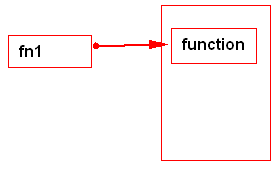
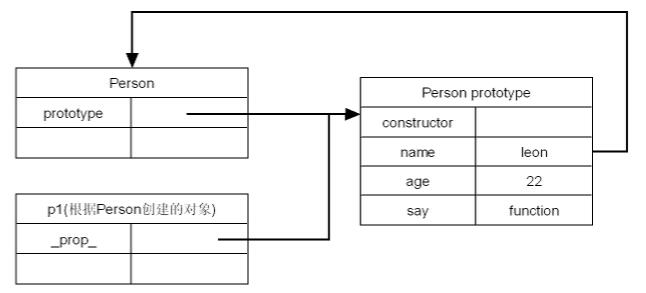
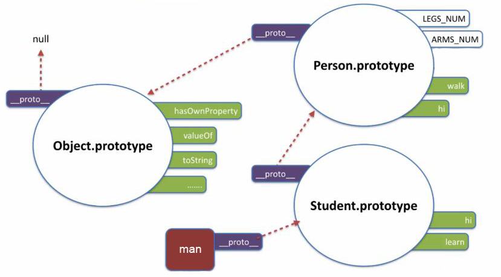

## this

`this` 是 `Javascript` 语言的一个关键字它代表函数运行时，自动生成的一个内部对象，只能在函数内部使用

随着函数使用场合的不同，`this` 的值会发生变化。但是有一个总的原则，那就是 `this` 指的是，调用函数的那个对象

`JavaScript` 中函数的调用有以下几种方式：

* 为对象方法调用

* 作为函数调用

* 作为构造函数调用

* 使用 `apply` 或 `call` 调用

下面就按照调用方式的不同，分别讨论 `this` 的含义。


#### 作为对象方法调用

在 `JavaScript` 中，函数也是对象，因此函数可以作为一个对象的属性，此时该函数被称为该对象的方法，在使用这种调用方式时，`this` 被自然绑定到该对象

```js
var point = { 
  x : 0, 
  y : 0, 
  moveTo : function (x, y) { 
    this.x = this.x + x; 
    this.y = this.y + y; 
  } 
}; 

point.moveTo(1, 1)  // this 绑定到当前对象，即 point 对象
```


#### 纯粹的函数调用 

函数也可以直接被调用，此时 `this` 绑定到全局对象。在浏览器中，`window` 就是该全局对象（`Node.js` 中为 `Global`）。比如下面的例子：函数被调用时，`this` 被绑定到全局对象，接下来执行赋值语句，相当于隐式的声明了一个全局变量，这显然不是调用者希望的

```js
function makeNoSense (x) { 
  this.x = x; 
} 

makeNoSense(5); 
x;  // x 已经成为一个值为 5 的全局变量
```

对于内部函数，即声明在另外一个函数体内的函数，这种绑定到全局对象的方式会产生另外一个问题

我们仍然以前面提到的 `point` 对象为例，这次我们希望在 `moveTo` 方法内定义两个函数，分别将 `x`，`y` 坐标进行平移。结果可能出乎大家意料，不仅 `point` 对象没有移动，反而多出两个全局变量 `x`，`y`

```js
var point = {
  x: 0,
  y: 0,
  moveTo: function (x, y) {
    // 内部函数
    var moveX = function (x) {
      this.x = x;
    };
    // 内部函数
    var moveY = function (y) {
      this.y = y;
    };

    moveX(x);
    moveY(y);
  }
};

point.moveTo(1, 1);

point.x; // ==>0 
point.y; // ==>0 

x; // ==>1 
y; // ==>1
```

内部函数中的 `this` 成为全局的了，为了规避这一设计缺陷，一般使用变量替代的方法，该变量常被命名为 `that/_this/self`

```js
var point = {
  x: 0,
  y: 0,
  moveTo: function (x, y) {
    var that = this;
    // 内部函数
    var moveX = function (x) {
      that.x = x;
    };
    // 内部函数
    var moveY = function (y) {
      that.y = y;
    }
    moveX(x);
    moveY(y);
  }
};

point.moveTo(1, 1);

point.x; // ==>1 
point.y; // ==>1
```


#### 作为构造函数调用

所谓构造函数，就是通过这个函数生成一个新对象（`object`）。这时，`this` 就指这个新对象。 如果不使用 `new` 调用，则和普通函数一样

```js
function Point (x, y) {
  this.x = x;
  this.y = y;
}
```


#### 使用 apply 或 call 调用

`apply()` 是函数对象的一个方法，它的作用是改变函数的调用对象，它的第一个参数就表示改变后的调用这个函数的对象。因此，`this` 指的就是这第一个参数

```js
function Point (x, y) {
  this.x = x;
  this.y = y;
  this.moveTo = function (x, y) {
    this.x = x;
    this.y = y;
  }
}

var p1 = new Point(0, 0);
var p2 = { x: 0, y: 0 };

p1.moveTo(1, 1);
p1.moveTo.apply(p2, [10, 10]);
```

在上面的例子中，我们使用构造函数生成了一个对象 `p1`，该对象同时具有 `moveTo` 方法

使用对象字面量创建了另一个对象 `p2`，我们看到使用 `apply` 可以将 `p1` 的方法应用到 `p2` 上，这时候 `this` 也被绑定到对象 `p2` 上。另一个方法 `call` 也具备同样功能，不同的是最后的参数不是作为一个数组统一传入，而是分开传入的

注意：`apply()` 的参数为空时，默认调用全局对象


#### 四种方式的优先级

如下所示，优先级从上往下：

1. 由 `new` 调用绑定到新创建的对象

2. 由 `call` 或者 `apply`（或者 `bind`）调用？绑定到指定的对象

3. 由上下文对象调用？绑定到那个上下文对象

4. 默认：在严格模式下绑定到 `undefined`，否则绑定到全局对象


----

以上是 `this` 常见的几种使用方式，下面来看看一些不太常见的场景


#### 原型链中的 this

相同的概念在定义在原型链中的方法也是一致的，如果该方法存在于一个对象的原型链上，那么 `this` 指向的是调用这个方法的对象，表现得好像是这个方法就存在于这个对象上一样

```js
var o = {
  f: function () {
    return this.a + this.b;
  }
};

var p = Object.create(o);

p.a = 1;
p.b = 4;

console.log(p.f());  // 5
```

对象 `p` 没有属于它自己的 `f` 属性，它的 `f` 属性继承自它的原型，但是这对于最终在 `o` 中找到 `f` 属性的查找过程来说没有关系，查找过程首先从 `p`.`f` 的引用开始，所以函数中的 `this` 指向 `p`，也就是说，因为 `f` 是作为 `p` 的方法调用的，所以它的 `this` 指向了 `p`


#### getter 与 setter 中的 this

作为 `getter` 或 `setter` 函数都会绑定 `this` 到从设置属性或得到属性的那个对象

```js
function modulus() {
  return Math.sqrt(this.re * this.re + this.im * this.im);
}

var o = {
  re: 1,
  im: -1,
  get phase() {
    return Math.atan2(this.im, this.re);
  }
};

Object.defineProperty(o, 'modulus', {
  get: modulus, enumerable: true, configurable: true
});

console.log(o.phase, o.modulus); // -0.78 1.4142
```


#### 构造函数中的 this

当一个函数被作为一个构造函数来使用（使用 `new` 关键字），它的 `this` 与即将被创建的新对象绑定

构造器返回的默认值是一个 `this` 引用的对象时，但是也可以手动设置返回其他的对象，如果返回值不是一个对象，则返回 `this`

```js
function C() {
  this.a = 37;
}

var o = new C();
console.log(o.a); // 37


function C2() {
  this.a = 37;
  // 手动的设置了返回对象，与 this 绑定的默认对象被取消
  return { a: 38 };
}

o = new C2();
console.log(o.a); // 38
```


#### DOM 事件处理函数中的 this

当函数被用作事件处理函数时，它的 `this` 指向触发事件的元素

需要注意：`IE` 的 `attachEvent()` 中的 `this` 指向 `window`（`IE11+` 已经支持 `addEventListener()`）

```js
// 被调用时，将关联的元素变成蓝色
function bluify(e) {
  console.log(this === e.currentTarget); // 总是 true

  // 当 currentTarget 和 target 是同一个对象是为 true
  console.log(this === e.target);
  this.style.backgroundColor = '#A5D9F3';
}

// 获取文档中的所有元素的列表
var elements = document.getElementsByTagName('*');

// 将 bluify 作为元素的点击监听函数，当元素被点击时，就会变成蓝色
for (var i = 0; i < elements.length; i++) {
  elements[i].addEventListener('click', bluify, false);
}
```


#### 内联事件处理函数中的 this

当代码被内联处理函数调用时，它的 `this` 指向监听器所在的 `DOM` 元素

```html
<button onclick="alert(this.tagName.toLowerCase());">
  Show this
</button>
```


上面的 `alert` 会显示 `button`，但是注意只有外层代码中的 `this` 是这样设置的，如果使用闭包（如下所示），则里面的 `this` 是指向 `window/global` 的

```html
<button onclick="alert((function(){return this})());">
  Show inner this
</button>
```


## 使用 new 的时候发生了什么

----

使用 ```new``` 来调用函数，或者说发生构造函数调用时，会自动执行下面的操作

1. 创建（或者说构造）一个全新的对象，可以简单的理解为一个空对象 `{}`

2. 这个新对象会被执行 [[原型]] 连接

3. 这个新对象会绑定到函数调用的 ```this```（简单来说就是将自己的上下文设置为这个 `{}`，即 this 表示为这个对象）

4. 如果函数没有返回其他对象，那么 ```new``` 表达式中的函数调用会自动返回这个新对象

```js
function foo(a) {
    this.a = a;
}
 
var bar = new foo(2);
console.log(bar.a); // 2
```

使用 ```new``` 来调用 ```foo(..)``` 时，我们会构造一个新对象并把它绑定到 ```foo(..)``` 调用中的 ```this``` 上


#### 关于函数的返回值

如果一个构造函数不写 `return` 语句，则系统会自动帮你返回一个对象，但是如果写了 `return` 语句，则

* 如果 `return` 的是一个基本类型的值（比如 string，number），则会忽略这个 `return`，该返回什么还是返回什么，但是会阻止构造函数接下来的执行

* 如果 `return` 了一个引用类型，则原有的 `return` 会被覆盖


## 正则中的 test() 与 全局选项 /g

先看一个示例：

```js
var i = 0, m = 20, a = [], r = /^\d+$/g;

for (i = 0; i < m; i++) {
  a.push('' + i);
}

m = a.length;

for (i = 0; i < m; i++) {
  if (r.test(a[i])) {
    document.write(a[i] + 'true<br />');
  } else {
    document.write(a[i] + 'false<br />');
  }
}
```

也许你期待的结果应该全是 `true`，可是实际结果呢？

`true` 和 `false` 交替出现，0 是 `true`，1 是 `false`，2 是 `true`，3 是 `false`……

解决办法也很简单，把正则表达式中的全局选项 `'g'`，去掉就好了

可是为什么有 `'g'` 就会出错呢？

原因其实很简单，当一个模式具有全局选项时，和 `exec` 一样，每次 `test` 都会保留上次匹配的位置——即 `lastIndex`

很显然，当第一次匹配之后，第二次匹配时的 `lastIndex` 已经到了字符串末尾，尽管这个时候字符串已经是一个新的字符串了，但是这个 `lastIndex` 的位置并没有重新初始化，所以会从末尾开始匹配——当然会匹配失败了


#### 解决方案有两种

1. 去掉正则表达式后面的 `g`

2. 每次完成匹配之后重置模式的 `lastIndex` 属性


关于 `lastIndex` 属性，见 [RegExp.lastIndex](https://developer.mozilla.org/zh-CN/docs/Web/JavaScript/Reference/Global_Objects/RegExp/lastIndex)

使用重置 `lastIndex` 的代码：

```js
var i = 0, m = 20, a = [], r = /^\d+$/g;

for (i = 0; i < m; i++) {
  a.push('' + i);
}

m = a.length;

for (i = 0; i < m; i++) {
  if (r.test(a[i])) {
    document.write(a[i] + 'true<br />');
  } else {
    document.write(a[i] + 'false<br />');
  }
  r.lastIndex = 0;
}
```


## Canvas 和 SVG 的区别

* ```SVG```
  
  * ```SVG``` 是一种使用 ```XML``` 描述 ```2D``` 图形的语言

  * ```SVG``` 基于 ```XML```，这意味着 ```SVG DOM``` 中的每个元素都是可用的，您可以为某个元素附加 ```JavaScript``` 事件处理器

  * 在 ```SVG``` 中，每个被绘制的图形均被视为对象，如果 ```SVG``` 对象的属性发生变化，那么浏览器能够自动重现图形

  * 特点：

    * 不依赖分辨率

    * 支持事件处理器

    * 最适合带有大型渲染区域的应用程序（比如谷歌地图）

    * 复杂度高会减慢渲染速度（任何过度使用 ```DOM``` 的应用都不快）

    * 不适合游戏应用

* ```Canvas```
  
  * ```Canvas``` 通过 ```JavaScript``` 来绘制 ```2D``` 图形

  * ```Canvas``` 是逐像素进行渲染的

  * 在 ```canvas``` 中，一旦图形被绘制完成，它就不会继续得到浏览器的关注，如果其位置发生变化，那么整个场景也需要重新绘制，包括任何或许已被图形覆盖的对象

  * 特点：

    * 依赖分辨率

    * 不支持事件处理器

    * 弱的文本渲染能力

    * 能够以 ```.png``` 或 ```.jpg``` 格式保存结果图像

    * 最适合图像密集型的游戏，其中的许多对象会被频繁重绘


## mouseover 与 mouseenter 的区别

不论鼠标指针穿过被选元素或其子元素，都会触发 ```mouseover``` 事件 -- 对应 ```mouseout```

只有在鼠标指针穿过被选元素时，才会触发 ```mouseenter``` 事件 -- 对应 ```mouseleave```

```mouseover``` 和 ```mouseout``` 在低版本的浏览器（```IE``` 出现较多）会出现闪烁的现象

此外还有一个重要的区别

* `mouseover` 事件会发现冒泡行为

* `mouseenter` 事件则不会冒泡

当一个内部元素鼠标进入，会触发这个元素的 `onmouseenter` 事件，但是事件不会继续向外层传播

它的外层盒子是不会触发 `onmouseenter` 事件的，因为事件不冒泡


## 浏览器中的各种长度

#### JavaScript

```js
document.body.clientWidth      // 返回对象内容的可视区的长度（不包括边框，边距或滚动条），会随对象显示大小的变化而改变

document.body.clientHeight     // 返回对象内容的可视区的高度（不包括边框，边距或滚动条），会随对象显示大小的变化而改变

document.body.offsetWidth      // 对象整体的实际长度（包括边框和填充），会随对象显示大小的变化而改变

document.body.offsetHeight     // 对象整体的实际高度（包括边框和填充），会随对象显示大小的变化而改变

document.body.scrollWidth      // 对象的实际内容的长度（不包括边线宽度），会随对象中内容超过可视区后而变大

document.body.scrollHeight     // 对象的实际内容的高度（不包括边线宽度），会随对象中内容超过可视区后而变大

----

document.body.scrollTop        // 页面滚动条向下拉动的距离

document.body.scrollLeft       // 页面滚动条向左拉动的距离

obj.offsetTop                  // 元素的上外缘距离最近采用定位父元素内壁的距离，如果父元素中没有采用定位的
                               // 则是获取上外边缘距离文档内壁的距离，即距离页面文档顶部距离，不会因为滚动条的改变而改变

obj.offsetLeft                 // 同 offsetTop 一样，只是方位不同

----

// 下面几个是用的比较少的
window.screen.width            // 屏幕分辨率的宽度

window.screen.height           // 屏幕分辨率的高度

window.screen.availWidth       // 显示器工作区宽度（除去任务栏的距离）

window.screen.availHeight      // 显示器工作区高度（除去任务栏的距离）
```


#### jQuery

```js
width();                       // 设置或返回被选元素的宽度
 
height();                      // 设置或返回被选元素的高度

$(window).height()             // 浏览器当前窗口可视区域高度

$(document).height()           // 浏览器当前窗口文档对象高度也就是页面整体高度

$(document.body).width()       // 浏览器当前窗口文档 body 的宽度
 
$(window).scrollTop()          // 垂直滚动的距离 即当前滚动的地方的窗口顶端到整个页面顶端的距离
                               // 与 $(document).scrollTop() 一致，但是 $(window).scrollTop() 被所有浏览器支持
 
$(window).scrollLeft()         // 这是获取水平滚动条的距离

----

// 返回偏移坐标
$(selector).offset();

top: $(selector).offset().top;

left: $(selector).offset().left;

----

// 两个用的较少的方法 
$(document.body).outerHeight(true)   // 浏览器当前窗口文档 body 的总高度 包括 border padding margin（对可见和隐藏元素均有效）

$(document.body).outerWidth(true)    // 浏览器当前窗口文档 body 的总宽度 包括 border padding margin（对可见和隐藏元素均有效）
```


#### 一些比较常用的方法

#### 可视区高度

获取元素到浏览器顶端的距离，根据页面滚动，这个值是一直在变化的

```js
obj.offsetTop - document.body.scrollTop
```


#### 判断页面是否在顶部

```js
document.body.scrollTop == 0
```

#### 判断页面是否在底部

```js
$(document).height() == $(window).height() + $(window).scrollTop()

即

$(window).scrollTop() >= $(document).height() - $(window).height()
```


#### innerHeight(value)


```js
innerHeight  // 高度＋补白

outerHeight  // 高度＋补白＋边框，参数为 true 时为 高度＋补白＋边框＋边距
```

`value` 参数可以是一个字符串（数字加单位）或者是一个数字，如果这个 `value` 参数只提供一个数字，`jQuery` 会自动加上像素单位（`px`）

如果只提供一个字符串，任何有效的 `CSS` 尺寸都可以为高度赋值（就像 `100px`，`50%`，或者 `auto`）

注意在现代浏览器中，`CSS` 高度属性不包含 `padding`，`border` 或者 `margin`， 除非 `box-sizing` 属性被应用


#### 兼容问题

`document.body.scrollTop` 有兼容问题，可以使用

```js
var top = document.body.scrollTop || document.documentElement.scrollTop;
```


#### scrollWidth，clientWidth 和 offsetWidth 区别

分为两种情况

#### 第一种情况

元素内无内容或者内容不超过可视区，滚动不出现或不可用的情况下

* `scrollWidth = clientWidth`，两者皆为内容可视区的宽度

* `offsetWidth` 为元素的实际宽度


#### 第二种情况

元素的内容超过可视区，滚动条出现和可用的情况下

* `scrollWidth > clientWidth`

* `scrollWidth` 为实际内容的宽度

* `clientWidth` 是内容可视区的宽度

* `offsetWidth` 是元素的实际宽度


#### Event 对象的五种坐标


```js
clientX 和 clientY    // 相对于浏览器（可视区，左上角0，0）的坐标

screenX 和 screenY    // 相对于设备屏幕左上角（0，0）的坐标

offsetX 和 offsetY    // 相对于事件源左上角（0，0）的坐标
 
pageX 和 pageY        // 相对于整个网页左上角（0，0）的坐标，但它不会随着滚动条而变动

X 和 Y                // 本来是 IE 属性，相对于用 CSS 动态定位的最内层包容元素
```


## parseInt

使用的时候建议始终添加**第二个参数**来指定进制，比如

```js
parseInt(123, 10)  // 返回 123
```

#### 如果是整数，返回其本身

```js
parseInt(123, 10)  // 返回 123
```

#### 如果是浮点数，返回整数部分

```js
parseInt(123.123, 10)   // 返回 123
```


#### 如果是字符串

* 如果字符串第一个非空字符前面含有空格，则忽略空格，直接从第一个非空字符开始解析

```js
parseInt(" 1234", 10)   // 返回 1234
```

* 如果第一个非空字符不是数字或者符号，则返回 ```NaN```

```js
parseInt("df2bc", 10)  // 返回 NaN
```

* 如果第一个非空字符是数字，则继续解析直至解析完毕或者**遇到第一个非数字符号**为止

```js
parseInt("123abc", 10)  // 返回 123
```


## sessionStorage，localStorage 和 cookie 的区别

`sessionStorage`、`localStorage`、`cookie` 都是在浏览器端存储的数据

其中 `sessionStorage` 的概念很特别，引入了一个 "浏览器窗口" 的概念，`sessionStorage` 是在同源的同窗口（或 `tab`）中，始终存在的数据，也就是说只要这个浏览器窗口没有关闭，即使刷新页面或进入同源另一页面，数据仍然存在

关闭窗口后，`sessionStorage` 即被销毁，同时 "独立" 打开的不同窗口，即使是同一页面，`sessionStorage` 对象也是不同的

----

**两者的共同点**：都是保存在浏览器端，且同源的

**区别如下**：

* `cookie` 数据始终在同源的 `http` 请求中携带（即使不需要），即 `cookie` 在浏览器和服务器间来回传递，而 `sessionStorage` 和 `localStorage` 不会自动把数据发给服务器，仅在本地保存

* `cookie` 数据还有路径（`path`）的概念，可以限制 `cookie` 只属于某个路径下，存储大小限制也不同，`cookie` 数据不能超过 4k，同时因为每次 `http` 请求都会携带 `cookie`，所以 `cookie` 只适合保存很小的数据，如会话标识，`sessionStorage` 和 `localStorage` 虽然也有存储大小的限制，但比 `cookie` 大得多，可以达到 5M 或更大，数据有效期不同

* `sessionStorage`：仅在当前浏览器窗口关闭前有效，自然也就不可能持久保持

* `localStorage`：始终有效，窗口或浏览器关闭也一直保存，因此用作持久数据

* `cookie` 只在设置的 `cookie` 过期时间之前一直有效，即使窗口或浏览器关闭，作用域不同，`sessionStorage` 不在不同的浏览器窗口中共享，即使是同一个页面

* `localStorage` 在所有同源窗口中都是共享的

* `cookie` 也是在所有同源窗口中都是共享的，`Web Storage` 支持事件通知机制，可以将数据更新的通知发送给监听者，`Web Storage` 的 `api` 接口使用更方便


## ifram 的优缺点

现在基本上都是使用 ```Ajax``` 来代替 ```iframe```，但是还是总结一下，优缺点如下：

#### 优点

1. ```iframe``` 能够原封不动的把嵌入的网页展现出来

2. 如果有多个网页引用 ```iframe```，那么你只需要修改 ```iframe``` 的内容，就可以实现调用的每一个页面内容的更改，方便快捷

3. 网页如果为了统一风格，头部和版本都是一样的，就可以写成一个页面，用 ```iframe``` 来嵌套，可以增加代码的可重用

4. 如果遇到加载缓慢的第三方内容如图标和广告，这些问题可以由 ```iframe``` 来解决


#### 缺点

1. 会产生很多页面，不容易管理

2. ```iframe``` 框架结构有时会让人感到迷惑，如果框架个数多的话，可能会出现上下、左右滚动条，会分散访问者的注意力，用户体验度差

3. 代码复杂，无法被一些搜索引擎索引到，这一点很关键，现在的搜索引擎爬虫还不能很好的处理 ```iframe``` 中的内容，所以使用 ```iframe``` 会不利于搜索引擎优化

4. 很多的移动设备（```PDA``` 手机）无法完全显示框架，设备兼容性差

5. ```iframe``` 框架页面会增加服务器的 ```http``` 请求，对于大型网站是不可取的


## Date 对象常用的一些方法

```js
// 获取当前时间
// 返回的是一个对象类型，类似（Mon Jul 03 20xx 20:04:31 GMT+0800 (中国标准时间)）
var d = new Date();

// 获取当前时间的时间戳，类似（1210745780625）
// 等同于 Date.now()  ==> 没有括号
var d = new Date().getTime();
```

#### 转换

对于时间戳格式的日期，可以将其传入 ```new Date()``` 方法，即可得到日期的对象格式

```js
var d = new Date().getTime();  // 1499084023051

// ==> 直接传入

new Date(d);  // Mon Jul 03 2017 20:14:59 GMT+0800 (中国标准时间)
```

得到日期对象以后就可以使用下面方式来得到当前的日期时间

```js
// 年 - 月 - 日（注意月份从 0 开始计算）
new Date(d).getFullYear()

new Date(d).getMonth()

new Date(d).getDay()

// 时 - 分 - 秒
new Date(d).getHours()

new Date(d).getMinutes()

new Date(d).getSeconds()
```


## ES6 中的 class

一些相关知识点：

* 类的内部所有定义的方法，都是不可枚举的

* 类和模块的内部，默认就是严格模式，所以不需要使用 ```use strict``` 指定运行模式

* 一个类必须有 ```constructor``` 方法，如果没有显式定义，一个空的 ```constructor``` 方法会被默认添加

* 不存在变量提升（```hoist```）

* 类的方法内部如果含有 ```this```，它默认指向类的实例

* ```class``` 中的方法有三种类型：构造函数、静态方法、原型方法

* ```class``` 内部只有静态方法，没有静态属性

#### 私有方法

```ES6``` 不提供，只能通过变通方法模拟实现

一种做法是在命名上加以区别

```js
class Widget {
  // 公有方法
  foo(baz) {
      this._bar(baz);
  }

  // 私有方法
  _bar(baz) {
      return this.snaf = baz;
  }

  // ...
}
```

另一种方法就是索性将私有方法移出模块，因为模块内部的所有方法都是对外可见的

```js
class Widget {
  // foo 是公有方法，内部调用了 bar.call(this, baz)
  // 使得 bar 实际上成为了当前模块的私有方法
  foo(baz) {
      bar.call(this, baz);
  }

  // ...
}

function bar(baz) {
  return this.snaf = baz;
}
```

有一种方法是利用 ```Symbol``` 值的唯一性，将私有方法的名字命名为一个 ```Symbol``` 值

```js
const bar = Symbol("bar");
const snaf = Symbol("snaf");

export default class myClass {
  // 公有方法
  foo(baz) {
      this[bar](baz);
  }

  // 私有方法
  [bar](baz) {
      return this[snaf] = baz;
  }

  // ...
};
```


#### 私有属性

与私有方法一样，```ES6``` 不支持私有属性，但是可以通过闭包来实现私有属性

```js
var People = (function () {
  var p = new WeakMap();
  class People {
    constructor(name) {
      var privateProperties = {
        name: name
      };
      p.set(this, privateProperties);
    }
    sayName() {
      console.log(this.name);
    }

    get name() {
      return p.get(this).name;
    }
  }
  return People;
})();

var p = new People("zhangsan");
console.log(p.name);
p.sayName();

var p2 = new People("lisi");
console.log(p2.name);
p2.sayName();
```


#### 静态方法

静态方法一般用来提供一些工具方法，可以通过 ```static``` 关键字定义静态方法

```js
class People {
  constructor(name) {
    this.name = name;
  }
  sayName() {
    console.log(this.name);
  }
  static formatName(name) {
    return name.toUpperCase();
  }
}

console.log(People.formatName("zhangsan"));
```


#### 静态属性

```Class``` 内部只有静态方法，没有静态属性

静态属性指的是 ```Class``` 本身的属性，即 ```Class.propName```，而不是定义在实例对象（```this```）上的属性

```js
class Foo {}

Foo.prop = 1;
Foo.prop // 1
```


----

#### getters & setters

现在可以通过 ```get``` 和 ```set``` 关键字来定义 ```getters``` 和 ```setters``` 了

```js
class People {
  constructor(name) {
    this.name = name;
  }

  get name() {
    return this._name.toUpperCase();
  }

  set name(name) {
    this._name = name;
  }

  sayName() {
    console.log(this.name);
  }
}

var p = new People("zhangsan");

console.log(p.name);    // ZHANGSAN
console.log(p._name);    // zhangsan
p.sayName();    // ZHANGSAN
```

因为定义了 ```name``` 的读写器，而没有定义 ```_name``` 的读写器，所以访问这两个属性的结果是不同的


#### 继承

通过关键字 ```extends``` 来继承一个类，并且可以通过 ```super``` 关键字来引用父类

```js
class People {
  constructor(name) {
    this.name = name;
  }

  sayName() {
    console.log(this.name);
  }
}

class Student extends People {
  constructor(name, grade) {
    super(name);
    this.grade = grade;
  }

  sayGrade() {
    console.log(this.grade);
  }
}
```

几个注意事项：

* 子类必须在 ```constructor``` 方法中调用 ```super``` 方法，否则新建实例时会报错，这是因为子类没有自己的 ```this``` 对象，而是继承父类的 ```this``` 对象，然后对其进行加工，如果不调用 ```super``` 方法，子类就得不到 ```this``` 对象

* 如果子类没有定义 ```constructor``` 方法，这个方法会被默认添加，也就是说不管有没有显式定义，任何一个子类都有 ```constructor``` 方法

* 在子类的构造函数中，只有调用 ```super``` 之后，才可以使用 ```this``` 关键字，否则会报错（因为只有 ```super``` 方法才能返回父类实例）

* ```Object.getPrototypeOf``` 方法可以用来从子类上获取父类（判断一个类是否继承了另一个类）

#### super 关键字

* 使用 ```super``` 的时候，必须显式指定是作为函数、还是作为对象使用，否则会报错

* ```super``` 作为函数调用时

  * ```super``` 作为函数调用时，代表父类的构造函数（子类的构造函数必须执行一次 ```super``` 函数）

  * 虽然代表了父类的构造函数，但是 ```super``` 内部的 ```this``` 指的是子类的实例（相当于 ```Father.prototype.constructor.call(this)```）

  * 作为函数时，```super()``` 只能用在**子类**的构造函数之中，用在其他地方就会报错

* ```super``` 作为对象调用时

  * 在普通方法中，指向父类的原型对象，在静态方法中，指向父类（与父类静态方法相呼应）

  * 当 ```super``` 指向父类的原型对象时，定义在父类实例上的方法或属性，是无法通过 ```super``` 调用的（定义在 ```prototype``` 上的则可以取到）

  * 通过 ```super``` 调用父类的方法时，```super``` 会绑定子类的 ```this```

  * 通过 ```super``` 对某个属性赋值，这时 ```super``` 就是 ```this```，赋值的属性会变成子类实例的属性，如下代码

```js
class A {
  constructor() {
    this.x = 1;
  }
}

class B extends A {
  constructor() {
    super();
    this.x = 2;

    // 等同于对 this.x 赋值为 3
    super.x = 3;

    // 而当读取 super.x 的时候，读的是 A.prototype.x，所以返回 undefined
    console.log(super.x);  // undefined
    console.log(this.x); // 3
  }
}

let b = new B();
```


## map 和 reduce

#### map

由于 ```map()``` 方法定义在 ```javascript``` 的 ```Array``` 中，比如我们有一个函数 ```f(x)=x2```，要把这个函数作用在一个数组 ```[1, 2, 3, 4, 5, 6, 7, 8, 9]``` 上，我们调用 ```Array``` 的 ```map()``` 方法，传入我们自己的函数，就得到了一个新的 ```Array``` 作为结果：

```js
function pow(x) {
  return x * x;
}

var arr = [1, 2, 3, 4, 5, 6, 7, 8, 9];
arr.map(pow); // [1, 4, 9, 16, 25, 36, 49, 64, 81]
```

再比如，把 ```Array``` 的所有数字转为字符串：

```js
var arr = [1, 2, 3, 4, 5, 6, 7, 8, 9];
arr.map(String); // ['1', '2', '3', '4', '5', '6', '7', '8', '9']
```

#### reduce

```Array``` 的 ```reduce()``` 把一个函数作用在这个 ```Array``` 的 ```[x1, x2, x3...]``` 上，这个函数必须接收两个参数，```reduce()``` 把结果继续和序列的下一个元素做累积计算，其效果就是：

```js
[x1, x2, x3, x4].reduce(f) = f(f(f(x1, x2), x3), x4)
```

比方说对一个 ```Array``` 求和，就可以用 ```reduce``` 实现：

```js
var arr = [1, 3, 5, 7, 9];

arr.reduce(function (x, y) {
  return x + y;
}); // 25
```

要把 ```[1, 3, 5, 7, 9]``` 变换成整数 ```13579```，```reduce()``` 也能派上用场：

```js
var arr = [1, 3, 5, 7, 9];
arr.reduce(function (x, y) {
  return x * 10 + y;
}); // 13579
```

利用 ```reduce()``` 求积

```js
function product(arr) {
  return arr.reduce(function(x, y){ return x * y})
}
```


#### 一个综合实例

实现一个算法，寻找字符串中出现次数最少的、并且首次出现位置最前的字符，如 `cbaacfdeaebb`

#### 方法一

利用 `hash table`，缺点是 `Object.keys()` 不能保证顺序，所以存在风险

```js
var o = [].reduce.call('cbaacfdeaebb', function (p, n) {
  return p[n] = (p[n] || 0) + 1, p;
}, {}),
  s = Object.keys(o).reduce(function (p, n) {
      return o[p] <= o[n] ? p : n;
  });
    
console.log(s, o[s]);
```

#### 方法二

引入了 `index` 来解决顺序问题

```js
const all = "cbaacfdeaebb".split("")
  .reduce((all, ch, i) => {
    const m = all[ch] || (all[ch] = { ch: ch, index: i, count: 0 });
    m.count++;
    return all;
  }, {});

const theOne = Object.keys(all)
  .map(ch => all[ch])
  .reduce((min, t) => min.count === t.count
    ? (min.index > t.index ? t : min)
    : (min.count > t.count ? t : min));

console.log(`${theOne.ch}: ${theOne.count}`);
```

#### 方法三

利用数组代替 `hash table`，解决了顺序问题，但是 `Array.sort()` 并不一定是稳定的，风险可能更大

```js
function findFirstChar(string) {
  const desc = [];

  [...string].forEach((char, index) => {
    const item = desc.find(item => item.char === char)
    item ? item.count++ : desc.push({ char, index, count: 1 })
  })

  return desc.sort((a, b) => a.count - b.count)[0]
}
```

#### 方法四

使用 `Object.values`，但是目前还是草案

```js
const less = (x, y) => (x.count <= y.count && x.first < y.first) ? x : y;

function firstSingle(string) {
  let map = {}
  string.split('')
    .forEach((char, index) => {
      map[char] ? map[char].count++ : map[char] = { count: 1, first: index, char }
    });
  return Object.values(map).reduce(less).char
}
```


#### 方法五

```js
var str = "cbaacfdeaebb";

var result = [...new Set(str)]
  .map(el => ({ el, len: str.split(el).length }))
  .reduce((a, e) => (a.len > e.len ? e : a))
  .el;
```


## call 和 apply 哪个速度更快一些

通常来说，`call` 是要比 `apply` 快一些的，至于为什么，这就要看它们在被调用之后发生了什么

#### Function.prototype.apply (thisArg, argArray)

1. 如果 `IsCallable（Function）` 为 `false`，即 `Function` 不可以被调用，则抛出一个 `TypeError` 异常

2. 如果 `argArray` 为 `null` 或未定义，则返回调用 `Function` 的 `[[Call]]` 内部方法的结果，提供 `thisArg` 和一个空数组作为参数

3. 如果 `Type（argArray）` 不是 `Object`，则抛出 `TypeError` 异常

4. 获取 `argArray` 的长度，调用 `argArray` 的 `[[Get]]` 内部方法，找到属性 `length`， 赋值给 `len`

5. 定义 `n` 为 `ToUint32（len）`

6. 初始化 `argList` 为一个空列表

7. 初始化 `index` 为 `0`

8. 循环迭代取出 `argArray`，重复循环 `while（index < n）`

  * 将下标转换成 `String` 类型，初始化 `indexName` 为 `ToString(index)`

  * 定义 `nextArg` 为 使用 `indexName` 作为参数调用 `argArray` 的 `[[Get]]` 内部方法的结果

  * 将 `nextArg` 添加到 `argList` 中，作为最后一个元素

  * 设置 `index ＝ index＋1`

9. 返回调用 `Function` 的 `[[Call]]` 内部方法的结果，提供 `thisArg` 作为该值，`argList` 作为参数列表


#### Function.prototype.call (thisArg [ , arg1 [ , arg2, .. ] ] )

* 如果 `IsCallable（Function）` 为 `false`，即 `Function` 不可以被调用，则抛出一个 `TypeError` 异常

* 定义 `argList` 为一个空列表

* 如果使用超过一个参数调用此方法，则以从 `arg1` 开始的从左到右的顺序将每个参数附加为 `argList` 的最后一个元素

* 返回调用 `func` 的 `[[Call]]` 内部方法的结果，提供 `thisArg` 作为该值，`argList` 作为参数列表


#### 总结

由于 `apply` 中定义的参数格式（数组），使得被调用之后需要做更多的事，需要将给定的参数格式改变（步骤 `8` 中所示）， 同时也有一些对参数的检查（步骤 `2`），而在 `call` 中却是不必要的

另外在 `apply` 中不管有多少个参数，都会执行循环，也就是步骤 `6 - 8`，而在 `call` 中也就是对应步骤 `3` ，是有需要才会被执行


## JavaScript 中的事件模型

简单来说，即一个类或是一个模块，有两个函数，一个 `bind` 一个 `trigger`，分别实现绑定事件和触发事件

核心需求就是可以对某一个事件名称绑定多个事件响应函数，然后触发这个事件名称时，依次按绑定顺序触发相应的响应函数

```js
var Emitter = function () {
  this._listeners = {};
};

// 注册事件
Emitter.prototype.on = function (eventName, callback) {
  var listeners = this._listeners[eventName] || [];
  listeners.push(callback);
  this._listeners[eventName] = listeners;
}

// 触发事件
Emitter.prototype.emit = function (eventName) {
  var args = Array.prototype.slice.apply(arguments).slice(1),
    listeners = this._listeners[eventName],
    self = this;

  if (!Array.isArray(listeners)) return;

  listeners.forEach(function (callback) {
    try {
      callback.apply(this, args);
    } catch (e) {
      console.error(e);
    }
  });
}

// 实例对象
var emitter = new Emitter();

emitter.on("event2", function (arg1, arg2) {
  console.log("get event2", arg1, arg2);
})

emitter.on("event1", function (arg1, arg2) {
  console.log("get event1", arg1, arg2);
})

console.log("emit event");

emitter.emit("event2", "arg1", "arg2");
emitter.emit("event1", "arg1", "arg2");
```


## JavaScript 中常用的设计模式

#### 单例模式

简单来说，任意对象都是单例，无须特别处理

```js
var obj = { name: "zhangsan", age: 20 };
```

一个通用的惰性单例

```js
var getSingle = function (fn) {
  var result;
  return function () {
    return result || (result = fn.apply(this, arguments))
  }
}
```


#### 工厂模式

工厂模式定义一个用于创建对象的接口，这个接口由子类决定实例化哪一个类。该模式使一个类的实例化延迟到了子类。而子类可以重写接口方法以便创建的时候指定自己的对象类型

```js
var Car = (function () {
  var Car = function (name, age) {
    this.name = name;
    this.age = age;
  };
  return function (name, age) {
    return new Car(name, age);
  };
})();


var zhangsan = new Car("zhangsan", 20);
var lisi = new Car("lisi", 22);
```

即

```js
var productManager = {};

productManager.createProductA = function () {
  console.log('ProductA');
}

productManager.createProductB = function () {
  console.log('ProductB');
}

productManager.factory = function (typeType) {
  return new productManager[typeType];
}

productManager.factory('createProductA');
```


#### 代理模式

简单来说，就是新建个类调用老类的接口，包装一下

```js
function Person() { }

Person.prototype.sayName = function () {
  console.log('zhangsan');
}

Person.prototype.sayAge = function () {
  console.log(20);
}

function PersonProxy() {

  this.person = new Person();
  var that = this;

  this.callMethod = function (functionName) {
    console.log('before proxy:', functionName);
    // 代理
    that.person[functionName]();
    console.log('after proxy:', functionName);
  }

}

var p = new PersonProxy();

p.callMethod('sayName');  // 代理调用 Person 的方法 sayName()
p.callMethod('sayAge');  // 代理调用 Person 的方法 sayAge()
```


#### 观察者模式

简单来说就是事件模式，比如按钮的 `onclick` 的应用

```js
function Publisher() {
  this.listeners = [];
}

// 发布者
Publisher.prototype = {

  'addListener': function (listener) {
    this.listeners.push(listener);
  },

  'removeListener': function (listener) {
    delete this.listeners[listener];
  },

  'notify': function (obj) {
    for (var i = 0; i < this.listeners.length; i++) {
      var listener = this.listeners[i];
      if (typeof listener !== 'undefined') {
        listener.process(obj);
      }
    }
  }

};

function Subscriber() { }

// 订阅者
Subscriber.prototype = {
  'process': function (obj) {
    console.log(obj);
  }
};

var publisher = new Publisher();

publisher.addListener(new Subscriber());
publisher.addListener(new Subscriber());

// 发布一个对象到所有订阅者
publisher.notify({ name: 'zhangsan', ageo: 30 });

// 发布一个字符串到所有订阅者
publisher.notify('2 subscribers will both perform process');
```


## JavaScript 中节点相关属性（nodeType）

一些常见的 `nodeType` 值

```js
1 - 普通元素节点，比如 div，p 等

3 - 文本节点

8 - 注释节点

9 - document 节点

10 - 文档 DTD
```

#### childNodes

用来获取子节点，注意，返回的是一个类数组对象

```js
var childs = oDiv.childNodes;
```

这里存在一个坑，比如如下

```html
<div>
  <p></p>
  <p></p>
  <p></p>
  <p></p>
</div>
```

当 `div` 中没有文本节点的时候，此时应该为 `4` 个节点，但是 `IE9`，`Chrome`，`FireFox` 会认为存在 `9` 个节点，而 `IE8` 则认为只有 `4` 个节点

**这时因为高级浏览器会把空文本节点也当作为一个节点，标签前后的空文本也会被算作一个节点**

而且对于注释的前后算不算空文本节点，每个浏览器的解释也有不相同，所以我们在使用节点的时候，一定要过滤，比如判断节点的 `nodeType` 是不是 `1`（普通元素节点）

```js
// 得到真正的标签子节点
function getRealChild(elem) {
  var result = [];
  for (var i = 0; i < elem.childNodes.length; i++) {
    if (elem.childNodes[i].nodeType == 1) {
      result.push(elem.childNodes[i]);
    }
  }
  return result;
}
```

另外，如果要改变文本节点的内容（`nodeType` 为 `3`），需要改变其 `nodeValue` 属性

```js
oDiv.childNodes[0].nodeValue = '张三'
```


#### parentNode

`parentNode` 属性表示父节点，任何节点的 `parentNode` 的 `nodeType` 一定为 `1`，也就是说父节点一定是标签节点


#### previousSibling 和 nextSibling

表示 **上/下** 一个兄弟节点，需要注意的是，其可能是 **文本/注释** 节点，而原生 `JS` 当中并没有提供 `prevAll()`，`nextAll()`，`siblings()` 等方法

如果不存在 **上/下** 兄弟节点，返回 `null`，所以可以利用这个特性来写一个方法

```js
// prev
function getRealPrev(elem) {
  // 原理就是遍历 elem 节点的前面，直到返回第一个 nodeType 为 1 的节点
  var o = elem;

  // 循环遍历，将循环的结果再次赋予 o，依次向上查询
  while (o = o.previousSibling) {
    if (o.nodeType == 1) {
      return o;
    }
    return null;
  }
}

// next
function getRealNext(elem) {
  // 原理就是遍历 elem 节点的后面，直到返回第一个 nodeType 为 1 的节点
  var o = elem;

  // 循环遍历，将循环的结果再次赋予 o，依次向下查询
  while (o = o.nextSibling) {
    if (o.nodeType == 1) {
      return o;
    }
    return null;
  }
}

// prevAll
function getRealprevAll(elem) {
  // 原理就是遍历 elem 节点的前面，直到返回第一个 nodeType 为 1 的节点
  var o = elem;
  var result = [];

  // 循环遍历，将循环的结果再次赋予 o，依次向上查询
  // 如果不存在上一个节点，则会返回 null，便自动停止循环
  while (o = o.previousSibling) {
    if (o.nodeType == 1) {
      result.unshift(o)
    }
    return result;
  }
}

// nextAll
function getRealnextAll(elem) {
  // 原理就是遍历 elem 节点的后面，直到返回第一个 nodeType 为 1 的节点
  var o = elem;
  var result = [];

  // 循环遍历，将循环的结果再次赋予 o，依次向下查询
  // 如果不存在下一个节点，则会返回 null，便自动停止循环
  while (o = o.nextSibling) {
    if (o.nodeType == 1) {
      result.push(o)
    }
    return result;
  }
}
```


#### 创建节点

使用 `document.createElement('标签名')` 来创建一个节点，需要注意的是，创建出来的节点是不存在与 `DOM` 树上的，即孤儿节点，需要手动添加至 `DOM` 树中

```js
var oBox = document.getElementById('div');
var oDiv = document.createElement('div');

oBox.appendChild(oDiv);
```

一个需要注意的地方，`JavaScript` 中存储 `DOM` 节点的变量是动态的，比如如下例子

```js
var oBox = document.getElementById('box')
var oDiv = oBox.getElementsByTagName('div')

// 会造成死循环
// 因为 oDiv.length 会动态增加
for (var i = 0; i < oDiv.length; i++) {
  var oP = document.createElement('p');
  oP.innerHTML = '123';
  oBox.appendChild(oP);
}
```

解决方法很简单，用一个变量将 `length` 存储起来即可

```js
for (var i = 0; l = oDiv.length, i < l; i++) {
  // ...
}
```


#### appendChild()

常用的方法是使用 `appendChild()` 来追加至元素的末尾，需要注意的地方就是

**如果节点已经存在（比如 `DOM` 树中已经存在），而不是新创建的，这个时候则会移动该节点（不会克隆）**


#### insetBefore()

接收两个参数，一个是新创建的元素，另一个为参照点

```js
oBox.insetBefore(新创建的元素，参照元素)
```

这样插入的元素会以参照的元素依次往上添加（即添加的为 3，2，1，参照），如果想让顺序变为正序，使用 `oBox.childNodes[0]` 即可（需要注意，如果使用 `childNodes[0]` 来做参照删除元素的话，会存在空白节点）


#### 删除节点

节点不能自己删除，如果想要删除节点，必须使用父元素参照

```js
父元素.removeChild(删除的元素)
```

如果不知道父元素是谁，则可以使用

```js
需要删除的元素.parentNode.removeChild(需要删除的元素)
```


#### replaceChild()

替换节点，用的不是很多

```js
父元素.replaceChild(新节点, 旧节点)
```

比如 `oBox.replaceChild(div1, div2)` 结果是将 `div1` 节点处的内容替换至 `div2` 处（`div1` 处的节点内容就不存在了）


#### 克隆节点

比较常用的方式是使用 `innerHTML` 的方式来进行克隆（亦或是修改），但是执行效率没有 `DOM` 原生方法速度快

原生的方法是 `cloneNode([true])`，可以追加一个布尔值参数 `true`，表示深度克隆，克隆其所有的子节点


## 事件流，冒泡与捕获

所谓事件流，即为了描述事件的传播而规定的一个事件传播方向，分为两个阶段，事件捕获和事件冒泡

正常情况下，事件先从最外层的元素向内捕获，然后从最内层的元素往外层传播

事件的触发一定是按照事件流的顺序而来

#### DOM 0 级

```js
btn.onclick = function () {
  alert(1)
}

btn.onclick = function () {
  alert(2)
}
```

只能监听冒泡阶段，如果给同一个对象，同一个事件名绑定多个监听，后面的会覆盖掉之前的

`this` 指向的是触发事件的 `DOM` 元素

`IE 6，7，8` 中事件只能冒泡到 `document`，不能继续冒泡到 `window` 对象上

> 所以一般不能给 `window` 添加 `click` 事件


#### DOM 2 级

```js
btn.addEventListener('click', function () {
  // ...
}, false)
```

最后一个参数，`true` 表示捕获阶段，而 `false` 则表示为冒泡阶段

几个注意事项：

* 所有现代浏览器都支持事件冒泡，并且会将事件一直冒泡到 `window` 对象

* 如果不是最内层的元素同时绑定有捕获和冒泡事件，改变事件绑定的先后顺序，不会影响执行结果，依然是先捕获后冒泡

* 如果是最内层的元素同时绑定有捕获和冒泡事件，则哪个事件写在前面就先执行哪一个，不再区分捕获或冒泡

* 可以对同一个元素绑定多个事件监听函数，彼此之间不会覆盖，按先后顺序执行

* `this` 指向的是触发事件的元素（也就是事件传播到的这个元素）


一个比较完整的案例，页面布局如下

```html
<div id='box1'>
  <div id='box2'>
    <div id='box3'>
        
    </div>
  </div>
</div>
```

测试相关代码如下

```js
box2.onclick = function () {
  alert('A');
};

box2.onclick = function () {
  alert('B');
};

box2.addEventListener('click', function () {
  alert('C');
}, false);

box2.addEventListener('click', function () {
  alert('D');
}, false);

box2.addEventListener('click', function () {
  alert('E');
}, true);

box2.addEventListener('click', function () {
  alert('F');
}, true);

box3.addEventListener('click', function () {
  alert('G');
}, false);

box3.addEventListener('click', function () {
  alert('H');
}, true);
```

执行后的结果依次为：`E => F => G => H => B => C => D`

最后总结如下

* `DOM 0` 级添加到冒泡阶段

* `DOM 0` 级同名事件会发生覆盖

* `true` 表示捕获阶段，`false` 表示冒泡阶段，会先执行捕获

* `DOM 2` 级同名事件不会覆盖，按先后顺序执行

* `DOM 2` 级最内层的元素不区分冒泡和捕获，按先后顺序执行（无论是 `DOM 0` 级还是 `DOM 2` 级）


## 函数的 length 属性与 callee

> 需要注意：`ES6` 以后不再提倡使用 `callee` 属性

#### length

函数的 `length` 是形参列表的长度，就是函数定义的时候写在 `()` 中的参数个数，无视实参的个数

也就是说，`arguments.callee.length` 就是形参列表的个数，而 `arguments.length` 则表示实参个数

即在调用函数的时候传入进来的实参个数

```js
function fn(a, b, c, d, e, f) {
  console.log(arguments.callee.length);  // 6
  console.log(arguments.length);  // 3
}

fn(1, 2, 3)
```


#### callee

在函数内部，如果想要得到函数本身，使用 `this` 是得不到的，这时一般会使用 `arguments.callee`

```js
function fn() {
  console.log(arguments.callee === fn);  // true，即 arguments.callee 就是函数本身
}

fn();
```


#### 相关实例

```js
function fun(m, n, o, p, q, r) {
  alert(this.length);
}

function f(a, b) {
  arguments[0](9, 10, 11, 12, 13);
}

f(fun, 5, 6, 7);  // 4
```

函数的最终调用，是 `arguments` 对象进行的调用，而 `arguments` 对象则是一个类数组对象，所以函数 `fun` 中的 `this` 就是代表的 `arguments` 对象，所以 `this.length` 就是表示调用函数 `f()` 的实参个数

如果换成如下形式

```js
function fun(m, n, o, p, q, r) {
  alert(this.callee.length);
}

function f(a, b) {
  arguments[0](9, 10, 11, 12, 13);
}

f(fun, 5, 6, 7);  // 2
```

因为函数 `fun` 里面的 `this` 是 `arguments` 对象，所以 `arguments` 对象的 `callee` 属性就是 `f()` 函数

它的长度就是它的形参列表个数，为 `2`


再来看一个相关示例

```js
function fun(a, b, c, d) {
  // 决定了 fun2 当中的 this 指向的是 fun 当中的 arguments 对象
  arguments[0](5, 6);
}

function fun2(q, w, e, r, t) {
  alert(this.length);              // 6
  alert(this.callee.length);       // 4
  alert(arguments.length);         // 2
  alert(arguments.callee.length);  // 5
}

fun(fun2, 8, 9, 10, 11, 12);
```


#### 综合案例

```js
var number = 2;

var obj = {

  number: 4,

  // fn1 是一个 IIFE
  fn1: (function () {
    // 此时 this 为 window，即把全局变量中的 number 修改为了 4
    this.number *= 2;

    // 因为下面的变量提升，所以此时的 number 为 undefined，所以 undefined * 2 为 NaN
    number = number * 2;

    // 变量提升，var number;
    var number = 3;

    // 然后返回一个函数（闭包）
    return function () {

      // 闭包特性，此时 this 为 window，所以此时全局变量中的 number 为 8
      this.number *= 2;

      // 闭包特性，number 可以拿到 fn1() 作用域当中的 number 值，所以 3 * 3 = 9
      number *= 3;

      // 9
      alert(number);
    }
  })()
}

var fn1 = obj.fn1;

// 此时全局中的 number 为 4
// 因为 IIFE 肯定最先执行
alert(number);

// 调用的实际上是返回的那个函数
// 把全局中的 number 变为了 8，闭包中的 number 变为了 9
// 执行的 alert() 弹出的是闭包中的 number 为 9
fn1();

// 这样调用的话，this 指向的是 obj
// 此时 this.number *= 2; 即把 obj.number 变为了 8
// 此时的闭包还是老的闭包，因为没有重新赋值（因为没有执行过类似 var fn1 = obj.fn1 的操作）
// 因为之前执行过 fn1，所以闭包中的 number 为 9，此时再次调用后变为 27
obj.fn1();

// 此时全局的 number 为 8
alert(window.number);

// 8
alert(obj.number);
```


## 原型链

每一个构造函数都有一个属性叫做 `prototype`，指向一个对象，当这个构造函数被 `new` 的时候，它的每一个实例的 `__proto__` 属性都会指向这个属性

每一个函数天生都有 `prototype` 属性，指向一个空对象，也就是说，不需要去手动的定义这个属性

```js
function People(name, age) {
  this.name = name;
  this.age = age;
}

var man = new People("小明", 20);

People.prototype === man.__proto__;  // true
```

如上，这时的 `People.prototype` 是 `People` 构造函数的 "原型"，`People.prototype` 则是 `man` 的 "原型对象"

当 `man` 身上没有某个属性或者方法的时候，它会沿着 `__proto__` 属性依次向上查询

总结如下：

* 任何函数都有 `prototype`，是一个空对象（也有特殊情况，比如 `Object.create(null)`）

* `prototype` 的值是一个对象，这个函数 new 出来的实例对象的 `__proto__` 是指向这个函数的 `prototype` 的


#### 什么是类式和原型继承，两者有什么区别

#### 类式继承（构造函数）

类式继承是在函数对象内调用父类的构造函数，使得自身获得父类的方法和属性（```call``` 和 ```apply``` 方法为类式继承提供了支持）

```js
var father = function () {
  this.age = 20;
  this.say = function () {
    alert('hello i am ' + this.name + ' and i am ' + this.age + 'years old');
  }
}

var child = function () {
  this.name = 'zhangsan';
  father.call(this);
}

var man = new child();
man.say();
```


#### 原型继承

它有别于类继承是因为继承不在对象本身，而在对象的原型上（```prototype```）

当一个对象需要调用某个方法时，它回去最近的原型上查找该方法，如果没有找到，它会再次往下继续查找，这样逐级查找，一直找到了要找的方法，这些查找的原型构成了该对象的原型链条（最后指向 ```null```）

```js
var father = function () {}
father.prototype.a = function () {}

var child = function () { }
child.prototype = new father();

var man = new child();
man.a();
```


#### 对比

构造函数继承的方法都会存在父对象之中，每一次实例，都会将 ```funciton``` 保存在内存中，这样的做法毫无疑问会带来性能上的问题，其次类式继承是不可变的，在运行时，无法修改或者添加新的方法，而且类式继承不支持多重继承

而原型继承是可以通过改变原型链接而对子类进行修改的（重写方法即可），对于原型继承，可以使用类似 ```extend``` 等方法对对象进行扩展


#### 组合模式

另外的一种模式，是结合类继承和原型继承的各自优点来进行对父类的继承，用类式继承属性，而原型继承方法，这种模式避免了属性的公用，因为一般来说，每一个子类的属性都是私有的，而方法得到了统一

```js
function father() {
  this.a = 'father'
}

father.prototype.b = function () {
  alert(this.a)
}

var child = function () {
  father.call(this)
}

child.prototype = new father();
```


#### 使用 Object.create(...)

还有一种方式就是使用 ```Object.create()``` 来实现，```Object.create()``` 的作用是 创建一个空对象，并且这个对象的原型指向这个参数

典型的"原型风格"：

```js
function Foo(name) {
  this.name = name;
}

Foo.prototype.myName = function () {
  return this.name;
};

function Bar(name, label) {
  Foo.call(this, name);
  this.label = label;
}

// 我们创建了一个新的 Bar.prototype 对象并关联到 Foo.prototype
Bar.prototype = Object.create(Foo.prototype);

// 注意！现在没有 Bar.prototype.constructor 了
// 如果你需要这个属性的话可能需要手动修复一下它
// Bar.prototype.constructor = Bar;

Bar.prototype.myLabel = function () {
  return this.label;
};

var a = new Bar('a', 'obj a');

a.myName(); // 'a'
a.myLabel(); // 'obj a'
```

#### 关于 constructor

代码如下：

```js
var father = function () {}
var child = function () { }

child.prototype = new father();
var man = new child();
```

任何一个 ```prototype``` 对象都有一个 ```constructor``` 属性，指向它的构造函数，在执行比如下面步骤之前，

```js
child.prototype = new father();
```

```child.prototype.constructor``` 是指向 ```child``` 的，但是在执行以后，```child.prototype.constructor``` 便指向了 ```father```

更重要的是，每一个实例也有一个 ```constructor``` 属性，默认调用 ```prototype``` 对象的 ```constructor``` 属性

```js
// 运行前
man.constructor == child.prototype.constructor  // true

// 运行后
man.constructor == father  // true
```

这显然会导致继承链的紊乱（```man``` 明明是用构造函数 ```child``` 生成的），因此我们必须手动纠正，将 ```child.prototype``` 对象的 ```constructor``` 值改为 ```child```

这是很重要的一点，即如果替换了 ```prototype``` 对象

```js
o.prototype = {};
```

那么，下一步必然是为新的 ```prototype``` 对象加上 ```constructor``` 属性，并将这个属性指回原来的构造函数

```js
o.prototype.constructor = o;
```

#### 总结

其实还有另外一种方式，用如上例子表示就是：

```js
child.prototype = father.prototype;
```

这样一来，在改变 ```child``` 的同时，也将同时改变 ```father```

即 ```child.prototype``` 和 ```father.prototype``` 现在指向了同一个对象，那么任何对 ```child.prototype``` 的修改，都会反映到 ```father.prototype```，强烈不推荐

而之前的：

```js
child.prototype = new father();
```

说起来也会存在一些小问题，这样一来相当于直接运行了一遍 ```father```（new 的作用），如果在 ```father``` 里做了一些其他事情（比如改变全局变量等）就会造成一些副作用

所以如果要实现继承的话，推荐使用 ```Object.create(...)```


## 深复制 和 浅复制

深复制 和 浅复制 只针对像（```Object```），```Array``` 这样的复杂对象

简单来说，浅复制只复制一层对象的属性，而深复制则递归复制了所有层级

详细可以参考：[变量的赋值与深浅拷贝](https://github.com/heptaluan/blog/blob/master/js/note/06.md)


#### 浅复制

一个简单的浅复制实现

```js
var obj = { a: 1, arr: [2, 3] };
var shallowObj = shallowCopy(obj);

function shallowCopy(src) {
  var dst = {};
  for (var prop in src) {
    if (src.hasOwnProperty(prop)) {
      dst[prop] = src[prop];
    }
  }
  return dst;
}
```

因为浅复制只会将对象的各个属性进行依次复制，并不会进行递归复制，而 ```JavaScript``` 存储对象都是存地址的，所以浅复制会导致 ```obj.arr``` 和 ```shallowObj.arr``` 指向**同一块内存地址**


所以

```js
shallowObj.arr[1] = 5;

obj.arr[1]   // = 5
```

#### 深复制

而深复制则不同，它不仅将原对象的各个属性逐个复制出去，而且将原对象各个属性所包含的对象也依次采用深复制的方法递归复制到新对象上，这就不会存在上面 ```obj``` 和 ```shallowObj``` 的 ```arr``` 属性指向同一个对象的问题

```js
var obj = { a:1, arr: [1,2] };

var obj2 = deepCopy(obj);
```


```js
function deepCopy(o, c) {

  var c = c || {}

  for (var i in o) {
    if (typeof o[i] === 'object') {
      // 要考虑深复制问题了
      if (o[i].constructor === Array) {
        // 这是数组
        c[i] = []
      } else {
        // 这是对象
        c[i] = {}
      }
      deepCopy(o[i], c[i])
    } else {
      c[i] = o[i]
    }
  }
  return c
}
```


## JavaScript 中的 mixin

```JavaScript``` 语言的设计是单一继承，即子类只能继承一个父类，不允许继承多个父类，毕竟一个对象只有一个原型，如果想实现多继承，可以使用 ```mixin```

```mixin``` 简单通俗的讲就是把一个对象的方法和属性拷贝到另一个对象上（和继承有区别）

```mixin``` 就是一个正常的类，不仅定义了接口，还定义了接口的实现

子类通过在 ```this``` 对象上面绑定方法，达到多重继承的目的

一个简单的 ```mixin```

```js
function extend(destClass, srcClass) {
  var destProto = destClass.prototype;
  var srcProto = srcClass.prototype;
  for (var method in srcProto) {
    if (!destProto[method]) {
      destProto[method] = srcProto[method];
    }
  }
}

function Book() { }
Book.prototype.printName = function () {
  console.log('I am a book, named hello');
};

function JS() { }

extend(JS, Book);
var js = new JS();
console.log(js);
```

```mixin``` 实现多继承

```js
function extend(destClass) {
  var classes = Array.prototype.slice.call(arguments, 1);
  for (var i = 0; i < classes.length; i++) {
    var srcClass = classes[i];
    var srcProto = srcClass.prototype;
    var destProto = destClass.prototype;
    for (var method in srcProto) {
      if (!destProto[method]) {
        destProto[method] = srcProto[method];
      }
    }
  }
}

function Book() { }
Book.prototype.getName = function () { };
Book.prototype.setName = function () { };

function Tech() { }
Tech.prototype.showTech = function () { };

function JS() { }

extend(JS, Book, Tech);
var js = new JS();
console.log(js);
```

很多前端库里都有 ```mixin``` 方法，比如 ```jQuery``` 的 ```extend```，```Underscore``` 中的 ```_.extend```


## 常见函数 once/bind/debouce/throttle 的实现原理

#### once

原理是利用闭包的特性，传递参数，执行完一次以后就自动解除绑定

```js
function once(dom, event, callback) {
  var handle = function () {
    callback();
    dom.removeEventListener(event, handle);
  }
  dom.addEventListener(event, handle)
}
```

第二种方式

```js
const once = (fn) => {
  let done = false;
  return function () {
    done ? undefined : ((done = true), fn.apply(this, arguments));
  }
}

const test = once(() => {
  console.log(`test`);
})

test();  // test
test();  // undefined
```

#### bind

```js
if (!Function.prototype.bind) {

  Function.prototype.bind = function (oThis) {

    if (typeof this !== "function") {
      throw new TypeError("Function.prototype.bind - what is trying to be bound is not callable");
    }

    var aArgs = Array.prototype.slice.call(arguments, 1),
      fToBind = this,
      fNOP = function () { },
      fBound = function () {
        return fToBind.apply(this instanceof fNOP
          ? this
          : oThis,
          aArgs.concat(Array.prototype.slice.call(arguments)));
      };

    fNOP.prototype = this.prototype;
    fBound.prototype = new fNOP();

    return fBound;

  };
}
```


#### debounce

在某些场景下，比如拖拽（```mousemove```），窗口大小调整（```resize```）等事件，触发频率比较高，若稍处理函数很复杂的话，就需要较多的运算执行时间，响应速度跟不上触发频率，往往会出现延迟，导致假死或者卡顿感

这种情况下就出现了函数节流（```throttle```），和其类似的就是 ```debounce``` 函数，这两个函数的目的都是为了解决上述问题

#### 原理

比如每天上班大厦底下的电梯，把电梯完成一次运送，类比为一次函数的执行和响应，假设电梯有两种运行策略 ```throttle``` 和 ```debounce``` ，超时设定为 ```15``` 秒，不考虑容量限制

* ```throttle``` 策略的电梯，保证如果电梯第一个人进来后，```15``` 秒后准时运送一次，不等待，如果没有人，则待机

* ```debounce``` 策略的电梯，如果电梯里有人进来，等待 ```15``` 秒，如果有人进来，```15``` 秒等待重新计时，直到 ```15``` 秒超时，开始运送

#### debounce

```js
// 空闲控制 返回函数连续调用时，空闲时间必须大于或等于 time，handle 才会执行
// debounce(time, handle)
var debounce = function (time, handle) {
  var last
  return function () {
    var ctx = this, args = arguments
    clearTimeout(last)
    last = setTimeout(function () {
      handle.apply(ctx, args)
    }, time)
  }
}
```


#### throttle

```js
// 频率控制 返回函数连续调用时，handle 执行频率限定为 次/time
// throttle(time, handle)

var throttle = function (time, handle) {
  var last = 0;
  return function () {
    var curr = +new Date();
    if (curr - last > time) {
      handle.apply(this, arguments)
    }
    last = curr;
  }
}
```


## 拖拽功能

#### PC 端拖拽功能

```js
var div = document.getElementById('div');

div.onmousedown = function (e) {
  var e = e || event;
  var disX = e.clientX - div.offsetLeft;
  var disY = e.clientY - div.offsetTop;

  document.onmousemove = function (e) {
    var e = e || event;
    div.style.left = e.clientX - disX + 'px';
    div.style.top = e.clientY - disY + 'px';
  }

  document.onmouseup = function () {
    document.onmousemove = null;
    document.onmouseup = null;
  }
}
```

#### 面向对象版本

```js
window.onload = function () {
  new Drag('div1');
  new Drag('div2');
};

function Drag(id) {
  var disX = 0;
  var disY = 0;
  var _this = this;

  this.oDiv = document.getElementById(id);
  this.oDiv.onmousedown = function (ev) {
    _this.fnDown(ev);

    return false;
  };
}

Drag.prototype.fnDown = function (ev) {
  var oEvent = ev || event;
  var _this = this;

  this.disX = oEvent.clientX - this.oDiv.offsetLeft;
  this.disY = oEvent.clientY - this.oDiv.offsetTop;

  document.onmousemove = function (ev) {
    _this.fnMove(ev);
  };

  document.onmouseup = function () {
    _this.fnUp();
  };
}

Drag.prototype.fnMove = function (ev) {
  var oEvent = ev || event;
  this.oDiv.style.left = oEvent.clientX - this.disX + 'px';
  this.oDiv.style.top = oEvent.clientY - this.disY + 'px';
}

Drag.prototype.fnUp = function () {
  document.onmousemove = null;
  document.onmouseup = null;
}
```

#### 移动端拖拽功能

与 ```PC``` 端实现类似，只是事件不太一样，一般用到的事件如下：

```js
touchstart:       // 手指放到屏幕上时触发

touchmove:        // 手指在屏幕上滑动式触发

touchend:         // 手指离开屏幕时触发


// 每个触摸事件被触发后，会生成一个 event 对象，event 对象里额外包括以下三个触摸列表:

touches:          // 当前屏幕上所有手指的列表

targetTouches:    // 当前 dom 元素上手指的列表，尽量使用这个代替 touches

changedTouches:   // 涉及当前事件的手指的列表，尽量使用这个代替 touches
```

```js
var div = document.getElementById('div');
var disX, disY;

div.addEventListener('touchstart', function (e) {
  var touches = e.targetTouches[0];
  disX = touches.clientX - div.offsetLeft;
  disY = touches.clientY - div.offsetTop;

  document.addEventListener('touchmove', function (e) {
    var touches = e.targetTouches[0];
    div.style.left = touches.clientX - disX + 'px';
    div.style.top = touches.clientY - disY + 'px';
  })

  document.addEventListener('touchend', function () {
    document.removeEventListener('touchmove', false)
  })

}, false);
```


## 将 url 的查询参数解析成字典对象

```js
// 使用 getQueryObject(url).userId
function getQueryObject(url) {

  url = url == null ? window.location.href : url;

  var search = url.substring(url.lastIndexOf("?") + 1);
  var obj = {};
  var reg = /([^?&=]+)=([^?&=]*)/g;

  search.replace(reg, function (rs, $1, $2) {
    var name = decodeURIComponent($1);
    var val = decodeURIComponent($2);
    val = String(val);
    obj[name] = val;
    return rs;
  });

  return obj;

}
```


## 在有序（无序）列表中插入 3 个，300 个，3000 个 li，并绑定事件

基本模版如下

```html
<ul id='list'></ul>
```

#### 插入 3 个 li

```js
// ...

for (var i = 0; i < 3; i++) {
  var item = document.createElement('li');
  item.innerText = i + 1;
  item.addEventListener('click', function () {
    alert(this.innerText)
  }, false)
  body.appendChild(item)
}

// ...
```

#### 插入 300 个 li，并且绑定点击事件

这个时候可以使用事件委托

```js
// ...

for (var i = 0; i < 300; i++) {
  var item = document.createElement('li');
  item.innerText = i + 1;
  ul.appendChild(item)
}

ul.addEventListener('click', function (e) {
  if (e.target.tagName === 'LI') {
    alert(target.innerHTML)
  }
}, false)

// ...
```

#### 插入 3000 个 li，并且绑定点击事件

当数据量很大的时候，这个时候可以使用 ```fragment + requestAnimationFrame``` 来分批插入数据

目的是减少 ```DOM``` 操作次数、缩短循环时间，每次插入的时机是在页面重新渲染之前

```js
var total = 3000;

// 每次插入多少
var listSize = 4;

// 分多少次插入
var listCount = total / listSize;

// 已经完成的批次
var listDone = 0;

function appendItems() {
  var fragment = document.createDocumentFragment();

  for (let i = 0; i < listSize; i++) {
    var item = document.createElement('li');
    item.innerText = (listSize * listDone + i) + 1;
    fragment.appendChild(item)
  }

  // 每批次只修改一次 DOM
  ul.appendChild(fragment)

  listDone += 1;
  listAppend()
}

function listAppend() {
  if (listDone < listCount) {
    window.requestAnimationFrame(appendItems);
  }
}

listAppend()

ul.addEventListener('click', function (e) {
  if (e.target.tagName === 'LI') {
    alert(this.innerHTML)
  }
}, false)
```


## 生成一个 20 X 12 的表格，并且设定指定格子的背景颜色

核心代码如下

```html
<style>
	td {
		border: 1px solid red;
		margin: 10px;
		width: 20px;
		height: 20px;
	}
</style>

<body>

	<table id="box"></table>

	<script>
		"use strict";

		var table = document.getElementById("box");

		var result = [];
		for (var i = 0; i < 20; i++) {
			var temp = [];
			var tr = document.createElement("tr");
			for (var j = 0; j < 12; j++) {
				var td = document.createElement("td");
				tr.appendChild(td);
				temp.push(td);
			}
			result.push(temp);
			table.appendChild(tr);
		}

		// 这个表示第三行第三列的表格颜色为红色
		// 因为下标是从 0 开始的
		result[2][2].style.background = "red";
	</script>
</body>
```


## 如何监听 对象/数组 属性改变

#### 监听对象属性改变

在 ```ES5``` 中新增了一个 ```Object.defineProperty``` 的方法，可以直接在一个对象上定义一个新属性，或者修改一个已经存在的属性， 并返回这个对象

```js
Object.defineProperty(obj, prop, descriptor)
```

其接受的第三个参数可以取 ```get/set``` 并各自对应一个 ```getter/setter``` 的方法

```js
var a = { obj: 0 };

Object.defineProperty(a, 'obj', {

  get: function () {
    console.log('get：' + obj);
    return obj;
  },

  set: function (value) {
    obj = value;
    console.log('set:' + obj);
  }

});

a.obj = 2; // set: 2
console.log(a.obj); // get：2
```

有个缺点就是在 ```IE8``` 及更低版本 IE 是无法使用的，因为这个特性是没有 ```polyfill``` 的，所以无法在不支持的平台实现


#### Proxy

另外还可以使用 ```ES6``` 提供的 ```Proxy``` 代理来处理

```js
var user = {}

var proxy = new Proxy(user, {

  get(target, property) {
    console.log(`get prop ${property}`)
    return `[${target[property]}]`
  },

  set(target, property, value) {
    console.log(`set prop ${property}`)
    target[property] = btoa(value)
  }
})

proxy.name = "admin"  // set prop name
                      // "admin"
```

#### 监听数组的变化

简单来说，就是定义一个新数组，然后继承原生的 ```Array```，然后重写其中我们需要监听的方法（```pop```，```push``` 等）

```js
class NewArray extends Array {
  constructor(...args) {
    // 调用父类 Array 的 constructor
    super(...args)
  }

  push(...args) {
    console.log(`监听到数组变化`)
    // 调用父类方法
    return super.push(...args);
  }
}

let arr = [1, 2];
let newArr = new NewArray(...arr);
console.log(newArr)  // [1, 2]

newArr.push(3);      // 监听到数组变化
console.log(newArr)  // [1, 2, 3]
```

#### 关于 ES5 以下实现

在 ```ES5``` 及以下的 ```JS``` 无法完美继承数组，因为 ```Array``` 构造函数执行时不会对传进去的 ```this``` 做任何处理，不止 ```Array```，```String```，```Number```，```Regexp```，```Object``` 等等 ```JS``` 的内置类都不行

数组其响应式的 ```length``` 属性以及内部的 ```[[class]]``` 属性我们无法再 ```JS``` 层面实现，这就导致我们无法去用任何一个对象来 "模仿" 一个数组

但是可以使用非标准属性 ```__proto__``` 来实现


## 常见的数组排序方式

#### 第一种 sort

也是比较常见的一种方式

```js
arr.sort(function (a, b) {
  // b - a 则相反
  return a - b;
})
```

#### 第二种 冒泡排序

比较相邻的元素，如果第一个比第二个大，就交换他们两个

```js
function bubbleSort(arr) {
  // i 表示所需循环的趟数
  // j 表示这一趟需要比较的次数
  var i = arr.length, j;
  while (i > 0) {
    for (j = 0; j < i - 1; j++) {
      if (arr[j] > arr[j + 1]) {
        var temp = arr[j];
        arr[j] = arr[j + 1];
        arr[j + 1] = temp;
      }
    }
    i--;
  }
  return arr;
}
```


#### 第三种 快速排序

找基准（一般是以中间项为基准）然后遍历数组，小于基准的放在 ```left```，大于基准的放在 ```right```，最后递归调用

```js
function quickSort(arr) {
  // 如果数组 <=1，则直接返回
  if (arr.length <= 1) { return arr; }

  // 以中间点为基准
  var pivotIndex = Math.floor(arr.length / 2);

  // 利用 splice() 方法得到基准值，用于最后的拼接还原
  var pivot = arr.splice(pivotIndex, 1)[0];

  // 定义左右数组
  var left = [];
  var right = [];

  // 比基准小的放在 left，比基准大的放在 right
  for (var i = 0; i < arr.length; i++) {
    if (arr[i] <= pivot) {
      left.push(arr[i]);
    }
    else {
      right.push(arr[i]);
    }
  }

  // 递归
  return quickSort(left).concat([pivot], quickSort(right));
}
```

#### 第四种 插入排序

每步将一个待排序的对象，按其排序码大小，插入到前面已经排好序的一组对象的适当位置上，直到对象全部插入为止

```js
function insertSort(array) {
  var i = 1,
    j, step, key, len = array.length;

  for (; i < len; i++) {
    step = j = i;
    key = array[j];
    while (--j > -1) {
      if (array[j] > key) {
        array[j + 1] = array[j];
      } else {
        break;
      }
    }
    array[j + 1] = key;
  }

  return array;
}
```


#### 扩展：对象排序

```js
var arr = [
  { 'x': 30, 'y': 15, 'z': 22 },
  { 'x': 15, 'y': 35, 'z': 21 },
  { 'x': 12, 'y': 55, 'z': 82 }
]

arr.sort(function (a, b) {
  return a.x > b.x
})

console.log(arr)
```


## 数组去重的几种方式

#### 第一种 Set

利用 ```ES6``` 提供的新数据类型 ```Set```，它不允许重复元素出现，如果你重复添加同一个元素的话，```Set``` 中只会存在一个

```js
var newArr = [...new Set(arr)]
```

#### 第二种 对象键值对法（速度最快，占用空间最多）

创建一个空对象和一个用于存放结果的新数组，在 ```for``` 循环的时候，每次取出一个元素与对象进行对比，如果这个元素不重复，则把它存放到结果数组中，同时把这个元素的内容作为对象的一个属性，并赋值为 ```1```（这个值可以自定义），存入到创建的对象中

```js
function unique(arr) {
  // 结果数组
  var res = [];

  // 创建一个辅助空对象
  var json = {};

  for (var i = 0; i < arr.length; i++) {
    // 遍历原数组，和对象里面的键进行比对，不存在就存入新数组
    if (!json[arr[i]]) {
      res.push(arr[i]);
      json[arr[i]] = 1;
    }
  }

  return res;
}
```

#### indexOf

使用 ```indexOf```，新建一个结果数组，循环传入的数组，筛选出匹配元素放入结果数组（返回 ```-1``` 就是没找到，也就是不重复）

```js
Array.prototype.unique = function () {
  var arr = [];
  for (var i = 0; i < this.length; i++) {
    if (arr.indexOf(this[i]) == -1) {
      arr.push(this[i]);
    }
  }
  return arr;
}
```

#### 相邻进行比较

先将原数组排序（排序后重复的元素应该位于相邻的位置），取第一项（下标为 ```0```）放入结果数组，依次与后面相邻的进行比较（循环是从第二项开始），不同的话则存入新数组

```js
Array.prototype.unique = function () {
  this.sort();
  var arr = [this[0]];
  for (var i = 1; i < this.length; i++) {
    if (this[i] !== arr[arr.length - 1]) {
      arr.push(this[i]);
    }
  }
  return arr;
}
```


#### indexOf + filter

利用了 ```filter``` 方法，过滤掉重复元素（```arr.filter(元素的值，元素的索引，被遍历的数组)```）

利用 ```indexOf``` 特性，几个相同的元素 ```indexOf``` 总是返回最先找到的那一个的下标

```js
arr.filter((el, index, _this) => {
  return _this.indexOf(el) === index;
})
```


## 字符串去重的几种方式

#### for 遍历

```js
function unique1(str) {
  var newStr = '';
  var flag;
  for (var i = 0; i < str.length; i++) {
    flag = 1;
    for (var j = 0; j < newStr.length; j++) {
      if (str[i] == newStr[j]) {
        flag = 0;
        break;
      }
    }
    if (flag) newStr += str[i];
  }
  return newStr;
} 
```


#### indexOf

```js
function unique2(str) {
  var newStr = '';
  for (var i = 0; i < str.length; i++) {
    if (newStr.indexOf(str[i]) == -1) {
      newStr += str[i];
    }
  }
  return newStr;
}  
```

#### search() 方法（同上面类似）

同上面类似

```js
function unique3(str) {
  var newStr = '';
  for (var i = 0; i < str.length; i++) {
    if (newStr.search(str[i]) == -1)
      newStr += str[i];

  }
  return newStr;
}  
```


#### 利用对象属性

```js
function unique4(str) {
  var obj = {};
  var newStr = '';
  for (var i = 0; i < str.length; i++) {
    if (!obj[str[i]]) {
      newStr += str[i];
      obj[str[i]] = 1;
    }
  }
  return newStr;
} 
```


## 常见的数组的几种复制方法

#### 第一种 slice

```js
var arr = [1, 2, 3];
var copyArr = arr.slice();
```


#### 第二种 concat

```js
var arr = [1, 2, 3];
var copyArr = arr.concat();
```

#### 第三种 for 循环

```js
var arr = [1, 2, 3];
var newArr = [];

for (var i = 0; i < arr.length; i++) {
  newArr.push(arr[i])
}
```

#### 第四种 扩展运算符

```js
var arr = [1, 2, 3];
var newArr = [...arr];
```

#### 第五种 Array.form()

```js
var arr = [1, 2, 3];
var newArr = Array.from(arr)
```

#### 第六种 Array.of()

```js
var arr = [1, 2, 3];
var newArr = Array.of(...arr)
```


## 数组操作 - 生成一个 m 长度，内容都为 n 的数组

#### 方法一

利用 `for` 循环，生成指定内容的数组

```js
function creatAry(m, n) {
  var ary = [];
  function aryPush(m, n) {
    if (ary.length == m) return ary;
    ary.push(n);
    return aryPush(m, n);
  }
  return (aryPush(m, n))
}
```

#### 方法二

利用 `fill` 填充数组

```js
function creatAry (m, n) {
  return new Array(m).fill(n)
}
```


## 生成 20 个 40 - 80 之间的随机数，并排序和乱序

```js
var arr = [];

for (var i = 0; i < 20; i++) {
  arr.push(randomNum(40, 80))
}

// 排序
console.log(arr.sort(function (a, b) { return a - b }))

// 乱序
console.log(arr.sort(function () { return 0.5 - Math.random() }))

// 范围 n ~ m
// 原理为：40 ~ 80 随机数即 40 + (80 - 40) * Math.random
function randomNum(n, m) {
  return parseInt(Math.random() * (m - n) + n)
}
```


## 常见的字符串算法

#### 短横变驼峰

比如将 `border-color` 变为 `borderColor`

一般常见的有两种方式，先使用 `split()` 方法将字符串分割为数组，然后遍历数组，将除去第一项之外的每一项的首字母变为大写（`toUpperCase()`），然后在使用 `join()` 方法还原为字符串

```js
var str = 'border-right-color'

toHump(str, '-')

function toHump(str, separator) {
  if (!(typeof str == 'string')) {
    throw new Error(`str need to be a string`)
  };
  var strArr = str.split(separator);
  for (var i = 1; i < strArr.length; i++) {
    strArr[i] = strArr[i][0].toUpperCase() + strArr[i].slice(1)
  }
  return strArr.join('')
}
```

另一种方式就是使用正则表达式

```js
var str = 'border-right-color'

toHump(str)

function toHump(str) {
  return str.replace(/\-(\w)/g, function (match, $1) {
    return $1.toUpperCase();
  })
}
```

#### 千位分隔符

同样有两种方式，利用 `slice()` 方法，每隔三位一分离

```js
thousandSeparator(12345)

function thousandSeparator(num) {
  if (!(typeof num == 'number')) {
    throw new Error(`num need to be a number`)
  };
  // 转换为字符串方便计算位数
  num = num.toString();
  var start = -3;
  var end = -Math.ceil(num.length / 3) * 3;

  // 第一次分隔不能添加第二个参数 slice(-3)
  // 所以先将其添加进数组
  var result = [num.slice(-3)]
  for (var i = start - 3; i >= end; i -= 3) {
    result.unshift(num.slice(i, i + 3))
  }

  return result.join(',');
}
```

另一种是同样的使用正则表达式

```js
// 使用 commafy(1234567.90)
function commafy(num) {
  return num && num
    .toString()
    // 也可以使用正则 /\B(?=(\d{3})+$)/g
    .replace(/(\d)(?=(\d{3})+\.)/g, function ($0, $1) {
      return $1 + ',';
    });
}
```

正则中的 `(?=)` 语法表示捕获，位置描述，简单来说就是过滤匹配中的内容

比如上面的匹配了 `(\d)`，然后过滤出什么样子的数字，后面就是描述（`\.` 表示任意单字符）

上面的正则简单来说就是匹配数字（`(\d)`），然后匹配什么样的数字（使用 `(?=)` 来描述）

`(\d{3})+` 表示有三个或多个三个连续的数字（`+` 表示一个或多个）


## 判断变量类型，如何判断变量是函数

#### 原始值

在 `JS` 中有 `5` 种原始类型：字符串，数字，布尔值，`null` 和 `undefined`，如果你希望检测一个值是否为原始类型，最佳选择是使用 `typeof` 运算符

```js
对于字符串，typeof 返回 'string'

对于数字，typeof 返回 'number'

对于布尔值，typeof 返回 'boolean'

对于undefined，typeof 返回 'undefined'
```

还有一个原始值 `null`，一般不用于检测语句，但有一个例外，如果所期望的值真的是 `null`，则可以直接和 `null` 进行比较，这时应当使用 `'==='` 或者 `'!=='` 来和 `null` 进行比较

```js
var element = document.getElementById('myDiv');
 
if (element !== null) {
  element.classList.add('found');
}
```


#### 引用值

在 `JS` 中除了原始值之外的值都是引用，有这几种内置的引用的类型：`Object`, `Array`, `Error`, `Date`

`typeof` 运算符在判断这些引用类型的时候就显得力不从心，因为所有的对象都会返回 `'object'`

```js
console.log(typeof {});  // 'object'
 
console.log(typeof []);  // 'object'
 
console.log(typeof new Date());  // 'object'
 
console.log(typeof new RegExp());  // 'object'
```

所以，在检测某个引用值的类型的最好的方法是使用 `instanceof` 运算符：

```js
// 检测日期
if (value instanceof Date) {
  console.log(value.getFullYear());
}
 
// 检测正则表达式
if (value instanceof RegExp) {
  if (value.test(anotherValue)) {
    console.log('Matches');
  }
}
 
// 检测 Error
if (value instanceof Error) {
  throw value;
}
```

默认情况下，每个对象都继承自 `Object`，因此每个对象的 `value instanceof Object` 都会返回 `true`

```js
var now = new Date();
 
console.log(now instanceof Date);    // true
console.log(now instanceof Object);    // true
```

正因为这个原因，使用 `value instanceof Object` 来判断对象是否属于某个特定类型的做法并非最佳

在 `JS` 中检测自定义类型的时候，最好的做法就是使用 `instanceof` 运算符，这也是唯一的方法，但是也有例外（跨 `frame`）


#### 函数检测

检测函数最好的方法是使用 `typeof` ，因为它可以跨 `frame` 使用

```js
function myFunc () {}
 
// 推荐，返回的是 function
console.log( typeof myFunc === 'function' );  // true
```


#### 数组检测

`ES5` 中将 `Array.isArray()` 正式的引入，唯一的目的就是检测一个值是否为数组

```js
function isArray (value) {
  if (typeof Array.isArray === 'function') {
    return Array.isArray(value);
  } else {
    return Object.prototype.toString.call(value) === '[object Array]';
  }
}
```


#### 属性检测

判断属性是否存在的最好的方法是使用 `in` 运算符，`in` 运算符仅仅会简单的判断属性是否存在，而不会去读属性的值，如果实例对象的属性存在，或者继承自对象的原型，`in` 运算符都会返回 `true`

```js
var object = {
  count: 0,
  related: null
};
 
// 推荐
if ('count' in object) {
  // ...
}
 
// 不推荐
if (object['count']) {
  // ...
}
```

如果你只想检查实例对象的某个属性是否存在，则使用 `hasOwnProperty()` 方法

所以在判断实例对象是否存在的时候，推荐使用 `in` 运算符，只有在需要判断实例属性的时候才会用到 `hasOwnProperty()`


#### 总结

* 原始值（字符串，数字，布尔值，`undefined`）  --  `typeof`

* 引用值（`Date`，`RegExp`，`Error`）  --  `instanceof`

* 函数  --  `typeof`

* 数组  --  `isArray`

* 属性检测（是否存在）  --  `in` / `hasOwnProperty()`


## JavaScript 中的几种遍历对象的方式

`JS` 中遍历对象的方法，小小的总结一下，大致有以下几种

```js

Object.keys(obj)                  // 返回所有可枚举属性（不包括原型中属性，不含 Symbol 属性）
                                  // （如果参数不是一个对象，ES6 之前报错，之后强制转换为对象）（返回数组）

for...in                          // 返回所有可枚举属性（包括原型中的属性，不含 Symbol 属性）
                                  // （如果参数不是一个对象，ES6 之前报错，之后强制转换为对象）

Object.getOwnPropertyNames(obj)   // 返回所有的自身属性（不包括原型中属性，不含 Symbol 属性，包括不可枚举（length））
                                  // （如果参数不是一个对象，ES6 之前报错，之后强制转换为对象）（返回数组）

Reflect.ownKeys(obj)              // 返回所有的自身属性（不管是否可枚举，不管是不是 Symbol，一律返回）
                                  // （如果参数不是一个对象，报错）（返回数组）

for...of                          // 返回当前对象上的每一个属性（不包括原型中的属性，包括 Symbol 属性）
                                  // （对于普通的对象，for...of 不能直接使用，否则会报错，必须部署了 iterator 接口才能使用）

```

#### Object.keys(obj)

返回一个表示给定对象的所有可枚举**属性**的**字符串数组**，包括对象自身的（不含继承的）所有可枚举属性（不含 `Symbol` 属性）

```js
var arr = ['a', 'b', 'c'];

console.log(Object.keys(arr));  // ['0', '1', '2']

// -------------------------------

var an_obj = { 100: 'a', 2: 'b', 7: 'c' };

console.log(Object.keys(an_obj));  // ['2', '7', '100']
```

几个注意点：

* 返回所有可枚举属性（不包括原型中属性，不含 `Symbol` 属性）（如果参数不是一个对象，`ES6` 之前报错，之后强制转换为对象）（返回数组）

* 返回的是一个表示给定对象的所有可枚举**属性**的**字符串数组**（但不包括原型中的属性）

* 数组中属性名的排列顺序和使用 `for...in` 循环遍历该对象时返回的顺序一致

* 因为 `for...in` 语句无法保证遍历顺序，故 `Object.keys(obj)` 顺序也是无法保证的，原因如下

  * `Chrome`，`Opera` 的 `JavaScript` 解析引擎遵循的是新版 `ECMA-262` 第五版规范，因此，使用 `for...in` 语句遍历对象属性时遍历书序并非属性构建顺序

  * 而 `IE6`，`IE7`，`IE8`，`Firefox`，`Safari` 的 `JavaScript` 解析引擎遵循的是较老的 `ECMA-262` 第三版规范，属性遍历顺序由属性构建的顺序决定


#### for...in

`for...in` 语句以任意顺序遍历一个对象的可枚举属性，对于每个不同的属性，语句都会被执行

```js
var obj = { a: 1, b: 2, c: 3 };

for (var prop in obj) {
  console.log(prop);  // a b c
}
```

几个注意点：

* 返回所有可枚举属性（包括原型中的属性，不含 `Symbol` 属性）（如果参数不是一个对象，`ES6` 之前报错，之后强制转换为对象）

* `for...in` 循环只遍历**可枚举**属性，循环将迭代对象的所有可枚举属性和从它的构造函数的 `prototype` **继承**而来的（包括被覆盖的内建属性）（即包括原型中的属性）

* `for...in` 不应该被用来迭代一个下标顺序很重要的 `Array`

* `for...in` 并不能够保证返回的是按一定顺序的索引，但是它会返回所有可枚举属性，包括非整数名称的和继承的

* 如果仅迭代自身的属性，而不是它的原型，可以使用：

  * `getOwnPropertyNames()`  ==> 返回一个由指定对象的所有自身属性的属性名（包括不可枚举属性）组成的数组

  * `hasOwnProperty()`  ==> 来确定某属性是否是对象本身的属性（一般使用这个来过滤）

  * `propertyIsEnumerable()`  ==> 返回一个布尔值，表明指定的属性名是否是当前对象可枚举的自身属性


#### Object.getOwnPropertyNames(obj)

`Object.getOwnPropertyNames()` 方法返回一个由指定对象的所有自身属性的属性名（**包括**不可枚举属性）组成的数组（但不会获取原型链上的属性）

```js
var arr = ['a', 'b', 'c'];

console.log(Object.getOwnPropertyNames(arr).sort()); // ['0', '1', '2', 'length']
```

几个注意点：

* 返回所有的自身属性（不包括原型中属性，不含 `Symbol` 属性，包括不可枚举（`length`））（如果参数不是一个对象，`ES6` 之前报错，之后强制转换为对象）（返回数组）

* 返回指定对象的所有自身属性的属性名**包括不可枚举属性**组成的数组

* 不会获取原型链上的属性

* 枚举属性的顺序与通过 `for...in` 循环（或 `Object.keys`）迭代该对象属性时一致

* 如果只获取到可枚举属性，使用 `Object.keys` 或用 `for...in` 循环（配合 `hasOwnProperty()`）


#### Reflect.ownKeys

静态方法 `Reflect.ownKeys()` 返回一个由目标对象自身的属性键组成的数组

```js
Reflect.ownKeys({ z: 3, y: 2, x: 1 }); // [ 'z', 'y', 'x' ]

Reflect.ownKeys([]); // ['length']
```

几个注意点：

* 返回所有的自身属性（不管是否可枚举，不管是不是 `Symbol`，一律返回）（如果参数不是一个对象，报错）（返回数组）

* 返回值等同于 `Object.getOwnPropertyNames(target).concat(Object.getOwnPropertySymbols(target))`


#### for...of

`for...of` 语句在可迭代对象（包括 `Array`, `Map`, `Set`, `String`, `TypedArray`（描述一个底层的二进制数据缓存区的一个类似数组（`array-like`）视图），`arguments` 对象等）上创建一个迭代循环，对每个不同属性的属性值，调用一个自定义的有执行语句的迭代挂钩

```js
let iterable = [10, 20, 30];

for (let value of iterable) {
  console.log(value);
}
// 10
// 20
// 30

//-----------------------------

let iterable = 'foo';

for (let value of iterable) {
  console.log(value);
}
// 'f'
// 'o'
// 'o'
```

几个注意点：

* 返回当前对象上的每一个属性（对于普通的对象，`for...of` 不能直接使用，否则会报错，必须部署了 `iterator` 接口才能使用）（不包括原型中的属性，包括 `Symbol` 属性）

* 并不适用于所有的 `object`，可以迭代出任何拥有 `iterator` 的对象

* `for...of` 遍历的是**当前对象上**的每一个属性值（不包括原型上的）


## 一些数组常用的方法和其返回值

#### 会改变调用它们的对象自身的值（不会返回新数组）

```js
Array.prototype.copyWithin()  // 在数组内部，将一段元素序列拷贝到另一段元素序列上，覆盖原有的值

Array.prototype.fill()        // 将数组中指定区间的所有元素的值，都替换成某个固定的值

Array.prototype.pop()         // 删除数组的最后一个元素，并返回这个元素

Array.prototype.push()        // 在数组的末尾增加一个或多个元素，并返回数组的新长度

Array.prototype.reverse()     // 颠倒数组中元素的排列顺序，即原先的第一个变为最后一个，原先的最后一个变为第一个

Array.prototype.shift()       // 删除数组的第一个元素，并返回这个元素

Array.prototype.sort()        // 对数组元素进行排序，并返回当前数组

Array.prototype.splice()      // 在任意的位置给数组添加或删除任意个元素

Array.prototype.unshift()     // 在数组的开头增加一个或多个元素，并返回数组的新长度
```

#### 不会改变调用它们的对象的值（返回一个新的数组或者返回一个其它的期望值）

```js
Array.prototype.concat()          // 返回一个由当前数组和其它若干个数组或者若干个非数组值组合而成的新数组

Array.prototype.includes()        // 判断当前数组是否包含某指定的值，如果是返回 true，否则返回 false

Array.prototype.join()            // 连接所有数组元素组成一个字符串

Array.prototype.slice()           // 抽取当前数组中的一段元素组合成一个新数组

Array.prototype.toString()        // 返回一个由所有数组元素组合而成的字符串，遮蔽了原型链上的 Object.prototype.toString() 方法

Array.prototype.toLocaleString()  // 返回一个由所有数组元素组合而成的本地化后的字符串，遮蔽了原型链上的 Object.prototype.toLocaleString() 方法

Array.prototype.indexOf()         // 返回数组中第一个与指定值相等的元素的索引，如果找不到这样的元素，则返回 -1

Array.prototype.lastIndexOf()     // 返回数组中最后一个（从右边数第一个）与指定值相等的元素的索引，如果找不到这样的元素，则返回 -1

// 一个非标准的
Array.prototype.toSource()        // 返回一个表示当前数组字面量的字符串，遮蔽了原型链上的 Object.prototype.toSource() 方法

// 还有两个方法可以返回新数组

Array.from()    // 从类数组或者迭代对象（iterable object）中创建一个新的数组实例

Array.of()      // 创建一个有可变数量的参数的新的数组实例，无论参数有多少数量，而且可以是任意类型
```


## 取两个数组的差集

可以利用对象的索引方法来处理

```js
var arr1 = [1, 2, 3, 4, 5, 6];
var arr2 = [3, 4, 5, 6, 7, 8, 9, 3, 4, 5];

// 创建一个临时对象
var temp = {};

// 然后遍历 arr2 数组，创建索引对象
for (var i = 0; i < arr2.length; i++) {
  temp[arr2[i]] = 1;
}

// 创建一个结果数组，再遍历 arr1，看 arr2 的索引对象中是否含有这个属性
var result = [];
for (var i = 0; i < arr1.length; i++) {
  if (!temp[arr1[i]]) {
    result.push(arr1[i])
  }
}

console.log(result)
```


## ajax，formData，同源策略，跨域

一些相关知识点：

```IE7+``` 已经内建 ```XMLHttpRequest``` 对象

老版本 ```IE``` 可以使用 ```ActiveX``` 对象（```new ActiveXObject('Microsoft.XMLHTTP')```）

在以下情况中，请使用 ```POST``` 请求：

* 无法使用缓存文件（更新服务器上的文件或数据库）

* 向服务器发送大量数据（```POST``` 没有数据量限制）

* 发送包含未知字符的用户输入时，```POST``` 比 ```GET``` 更稳定也更可靠

```open()``` 方法第三个参数表示 异步 操作（```true```）


#### 原生 ajax

```js
var xhr = new xhrRequest();

if (xhr) {

  xhr.open('GET', url);

  // 每当 readyState 值改变时，就会触发 onreadystatechange 事件
  // 注意：onreadystatechange 事件会被触发 5 次（0 - 4），对应着 readyState 的每个变化
  xhr.onreadystatechange = function () {

    // readyState 值说明  
    // 0 -- 初始化，xhr 对象已经创建，还未执行 open  
    // 1 -- 载入，已经调用 open 方法，但是还没发送请求  
    // 2 -- 载入完成，请求已经发送完成  
    // 3 -- 交互，可以接收到部分数据  
    // 4 -- OK

    // status 值说明  
    // 200: 成功  
    // 404: Not Found
    // 500: 服务器产生内部错误  
    if (xhr.readyState == 4 && xhr.status == 200) {
      // 响应分为两种
      // responseText -- 获得字符串形式的响应数据（通常是这个）
      // responseXML -- 获得 XML 形式的响应数据
      console.log(xhr.responseText);
    }
  };

  xhr.send();

}

// ---------------------------------------------------

// 如果需要使用 POST 请求发送表单数据，使用 setRequestHeader() 来添加 HTTP 头
// 然后在 send() 方法中添加需要发送的数据

// 在 Form 元素的语法中，EncType 表明提交数据的格式，用 Enctype 属性指定将数据回发到服务器时浏览器使用的编码类型

// 下面是三种常用的设置方式
// application/x-www-form-urlencoded   -- 窗体数据被编码为 名称/值 对，这是标准的编码格式
// multipart/form-data                 -- 窗体数据被编码为一条消息，页上的每个控件对应消息中的一个部分
// text/plain                          -- 窗体数据以纯文本形式进行编码，其中不含任何控件或格式字符 

xhr.open('POST', url, true);
xhr.setRequestHeader('Content-type', 'application/x-www-form-urlencoded');
xhr.send(data);
```

如果 ```ajax``` 指定为 ```post``` 但是未设置 ```content-type``` 或未指定键时，由于 ```content-type``` 为 ```text/plain```，动态页并未帮你处理成键值对的形式，所以你得自己使用 ```2``` 进制流数据生成对应的 ```string``` 类型的数据

所以如果要生成键值对形式，你得指定 ```content-type``` 为 ```'application/x-www-form-urlencoded'```


#### ajax 改为 Promise

```js
function ajax(method, url, data) {
  var xhr = new XMLHttpRequest();
  return new Promise(function (resolve, reject) {
    xhr.onreadystatechange = function () {
      if (xhr.readyState == 4 && xhr.status == 200) {
        resolve(xhr.responseText)
      } else {
        reject(xhr.status)
      }
    }
    xhr.open(method, url)
    xhr.send(data)
  })
}

// 使用
var p = ajax('GET', url);

p.then(function (data) {
  console.log(data)
}).catch(function (status) {
  console.log(`Error: ${status}`)
})
```

----

#### xhr2

```xhr2``` 于 ```xhr``` 最大的区别在于 ```xhr``` 只支持字符串类型的数据，而 ```xhr2``` 支持任意类型的数据，比如使用 ```xhr2``` 向服务器请求一张图片

```js
var xhr = new XMLHttpRequest();
xhr.open('get', url, true)

// 处理返回内容的类型
xhr.responseType = 'bold';

xhr.onload = function (e) {
  if (this.status == 200) {
    var url = window.URL.createObjectURL(this.responseType);
    var img = new Image();
    img.src = url;
    document.body.appendChild(img);
  }
}

xhr.send();
```

#### FormData 接口

简单来说，比起普通的 ```ajax```, 使用 ```FormData``` 的最大优点就是我们可以异步上传一个二进制文件

```js
// 如果带参数使用，比如 new FormData(someForm)，FormData 对象的作用就类似于 jQuery 中的的 serialize() 方法
// 得到的对象就是这个表单元素中所有键值对数据了
function sendForm(form) {
  var data = new FormData(form);

  // 在已知的表单后添加
  data.append({ 'user': '123' })
  xhr.send(data);
}

// 不带参数使用的话，可以使用 append 来添加我们想要的数据，比如常见的表单提交
var data = new FormData();
data.append({ 'user': '123' });

var xhr = new XMLHttpRequest();
xhr.open('POST', url, true);
xhr.send(data);
```

#### upload 属性

```xhr2``` 新增了一个 ```upload``` 属性，并可以为之绑定一个 ```onprogress``` 事件，检测上传的速度

```js
var xhr = new XMLHttpRequest();
xhr.open('POST', url, true);

var body = new FormData();
body.append(data);

xhr.upload.onprogress = function (e) {
  if (e.lengthComputable) {
    document.getElementById('test').innerHTML = (e.loaded / e.total * 100) + '%';
  }
};

xhr.send(body)
```


#### 同源策略

```JavaScript``` 出于安全方面的考虑，不允许跨域调用其他页面的对象

即 同协议，同端口，同域名

#### CORS

```xhr``` 不能跨越，但 ```xhr2``` 新增了跨源资源共享的能力

在服务器设置一些标头实现真正的跨域 ```ajax``` 请求 可以跨某个域的 ```http``` 标头

```js
Access-Control-Allow-Origin: *
```

可见，跨域能否成功，取决于对方服务器是否愿意给你设置一个正确的 ```Access-Control-Allow-Origin```，决定权始终在对方手中

假设本域是 ```my.com```，外域是 ```sina.com```，只要响应头 ```Access-Control-Allow-Origin``` 为 ```http://my.com```，或者是 ```*```，本次请求就可以成功

这种跨域请求，称之为'简单请求'。简单请求包括 ```GET```、 ```HEAD``` 和 ```POST```（```POST``` 的 ```Content-Type``` 类型，仅限 ```application/x-www-form-urlencoded```、 ```multipart/form-data``` 和 ```text/plain```），并且不能出现任何自定义头（例如， ```X-Custom: 12345``` ），通常能满足 ```90%``` 的需求

对于 ```PUT```、```DELETE``` 以及其他类型如 ```application/json``` 的 ```POST``` 请求，在发送 ```ajax``` 请求之前，浏览器会先发送一个 ```OPTIONS``` 请求（称为 ```preflighted``` 请求）到这个 ```URL``` 上，询问目标服务器是否接受：

```js
OPTIONS /path/to/resource HTTP/1.1
Host: bar.com
Origin: http://my.com
Access-Control-Request-Method: POST
```

服务器必须响应并明确指出允许的 ```Method```：

```js
HTTP/1.1 200 OK
Access-Control-Allow-Origin: http://my.com
Access-Control-Allow-Methods: POST, GET, PUT, OPTIONS
Access-Control-Max-Age: 86400
```

浏览器确认服务器响应的 ```Access-Control-Allow-Methods``` 头确实包含将要发送的 ```ajax``` 请求的 ```Method```，才会继续发送 ```ajax```，否则，抛出一个错误


#### document.domain

对于主域相同而子域不同的例子，可以通过设置 ```document.domain``` 的办法来解决。具体的做法是可以在 ```http://www.a.com/a.htm``` l和 ```http://script.a.com/b.html``` 两个文件中分别加上 ```document.domain = 'a.com'```

#### window.name

`window` 对象有个 `name` 属性，该属性有个特征：即在一个窗口（`window`）的生命周期内,窗口载入的所有的页面都是共享一个 `window.name` 的，每个页面对 `window.name` 都有读写的权限，`window.name` 是持久存在一个窗口载入过的所有页面中的

#### jsonp

实质上和 ```xhr``` 对象没有太大关系，其是借助了 ```script``` 标签节点可以跨域去访问，去获取的一个特性

```jsonp``` 只能对 ```GET``` 请求起到效果，即 ```jsonp``` 的方式是不支持 ```POST``` 请求的，这也是 ```jsonp``` 这种方式的局限性

原理是：动态插入 `script` 标签，通过 `script` 标签引入一个 `js` 文件，这个 `js` 文件载入成功后会执行我们在 `url` 参数中指定的函数，并且会把我们需要的 `json` 数据作为参数传入

```js
// JSONP 即 json+padding（内填充，就是把 JSON 填充到一个盒子里）
function createJs(sUrl) {
  var oScript = document.createElement('script');
  oScript.type = 'text/javascript';
  oScript.src = sUrl;
  document.getElementsByTagName('head')[0].appendChild(oScript);
}

createJs('jsonp.js');

box({
  'name': 'test'
});

function box(json) {
  alert(json.name);
}
```

#### GET 与 POST 区别

* 在客户端，```GET``` 方式在通过 ```URL``` 提交数据，数据在 ```URL``` 中可以看到，```POST``` 方式，数据放在 ```HTTP``` 包的 ```body``` 中

* ```GET``` 方式提交的数据大小有限制（因为浏览器对 ```URL``` 的长度有限制），而 ```POST``` 则没有此限制

* 安全性问题，使用 ```GET``` 的时候，参数会显示在地址栏上，而 ```POST``` 不会，所以如果这些数据是中文数据而且是非敏感数据，那么使用 ```GET```，如果用户输入的数据不是中文字符而且包含敏感数据，那么还是使用 ```POST``` 为好


#### xhr 的 withCredentials 属性

默认情况下，```ajax``` 跨源请求不提供凭据（```cookie```、```HTTP``` 认证及客户端 ```SSL``` 证明等），通过将设置 ```ajax``` 的 ```withCredentials``` 属性设置为 ```true```，可以指定某个请求应该发送凭据，如果服务器接收带凭据的请求，会用下面的 ```HTTP``` 头部来响应

```js
Access-Control-Allow-Credentials: true
```

需要注意：永远不会影响到同源请求

简单来说，在平常开发的时候，身份验证是经常遇到的问题，在**跨域请求**中，默认情况下是不发送验证信息的，要想发送验证信息，需要设置 ```withCredentials``` 属性

```js
var xhr = new XMLHttpRequest();

xhr.open('GET', url, true);
xhr.withCredentials = true;

xhr.send(null);
```


## promise 和 setTimeout

首先它是一个对象，它和 ```javascript``` 普通的对象没什么区别，同时，它也是一种规范，跟异步操作约定了统一的接口，表示一个异步操作的最终结果，以同步的方式来写代码，执行的操作是异步的，但又保证程序执行的顺序是同步的

1. ```promise``` 只有三种状态，未完成，完成 (```fulfilled```) 和失败 (```rejected```)

2. ```promise``` 的状态可以由未完成转换成完成，或者未完成转换成失败

3. ```promise``` 的状态转换只发生一次

4. ```Promise``` 状态转换完成后就是外部**不可变**的值，我们可以安全地把这个值传递给第三方，并确信它不会被有意无意的修改（特别是对于多方查看同一个 Promise 状态转换的情况）

```promise``` 有一个 ```then``` 方法，```then``` 方法可以接受 ```3``` 个函数作为参数

前两个函数对应 ```promise``` 的两种状态 ```fulfilled```, ```rejected``` 的回调函数，第三个函数用于处理进度信息（```.then()``` 总是返回一个新的 ```promise```）

一个简单的读取文件示例：

```js
var fs = require("fs");

function readFile() {
  return new Promise(function (resolve, reject) {
    fs.readFile("1.txt", "utf-8", function (err, data) {
      if (err) {
        reject(err)
      } else {
        resolve(data)
      }
    })
  })
}

readFile().then(function (data) {
  console.log(data)
}).catch(function (err) {
  console.log(err)
})
```

#### promise 和 setTimeout 执行顺序

详细可见 《你不知道的js（中卷）》 -- 1.5节

一个简单的示例：

```js
setTimeout(function () {
  console.log(1)
}, 0);

new Promise(function (resolve) {
  resolve();
}).then(function () {
  console.log(2);
});

// 2, 1
```

简单来说，```promise``` 的任务会在当前事件循环末尾中执行，而 ```setTimeout``` 中的任务是在下一次事件循环执行

在 ```ES6``` 中，有一个新的概念建立在事件循环队列之上，叫做 **任务队列**

简单的理解就是，它是挂在事件循环队列的每个 ```tick``` 之后的一个队列，在事件循环的每个 ```tick``` 中，可能出现的异步动作不会导致一个完整的新事件添加到事件循环队列中，而会在当前 ```tick``` 的任务队列末尾添加一个项目（任务）

一个任务可能引起更多任务被添加到同一个队列末尾，所以，理论上说，任务循环可能无限循环（一个任务总是添加另一个任务，以此类推），进而导致程序的无限循环，无法转移到下一个事件循环 ```tick```，从概念上看，这和代码中的无限循环（类似 ```while(true)```）的体验几乎是一样的

再来看一个实例

```js
setTimeout(function () {
  console.log(1)
}, 0);

new Promise(function executor(resolve) {
  console.log(2);
  for (var i = 0; i < 10000; i++) {
    i == 9999 && resolve();
  }
  console.log(3);
}).then(function () {
  console.log(4);
});

console.log(5);
// 结果为 2 3 5 4 1
```

首先是一个 `setTimeout`，于是会先设置一个定时，在定时结束后将传递这个函数放到任务队列里面，因此开始肯定不会输出 `1`

然后是一个 `Promise`，里面的函数是会立即执行的，所以首先输出 `2` 和 `3`

这里需要注意的是，`Promise` 的 `then` 应当会放到当前 `tick` 的最后，但是还是在当前 `tick` 中，所以会先输出 `5` 然后才会输出 `4`，最后轮到下一个 `tick` 之后才会输出 `1`

扩展：[promise 的队列与 setTimeout 的队列有何关联？](https://www.zhihu.com/question/36972010)


## IOS 移动端 click 事件 300ms 的延迟响应

移动设备上的 ```web``` 网页是有 ```300ms``` 延迟的，玩玩会造成按钮点击延迟甚至是点击失效，这是由于区分单击事件和双击屏幕缩放的历史原因造成的

双击缩放是指用手指在屏幕上快速点击两次，```iOS``` 自带的 ```Safari``` 浏览器会将网页缩放至原始比例

原因就出在浏览器需要如何判断快速点击上，当用户在屏幕上单击某一个元素时候，例如跳转链接 ```<a href="#"></a>```，此处浏览器会先捕获该次单击，但浏览器不能决定用户是单纯要点击链接还是要双击该部分区域进行缩放操作

所以，捕获第一次单击后，浏览器会先等待一段时间 ```t```，如果在 ```t``` 时间区间里用户未进行下一次点击，则浏览器会做单击跳转链接的处理，如果 ```t``` 时间里用户进行了第二次单击操作，则浏览器会禁止跳转，转而进行对该部分区域页面的缩放操作

这个 ```t``` 在 ```IOS safari``` 下，大概为 ```300``` 毫秒，这就是延迟的由来，造成的后果用户纯粹单击页面，页面需要过一段时间才响应，给用户慢体验感觉，对于 ```web``` 开发者来说是，页面 ```js``` 捕获 ```click``` 事件的回调函数处理，需要 ```300ms``` 后才生效，也就间接导致影响其他业务逻辑的处理

一般常见的有以下几种解决方案：

* 使用 ```fastclick.js``` 库可以解决在手机上点击事件的 ```300ms``` 延迟

* ```zepto``` 的 ```touch``` 模块，```tap``` 事件也是为了解决在 ```click``` 的延迟问题

* 触摸事件的响应顺序为 ```touchstart``` --> ```touchmove``` --> ```touchend``` --> ```click```，也可以通过绑定 ```ontouchstart``` 事件，加快对事件的响应，解决 ```300ms``` 延迟问题


#### 从上面引申出来的 Zepto 点透问题

问题如下：


在点击弹出来的选择组件的右上角完成后会让完成后面的 ```input``` 输入框聚焦，弹出输入键盘，也就是点透了

这是因为 ```zepto``` 的 ```tap``` 是通过兼听绑定在 ```document``` 上的 ```touch``` 事件来完成 ```tap``` 事件的模拟的，及 ```tap``` 事件是冒泡到 ```document``` 上触发的

在点击完成时的 ```tap``` 事件（```touchstart/touchend```）需要冒泡到 ```document``` 上才会触发，而在冒泡到 ```document``` 之前，用户手的接触屏幕（```touchstart```）和离开屏幕（```touchend```）是会触发 ```click``` 事件的

因为 ```click``` 事件有延迟触发（就是上面的 ```300ms```，这也就是为什么移动端不用 ```click``` 而用 ```tap``` 的原因），所以在执行完 ```tap``` 事件之后，弹出来的选择组件马上就隐藏了

此时 ```click``` 事件还在延迟的 ```300ms``` 之中，当 ```300ms``` 到来的时候，```click``` 到的其实不是完成而是隐藏之后的下方的元素，如果正下方的元素绑定的有 ```click``` 事件此时便会触发，如果没有绑定 ```click``` 事件的话就当没 ```click```，但是正下方的是 ```input``` 输入框（或者 ```select``` 选择框或者单选复选框等其他组件），点击默认聚焦而弹出输入键盘，也就出现了上面的点透现象

几种解决方案：

方案一：引入 ``````fastclick.js``````，因为 ``````fastclick`````` 源码不依赖其他库所以你可以在原生的 ```js``` 前直接加上

```js
window.addEventListener("load", function () {
  FastClick.attach(document.body);
}, false);
```

方案二：用 ```touchend``` 代替 ```tap``` 事件并阻止掉 ```touchend``` 的默认行为 ```preventDefault()```

```js
$("#cbFinish").on("touchend", function (event) {
  // ...
  event.preventDefault();
});
```

方案三：延迟一定的时间（```300ms+```）来处理事件

```js
$("#cbFinish").on("tap", function (event) {
  setTimeout(function () {
    // ...
  }, 320);
}); 
```   

如果实在不行，那还是用 ```click``` 吧


## 字符编码

这里主要介绍 `ASCII`，`UTF-8`，`GBK`，`GB2312` 和 `Unicode`

#### ASCII

由于计算机是美国人发明的，因此，最早只有 `127` 个字母被编码到计算机里，也就是大小写英文字母、数字和一些符号，这个编码表被称为 `ASCII` 编码，比如大写字母 `A` 的编码是 `65`，小写字母 `z` 的编码是 `122`

但是要处理中文显然一个字节是不够的，至少需要两个字节，而且还不能和 `ASCII` 编码冲突

#### Unicode 编码

因此，`Unicode` 应运而生，`Unicode` 把所有语言都统一到一套编码里，`Unicode` 只是一个符号集，`Unicode` 是为了解决传统的字符编码方案的局限而产生的，它为每种语言中的每个字符设定了统一并且唯一的二进制编码，以满足跨语言、跨平台进行文本转换、处理的要求

我们常见的 `UTF-8` 就是 `Unicode` 其中一个**实现方式**（还有 `utf-16`、`utf-10` 等）


#### UTF-8 编码

`ASCII` 编码是 `1` 个字节，而 `Unicode` 编码通常是 `2` 个字节，如果统一成 `Unicode` 编码，乱码问题从此消失了

但是，如果你写的文本基本上全部是英文的话，用 `Unicode` 编码比 `ASCII` 编码需要多一倍的存储空间，在存储和传输上就十分不划算

因此，又出现了把 `Unicode` 编码转化为 "可变长编码" 的 `UTF-8` 编码，`UTF-8` 编码把一个 `Unicode` 字符根据不同的数字大小编码成 `1 - 6` 个字节，常用的英文字母被编码成 `1` 个字节，汉字通常是 `3` 个字节，只有很生僻的字符才会被编码成 `4 - 6` 个字节

再次强调：**unicode 是一种编码方式，和 ASCII 是同一个概念，而 UTF-8，UTF-16 等是一种存储方式，在存储和传输上节约空间、提高性能的一种编码形式**


#### GBK 和 GB2312

总体说来，`GBK` 包括所有的汉字，包括简体和繁体，而 `GB2312` 则只包括简体汉字

`GBK` 是 `GB2312` 的扩展，除了兼容 `GB2312` 外，它还能显示繁体中文，还有日文的假名


## JavaScript 中的垃圾回收机制

> 《JavaScript 权威指南》

* 由于字符串、对象和数组没有固定大小，所有当他们的大小已知时，才能对他们进行动态的存储分配

* `JavaScript` 程序每次创建字符串、数组或对象时，解释器都必须分配内存来存储那个实体

* 只要像这样动态地分配了内存，最终都要释放这些内存以便他们能够被再用，否则，`JavaScript` 的解释器将会消耗完系统中所有可用的内存，造成系统崩溃

现在各大浏览器通常用采用的垃圾回收有两种方法：**标记清除**、**引用计数**

#### 标记清除

这是 `javascript` 中最常用的垃圾回收方式

当变量进入执行环境是，就标记这个变量为 "进入环境"，从逻辑上讲，永远不能释放进入环境的变量所占用的内存，因为只要执行流进入相应的环境，就可能会用到他们，当变量离开环境时，则将其标记为 "离开环境"

#### 引用计数

另一种不太常见的垃圾回收策略是引用计数（有时候会造成内存泄漏，一般发生在循环引用）

引用计数的含义是跟踪记录每个值被引用的次数，当声明了一个变量并将一个引用类型赋值给该变量时，则这个值的引用次数就是 `1`

相反，如果包含对这个值引用的变量又取得了另外一个值，则这个值的引用次数就减 `1`

当这个引用次数变成 `0` 时，则说明没有办法再访问这个值了，因而就可以将其所占的内存空间给收回来

这样，垃圾收集器下次再运行时，它就会释放那些引用次数为 `0` 的值所占的内存


## GIT 和 SVN 的区别

#### GIT 是分布式的，SVN 不是

`GIT` 跟 `SVN` 一样有自己的集中式版本库或服务器，但 `GIT` 更倾向于被使用于分布式模式，也就是每个开发人员从 中心版本库/服务器 上 `chect out` 代码后会在自己的机器上克隆一个自己的版本库，当遇到没有网络的环境时，仍然能够提交文件，查看历史版本记录，创建项目分支等

#### GIT 把内容按元数据方式存储，而 SVN 是按文件

所有的资源控制系统都是把文件的元信息隐藏在一个类似 `.svn`，`.cvs` 等的文件夹里，`.git` 目录是是处于你的机器上的一个克隆版的版本库，它拥有中心版本库上所有的东西，例如标签，分支，版本记录等

#### GIT 分支和 SVN 的分支不同

`SVN` 如果想知道是否合并了一个分支，需要手工运行像这样的命令 `svn propget svn:mergeinfo`，来确认代码是否被合并，所以，经常会发生有些分支被遗漏的情况

`GIT` 的分支可以从同一个工作目录下快速的在几个分支间切换，你很容易发现未被合并的分支，你能简单而快捷的合并这些文件

#### GIT 没有一个全局的版本号，而 SVN 有

`SVN` 的版本号实际是任何一个相应时间的源代码快照

#### GIT 的内容完整性要优于 SVN

`GIT` 的内容存储使用的是 `SHA-1` 哈希算法，这能确保代码内容的完整性，确保在遇到磁盘故障和网络问题时降低对版本库的破坏


## 函数

```js
// 第一种定义方式
function fn1 () {
  alert('fn1');
}

typeof fn1;  // function
```

在 `JavaScript` 中函数就是对象，只不过 函数是一个非常特殊的对象，是一个 `Function` 类的实例，其实在内存中存储的操作是通过一个键值对来存储的(如下图所示)

函数的名称仅仅是一个键，它的值是指向了内存中的一个对象，这个对象就是 `Function` 的一个对象



由于函数是一个对象，所以可以通过如下方式定义

以下是通过函数的拷贝来完成赋值的，两个引用并没有指向同一个对象

```js
var fn2 = fn1;

fn2();   // fn1 两个的值是虽然相等，但是指向不同的空间

// fn1 的值改变了以后，不会影响 fn2 的值
fn1 = function(){
  alert('fnn1');
}

fn2();  // 这里修改了 fn1 的内容，fn2 未做修改，故还是 fn1
fn1();  // fnn1
```


函数虽然是一个对象，但是却和对象有一些区别，对象是通过引用的指向完成对象的赋值的，而函数确实通过对象的拷贝来完成的，所以 `fn1` 虽然改变了，但是并不会影响 `fn2`

对于对象而言，是通过引用的指向来完成赋值的，此时修改 `o1` 或者 `o2` 会将两个值都完成修改

```js
// o1 和 o2 其实指向了同一块空间，当修改 o2 的值的时候，o1 的也会改变
var o1 = new Object();
var o2 = o1;

o2.name = 'abc';
alert(o1.name);  // abc
```


#### 函数对象

简单来说，对象就是"名/值"对的集合并拥有一个连到原型对象的隐藏连接

对象字面量产生的对象连接到 `Object.prototype`， 函数对象连接到 `Function.prototype`（该原型对象本身连接到 `object.prototype`）

每个函数在创建的时候会有两个附加属性：函数上下文 和 实现函数行为的代码

每个函数对象在创建的时候也会带有一个 `constructor` 属性，它的值是一个拥有 `constructor` 属性且值即为该函数的对象

函数的与众不同之处在于 它们可以被调用


#### 调用

调用一个函数将暂停当前函数的执行，传递控制权和参数给新函数，除了声明的时候定义的形式参数，每个函数接收两个附加的参数：`this` 和 `arguments` ，参数 this 的值取决于调用的模式，在 `JavaScript` 中一共有四种调用模式：

* 方法调用模式

* 函数调用模式

* 构造调用模式

* `apply/call` 调用模式

当实际参数（`arguments`）的个数与形式参数（`parameters`）的个数不匹配的时候不会导致程序错误

如果实际参数过多，超出的参数值将会被忽略

如果实际参数过少，缺失的部分将会被替换为 `undefined`

对参数的值不会进行类型检查，即 任何类型的值都可以被传递给参数


#### 函数重载（没有重载）

```js
function sum (num1, num2) {
  return num1 + num2;
}

function sum (num1) {
  return num1 + 100;
}

sum(10);      // 110
sum(10,20);   // 110
```

换一种写法，可以看的更清楚些

```js
var sum = function (num1, num2) {
  return num1 + num2;
}

var sum = function (num1) {
  return num1 + 100;
}

sum(10);      // 110
sum(10,20);   // 110
```

此时 `sum` 所指向的空间已经从有两个参数的函数变化到只有 `num1` 的函数中

在调用的时候就只会调用 `num1` 的函数


特别指出：函数的参数和调用没用关系，如果函数只有一个参数，但是却传入了两个参数，仅仅只会匹配一个

函数是对象，不存在重载，只会存在覆盖，后面定义的会覆盖前面所定义的

```js
/**
 *  如下定义方式等于定义了一个
 *  function fn (num1, num2) {
 *      alert(num1 + num2);
 *  }
 * 
 *  所以通过以下的例子，充分说明了函数就是一个对象
 */

var fn = new Function('num1', 'num2', 'alert(num1 + num2)');

fn(12, 22);  // 34

sum(10);    // 110
sum(10, 20); // 110
```


#### 函数的值传递

由于函数是对象，所以可以直接把函数通过参数传递进来

```js
function callFun (fun, arg) {
  // 第一个参数就是函数对象
  return fun(arg);
}

function sum (num) {
  return num + 100;
}

function say (str) {
  alert(str);
}

// 调用了 say 函数
callFun(say,'abc');

// 调用了 sum 函数
callFun(sum,20);
```


作为返回值来传递（也就是所谓的闭包）

```js
function fn1 (arg) {
  var rel = function (num) {
    return arg + num;
  }
  return rel;
}

// 此时 f 是一个函数对象，可以完成调用
// 在外部调用的时候，更改函数内部的值

var f = fn1(20);

f(20); //40
f(11); //31
```

#### 来看几个实例

1）

```js
function sortByNum (a, b) {
  return a - b;
}

var arr = [1, 2, 11, 33, 12, 190];

// 对于 JS 而言，默认是按照字符串来进行排序的

arr.sort();           // 1, 11, 12, 190, 2, 33
arr.sort(sortByNum);  // 1, 2, 11, 12, 33, 190
```

2）

```js
function Person (name, age) {
  this.name = name;
  this.age = age;
}

var p1 = new Person('Lily', 30);
var p2 = new Person('Jim', 35);
var p3 = new Person('Aid', 40);

var ps = [p1, p2, p3];

function sortByName (obj1, obj2) {
  if (obj1.name > obj2.name) {
    return 1;
  }
  else if (obj1.name == obj2.name) {
    return 0;
  } else {
    return -1;
  }
}

function sortByAge (obj1, obj2) {
  return obj1.age - obj2.age;
}

ps.sort(sortByName);
ps,sort(sortByAge);
```

使用如上的方式来处理排序，带来的问题是需要为每一个属性都设置一个函数，显得不是很灵活，所以可以通过函数的返回值来调用,实现函数排序功能

```js
function sortByProperty (propertyName) {
  var sortFun = function (obj1, obj2) {
    if(obj1[propertyName] > obj2[propertyName]){
      return 1;
    } else if (obj1[propertyName] == obj2[propertyName]){
      return 0;
    } else {
      return -1;
    }
  }
}

ps.sort(sortByProperty('name'));
ps.sort(sortByProperty('age'));
```

#### 函数中的 arguments

在函数对象中有一个属性叫做 `arguments`，通过这个属性可以获取相应的参数值，之歌属性是一个数组，其实就是传递进来的参数的一个集合

```js
function say (num) {
  alert(num);    // 1
  alert(arguments.length);    // 3
}

say(1, 2, 3);
```

#### arguments.callee()

在 `arguments` 这个对象中有一个 `callee` 的方法，`arguments.callee(arg)` 可以实现反向的调用（不推荐使用）

```js
function factorial (num) {
  if (num <= 1) {
    return 1;
  } else {
    // 此时和函数名耦合在一起
    return num * factorial(num - 1);
  }
}

factorial(5); // 120
```

以上是一个求阶乘的函数，递归调用的函数名称和原有函数名耦合在一起，如果将这个函数名称更改以后，递归就会失效

```js
var fn = factorial;

// 此时不会报错
fn(5);  //120

factorial = null;

fn(5); // 报错
```

此时由于 `fn` 函数依然使用 `factorial` 这个名称来调用，但是 `factorial` 已经指向 `null` 了，所以会报错，如上情况就需要使用 `arguments.callee` 方法来调用（已经不再建议使用）

```js
function factorial (num) {
  if (num <= 1) {
    return 1;
  } else {
    // 以下就实现了函数名的解耦和，在 js 中通常都是使用这种方式来做递归
    return num * arguments.callee(num - 1);
  }
}
fn(5);  //120
```

#### 函数中的 this

当需要创建一个函数对象的时候，设置函数对象的书香和方法需要通过 `this` 关键字来引用

但是特别注意：`this` 关键字在调用的时候会根据不同的调用对象而变得不同

```js
var color = 'red';

function showColor () {
  alert(this.color);
}

function Circle (color) {
  this.color = color;
  this.showColor = showColor;
}

var c = new Circle('yellow');

c.showColor();    // yellow
showColor();      // red
```

使用 `c` 来调用 `showColor` 方法，等于调用了 `showColor` 方法，此时的 `this` 是 `c`，所以是 `yellow`

直接调用 `showColor`，此时调用的对象等于是 `window`，`showColor` 的 `this` 就是 `window`，所以就会在 `window` 中寻找 `color`


#### 返回值

当一个函数被调用的时候，它从第一个语句开始执行，并在遇到关闭函数体的 `}` 时结束，从而是的函数把控制权交还给调用该函数的程序部分

`return` 语句可用来使函数提前返回，当 `return` 被执行的时候，函数立即返回而不再执行余下的语句

一个函数总是有一个返回值，如果没有指定返回值，则返回 `unfefined`

如果函数在前面加上 `new` 前缀的方式来调用，且返回值不是一个对象，则返回 `this`（该新对象）


## JavaScript 对象

`JavaScript` 中的所有事物都是对象：字符串、数值、数组、函数...，对象只是带有属性和方法的特殊数据类型

`typeof` 函数输出的一共有几种类型，在此列出：

```js
function show(x) {
  console.log(typeof (x));    // undefined
  console.log(typeof (10));   // number

  console.log(typeof ("abc"));  // string
  console.log(typeof (true));   // boolean

  console.log(typeof (function () { }));  //function
  console.log(typeof ([1, "a", true]));  //object

  console.log(typeof ({ a: 10, b: 20 }));  //object
  console.log(typeof (null));  //object

  console.log(typeof (new Number(10)));  //object
}

show();
```

其中上面的四种（`undefined`, `number`, `string`, `boolean`）属于简单的值类型，不是对象

剩下的几种情况 -- 函数、数组、对象、`null`、`new Number(10)` 都是对象，他们都是引用类型

判断一个变量是不是对象非常简单，只需要记住：值类型的类型判断用 `typeof`，引用类型的类型判断用 `instanceof`

```js
var fn = function () { };
console.log(fn instanceof Object);  // true
```


#### 创建 JavaScript 对象的几种方式

#### 使用 new object() 来创建对象

在 `js` 中并不存在类，所以可以直接通过 `Objeact` 来创建对象

```js
var person = new object();

person.name = "abc";
person.age = "20";

person.say = function () {
  alert(this.name + "," + this.age);
}
```

使用如上方式创建，带来的最大问题是，由于没有类的约束，无法实现对象的重复利用，并且没有一种约定，在操作的时候可能会带来问题


#### 使用 JSON 来创建对象

`json` 格式就是 `js` 的对象，但是它神略去了 `xml` 中的标签，而是通过 `{ }` 来完成对象的说明

```js
var person = {
  name : "张三",  // 通过 "属性名：属性值" 来表示，不同的属性通过 "," 来间隔，最后一个属性后不能有 ","
  age : 20,
  say : function() {
    alert(this.name + "," + this.age);
  }
}

person.say();
```

通过 `json` 依然可以创建对象数组，创建的方式和 `js` 的数组一样

```js
var ps = [
  {name : "张三", age : 20},
  {name : "李四", age : 30}
];

for (var i = 0; i < ps.length; i++) {
  alert(ps[i]);
}
```


#### 使用工厂模式来创建对象

通过工厂的方式来创建 `person` 对象，在 `createPerson` 中创建一个对象，然后为这个对象设置相应的属性和方法，之后在返回这个对象

```js
function createPerson (name,age) {
  var o = new Object();

  o.name = name;
  o.age = age;

  o.say = function () {
    alert(this.name + "," + this.age);
  }

  return o;
}

var p1 = createPerson("张三", 20);
var p2 = createPerson("李四", 20);

p1.say();
p2.say();
```

使用工厂的方式，虽然有效的解决了类的问题，但是依然存在一个问题，没有办法检测 `p1` 和 `p2` 的数据类型

通过 `typeof` 仅仅只能检测出 `object` 类型，如果希望使用 `instanceof` 来检测的话，无法确定检测的类型

#### 使用构造函数来创建对象

通过构造函数的方式创建，和基于工厂的创建类似，最大的区别就是函数的名称，约定成俗，第一个字母大写，使用构造函数创建的时候，在函数内部是通过 `this` 关键字来完成属性的定义

```js
function Person (name,age) {
  this.name = name;
  this.age = age;
  this.say = function(){
    alert(this.name + "," + this.age);
  }
}

// 通过 new Person 来创建对象
var p1 = new Person("张三",20);
var p2 = new Person("李四",30);

p1.say();
p2.say();

// 使用构造函数的方式可以通过以下的方式来检测对象的类型
alert(p1 instanceof Person);
```

使用构造函数创建所带来的第一个问题就是每一个对象中都会存在一个方法的拷贝，如果对象行为很多的话，空间的占用率会大大的增加

如果在 `Person` 内部来创建方法 `p1.say()` 和 `p2.say()` 是不一样的

解决方法是可以将函数放到全局变量中去定义，这样可以让类中的行为指向同一个函数

```js
function Person (name,age) {
  this.name = name;
  this.age = age;
  this.say = say;
}

function say () {
  alert(this.name + "," + this.age);
}
```

若是将其设置为全局方法，如果将所有的方法都设为全局函数的时候，这个函数就可以被 `window` 调用

此时就破坏了对象的封装性，而且如果某个对象有大量的方法，就会导致代码中充斥着大量的全局函数，而不利于维护


#### 原型的内存

原型是 `js` 中非常特殊的一个对象，当一个函数创建之后，就会随之产生一个原型对象，当通过这个函数的构造函数创建了一个具体的对象之后，在这个具体的对象中就会有一个属性指向原型

```js
// 第一种状态
function Person(){}

//第二种状态
Person.prototype.name = "Leon";
Person.prototype.age = 23;

Person.prototype.say = function () {
  alert(this.name + "," + this.age);
}

// 第三种状态
// 创建了一个对象之后会有一个 _prop_ 的属性指向原型
// 在使用的时候如果在对象内部没有找到属性就会去原型中找，_prop_ 属性是隐藏的
var p1 = new Person();
p1.say();

// 以下方法可以检测出 p1 是否有 _prop_ 指向 Person 的原型
alert( Person.prototype.isPrototypeOf(p1) );


// 第四种状态
var p2 = new Person();
p2.name = "Ada";

p2.say();
p1.say();
```

然后依次图解函数中的四种状态，如下所示

#### 第一种状态


以上是第一种状态：`function Person(){}` 

`Person` 函数中有一个 `prototype` 的属性指向 `Person` 的原型对象，在原型对象中有一个 `constructor` 的属性指向了 `person` 函数，所以可以通过 `new Person()` 创建对象

#### 第二种状态


以上是第二种状态，通过 `Person.prototype.name` 为原型设置值以后，这些属性和方法都是设置在 `Person` 的原型中的

#### 第三种状态



第三种状态是，当使用 `Person` 创建了对象之后，会在对象中有一个 `_prop_` 属性（这个属性是不能被访问的）指向了原型

当使用对象调用原型的时候，首先会在对象的内部找是否有这个属性，如果没有会通过 `_prop_` 去原型中找属性，所以当调用 `p1.say()` 在自己的空间中不存在这个方法，就会去原型中寻找，找到了之后完成 `say` 的调用

#### 第四种状态


第四种状态，当创建了一个新的 `p2` 之后，依然会有一个 `_prop_` 属性指向 `Person` 的原型

此时如果通过 `p2.name` 设置了属性之后，会在对象自己的内存空间中存储 `name` 的值，当调用 `say` 方法的时候，在寻找 `name` 的时候，在自己的空间中找到以后，就不会去原型中查找了。（特别注意：原型中的值不会被替换，仅仅只是在查找的时候会被覆盖）


#### 原型的重写

使用如下方式来编写代码，当属性和方法特别多的时候，编写起来不是很方便，可以通过 `json` 的格式来编写

```js
Person.prototype.name = "Leon";
Person.prototype.age = 23;

Person.prototype.say = function () {
  alert(this.name + "," + this.age);
}
```

以下方式将会重写原型，由于原型重写，而且没有通过 `Person.prototype` 来指定，此时 `constructor` 不会在指向 `Person` 而是指向 `Object`
 
如果 `constructor` 真的比较重要，可以在 `json` 中说明原型的指向

```js
Person.prototype = {
  constructor : Person,  // 手动指定 constructor 
  name : "Leon",
  age : 23,
  say : function () {
    alert(this.name + "," + this.age);
  }
}

var p1 = new Person();
p1.say();
```


#### 测试

```js
function Person () {};
var p1 = new Person();

Person.prototype.sayHi = function () {
  alert(this.name + " :hi");
}

p1.sayHi();

// 注意 是把重写放置在 new Person 之后

Person.prototype = {
  constructor : Person, // 手动指定 constructor 
  name : "Leon",
  age : 23,
  say : function () {
    alert(this.name + "," + this.age);
  }
}

p1.sayHi();  // 不会报错，但是没有 this.name
p2.sayHi()   // 此时 p2 没有 sayHi 所以会报错

p2.say();    // Leon 23
```

运行如下图所示：


#### 基于组合和动态原型创建

为了解决原型所带来的问题，此外需要通过组合构造函数和原型来实现对象的创建，将属性在构造函数中定义，将方法在原型中定义，这种有效集合了两者的优点，是目前最为常用的一种方式

```js
function Person (name, age, friends) {
  // 属性在构造函数中定义
  this.name = name;
  this.age = age;
  this.friends = friends;
}

Person.prototype = {
  constructor : Person,
  // 方法在原型中定义
  say : function () {
    alert(this.name + "[" + this.friends + "]");
  }
}

// 此时所有的属性都是保存在自己的空间中的
var p1 = new Person("Leon', 23, ["Aid", "Cilr"]);
p1.name = "Jim";
p1.friends.push("Milk"); //为 p1 增加一个朋友

p1.say();

var p2 = new Person("Aid", 33, ["Leon"]);

// 此时原型中就多了一个 Milk
p2.say();  // leon adi cilr milk
```

#### 基于原型的一个实例

```js
function obj (name) {
  if (name) {
    this.name = name;
  }
  return this;
}

obj.prototype.name = "name2";

var a = obj("name1");
var b = new obj;

console.log(a.name);  // name1
console.log(window.name);  // name1
console.log(b.name);  // name2
```

一般函数直接调用，默认 `this` 指向全局 `window | global`

通过 `obj("name1")` 调用，返回 `this` 引用，并传递给 `a`，此时 `a` 等于 `window` 对象，即可输出 `name` 值

`new` 操作，`new obj` 等价于 `new obj()` ，实例化一个对象，这时 `this` 指向 `obj`，要拿到 `b.name` 的值，需要保证 `name` 属性存在

属性查找原则是先查找当前实例有没有属性，如果有就直接使用，如果没有，就到原型上去找，在没有就接着原型链一步一步往上

这里为了和 `a.name` 作属性区别，使用了 `if (name)` 有条件的构建 `this` 的属性 `name`

所以，现在 `name` 属性提供给 `a` 使用，原型上的 `name` 提供给 `b` 使用


#### 变体一

```js
// 去掉 if 判断
function obj (name) {
  // if(name){
    this.name = name;
  // }
  return this;
}

obj.prototype.name = "name2";

var a = obj("name1");
var b = new obj;

console.log(a.name);  // name1
console.log(window.name);  // name1

// 这时，b 实例已经有属性 name，但是参数 name 为 undefined，所以这时可以把 this.name 属性删掉，这样就能去原型找 name 了
function obj (name) {
  // if (name) {
    this.name = name;
  // }
  return this;
}

obj.prototype.name = "name2";

var a = obj("name1");
var b = new obj;

console.log(a.name);  // name1
console.log(window.name);  // name1

delete b.name;
console.log(b.name);  // name2
```


#### 变体二 new obj("myname") 试试传个参数

```js
function obj (name) {
  // if (name) {
    this.name = name;
  // }
  return this;
}

obj.prototype.name = "name2";
var a = obj("name1");

var b = new obj("myname");

console.log(a.name);  // name1
console.log(window.name);  // name1
console.log(b.name);  // myname
```


#### 其中的 this 指向问题

```js
/* new Constructor*/
function new (f) {
  var n = {"__prop__": f.prototype;  /* step1 */ }
  return function(){
    f.apply(n, arguments);  /* step2 */
    return n;  /* step3 */
  };
}
```

笼统的说，都是指向了构造函数，但实际上是指向了实例化的对象

其实 `new` 一个构造函数的过程是：先创建一个空对象，然后该对象自然有了 `this`，然后产生一个继承的过程（为该函数添加一个 `__peoto__` 属性，指向构造函数的原型）

这样一来，自然而然空对象就具有了构造函数的所有属性，最后在通过 `apply` 之类的方式调用构造函数，把环境指向原先的空对象，达到模拟调用构造函数产生一个新对象的目的


#### 扩展已经存在的对象的原型

#### 为数组添加去除重复项的方法

```js
// 方法一	 	 
Array.prototype.cx = function () {
  var arr = [];
  for (var i = 0; i &amp; lt; this.length;i++){
    if (arr.indexOf(this[i]) == -1) {
      arr.push(this[i]);
    }
  }
  return arr;
}

// 方法二	 	 
Array.prototype.cx2 = function () {
  this.sort();
  var arr = [this[0]];
  for (var i = 1; i &amp; lt; this.length ;i++ ){
    if (this[i] !== arr[arr.length - 1]) {
      arr.push(this[i]);
    }
  }
  return arr;
}	
```	
 	 
#### 去掉字符串两边的空格

```js
// 为 String 扩展一个 trim 的方法，去除两边的空格
String.prototype.trim = function(){
  return this.replace(/(^\s+)|(\s+$)/g,'');
}
```	

####  几种面向对象的书写方式 

#### 第一类

```js
(function () {
  function Circle (nRadius) {
    this.nR = nRadius;
  }

  Circle.prototype = {
    PI: 3.14,
    fnGetArea: function () {
      return this.PI * this.nR * this.nR;
    }
  }

  var c1 = new Circle(5);
  alert(c1.fnGetArea()); // 78.5
})();
```

上面这种可以说是很标准的面向对象 `JS` 书写方式了我们又称之为工厂模式，优点就是简单容易上手，以上代码略微改动，会有如下这个变种：

```js
(function () {
  function Circle (nRadius, sMessage) {
    this.init.apply(this, arguments);
  }

  Circle.prototype = {
    init: function (nRadius, sMessage) {
      this.nR = nRadius;
      this.sMessage = sMessage;
    },
    PI: 3.14,
    fnGetArea: function () {
      return this.sMessage + ": " + this.PI * this.nR * this.nR;
    }
  }

  var c = new Circle(5, "构造初始化 面积");
  alert(c.fnGetArea()); // 构造初始化 面积: 78.5
})();
```

上面这个变种，就比较有意思了，`this.init.apply(this, arguments);` 这行代码把初始化的任务交接给了 `init()` 方法，这么做的好处就是可以把所有初始化的东西都放在一个地方进行，增加可阅读性


#### 第二类

```js
(function () {
  function Circle () {
  }

  Circle.prototype = {
    init: function (nRadius, sMessage) {
      this.nR = nRadius;
      this.sMessage = sMessage;
    },
    PI: 3.14,
    fnGetArea: function () {
      return this.sMessage + ": " + this.PI * this.nR * this.nR;
    }
  }

  var c = new Circle();
  c.init(5, "手动构造初始化 面积");

  alert(c.fnGetArea()); // 手动构造初始化 面积: 78.5
})();
```

这类写法从书写角度来看省去了构造函数初始化属性，改用其 `init()` 中初始化

另一个好处在于不在 `new Circle()` 构造之初传入参数，个人认为当 `new` 构造对象的时候，最好不要掺杂参数，这样做很危险

改为手动型初始化更易于代码排查修改，当然这种写法还有一个原因就是他可以很好的转换成一般前端接受的封装型代码，我们把上面的代码也略微改动一下：

```js
(function () {
  var Circle = {
    init: function (nRadius, sMessage) {
      this.nR = nRadius;
      this.sMessage = sMessage;
    },
    PI: 3.14,
    fnGetArea: function () {
      return this.sMessage + ": " + this.PI * this.nR * this.nR;
    }
  }

  Circle.init(5, "封装型 面积");
  alert(Circle.fnGetArea()); // 封装型 面积: 78.5
})();
```

上面这类代码优点是代码的封装性良好，可以有效的重用，多用于页面功能性效果实现，封装一个 `Tab` 控件、封装一个跑马灯效果等等

缺点就是不能很好的用作继承，这是和上面三种格式最大区别。可话又说回来一般 `JS` 代码很少会用到继承的地方，除非是写一个大型库（类似 `YUI`）会用到继承外，一般写一个功能模块用到封装型代码就够用了

上面介绍了 2 类 4 种面向对象的写法，一般面向对象书写格式基本都在上面了，熟悉面向对象书写可以有效的增加你对 `JS` 的理解

熟练使用上面4中写法也能够很好的在工作中给代码维护修改带来便利。最后我们再来谈一个技巧，让你的 `Javascript` 代码在技巧上进化

#### 用对象字面量构造对象

一个对象字面量就是包含在一对花括号中的 `0` 个或多个 `名/值` 对。上文在面向对象书写格式的时候我们就大量的使用了对象字面量的书写格式

对象字面量书写 `Javascript` 可以很好的简化代码，又能极大的增加代码可读性，尤其作为参数使用可以有化腐朽为神奇的表现。我们看下面代码

```js
(function () {
  function Person (sName, nAge, nWeight, bSingle) {
    this.sName = sName;
    this.nAge = nAge;
    this.nWeight = nWeight;
    this.bSingle = bSingle;
  }

  Person.prototype.showInfo = function () {
    return this.sName + " " + this.nAge + " " + this.nWeight + " " + this.bSingle;
  }

  var p = new Person("张三", 25, 75, true);
  alert(p.showInfo());  // 张三 25 75 true
})();
```

上面是一个很标准的工厂模式，一般而言这类写法属于那种规规矩矩没有大错也没有亮点的代码，而且参数不少，一个不小心还会传入错误的参数，而应用对象字面量技巧可以很好的规避此类问题，我们来看改动过后的代码：

```js
(function () {
  function Person() {} 

  Person.prototype = {
    init: function (option) {
      if (typeof option == "undefined") {
          option = {};
      }
      this.sName = option.sName || "张三";
      this.nAge = option.nAge || 25;
      this.nWeight = option.nWeight || 75;
      this.bSingle = (typeof option.bSingle != "undefined") ? option.bSingle : true;
    },
    showInfo: function () {
      return this.sName + " " + this.nAge + " " + this.nWeight + " " + this.bSingle;
    }
  }

  var p = new Person();
  p.init({
    nWeight: 80,
    sName: "李四"
  })
  alert(p.showInfo()); // 李四 25 80 true
})();
```

这里使用第三种面向对象写法，传入参数改成了一个对象字面量，而且传入参数可以是随意设置，位置颠倒也不会有任何问题

这里充分利用对象字面量优点，利用键值对代替原始的传参方式大大提升了可读性和容错性

还有一个改进就是默认值的处理，如果没有传入任何参数，此代码也能很好的运行下去，不会有任何问题

参考：

[JavaScript 面向对象](http://www.cnblogs.com/dolphinX/p/4385862.html)

[全面理解面向对象的 JavaScript](http://blog.jobbole.com/38614/)


## 继承

在那些基于类的语言（比如 `Java`）中，继承（`inheritance/extends`）提供了两个有用的服务，如果一个新的类与一个已存在的类大部分相似，那么你只需说明其不同点即可

`JavaScript` 是一门弱类型语言，从不需要类型转换，它可以模拟那些基于类的模式，同时它也支持其他更具表现力的模式

在基于类的语言中，对象是类的实例，并且类可以用另一个类继承，`JavaScript` 是一门基于原型的语言，这意味着对象直接从其他对象继承

#### 1、基于原型的继承

先看一个实例

```js
function Foo () {
  this.y = 2;
}

typeof Foo.prototype; // Object

Foo.prototype.x = 1;
var obj3 = new Foo();

obj3.x; // 1
obj3.y; // 2
```

用函数声名的方式声明函数 `Foo` 的时候，就会有一个内置的属性，并且这个属性是一个对象，而且是预设的

然后给这个对象属性增加一个 `x`，赋值为 `1`，然后用 `new Foo()`来创建一个 `Foo` 的实例

当使用 `new` 去使用的时候，函数会做为一个构造器来使用，这时候 `this` 会指向一个对象，而这个对象的原型会指向构造器的 `prototype` 属性

所以，`y` 是这个对象上的，故为 `2`，而 `x` 是原型链上的，也就是 `Foo.prototype` 上的，为 `1`


#### 2、prototype 的属性与原型

用函数声名的方式声明函数 `Foo` 的时候，函数就会有一个 `prototype` 属性

```js
Foo.prototype
{
  constructor : Foo,
  _proto_ : Object.prototype,
  x : 1
}
```

当一个函数对象被创建的时候，`Function` 构造器产生的函数对象会运行类似这样的一些代码：

```js
this.prototype = {constructor: this};
```

新的函数对象被赋予一个 `prototype` 属性，它的值是包含了一个 `constructor` 属性且属性值为该新函数对象，该 `prototype` 对象是存放继承特征的地方。因为 `JavaScript` 语言没有提供一种方法去确定哪个函数是打算用来作构造器的，所以每个函数都会得到一个 `prototype` 对象

当采用构造器调用模式，即使用 `new` 前缀去调用一个函数的时候，这将会修改函数执行的方式，如果 `new` 运算符是一个方法而不是一个运算符，它可能会像这样执行：

```js

Function.prototype.method = function (name, func) {
	this.prototype[name] = func;
	return this;
}

Function.method("new", function () {
	// 创建一个新对象，它继承自构造器函数的原型对象
	var that = Object.beget(this.prototype)
	// 调用构造函数，绑定 this 到新的对象上
	var other = this.apply(that, arguments);
	// 如果它的返回值不是一个对象，就返回该新对象
	return (typeof other === "object" && other) || that;
});
```

我们可以定义一个构造器并扩充它的原型：

```js
var Mammal = function (name) {
	this.name = name;
};

Mammal.prototype.getName = function () {
	return this.name;
};

Mammal.prototype.says = function () {
	return this.saying || "" ;
};
```

现在，我们可以构造一个实例：

```js
var myMammal = new Mammal("The Mammal");
var name = myMammal.getName();  // "The Mammal"
```

我们可以构造另一个伪类来继承 `Mammal`，这是通过定义它的 `constructor` 函数并替换它的 `prototype` 为一个 `Mammal` 的实例来实现的：

```js
var Cat = function (name) {
	this.name = name;
	this.saying = "meow";
}

// 替换 Cat.prototype 为一个新的 Mammal 实例
Cat.prototype = new Mammal();

// 扩充原型对象，增加 purr 和 getName 方法
Cat.prototype.purr = function (n) {
	var i, s = "";
	for (i = 0; i < n; i++) {
		if (s) {
			s += "-";
		}
		s += "r";
	}
	return s;
};

Cat.prototype.getName = function () {
	return this.says() + " " + this.name + " " + this.says();
};

var myCat = new Cat("Henrietta");
var says = myCat.says();	  // "meow"

var purr = myCat.purr(5);	  // "r-r-r-r-r"
var name = myCat.getName();	// "meow Henrietta meow"

```

伪类模式本意是想向面向对象靠拢，但是它看起来格格不入。下面的代码是通过 `method` 方法定义的一个 `inherits` 方法来实现的：

```js
Function.method("inherits", function (Parent) {
	this.prototype = new Parent();
	return this;
})
```

`inherits` 和 `method` 方法都返回 `this`，这将允许我们可以以级联的样式编程：

```js
var Cat = function (name) {
	this.name = name;
	this.saying = "meow";
}
  .inherits(Mammal)
  .method("puur", function (n) {
		var i, s = "";
		for (i = 0; i < n; i++) {
			if (s) {
				s += "-";
			} 
			s += "r";
		}
		return s;
	})
  .method("getName", function () {
		return this.says() + " " + this.name + " " + this.says();
	})
```

虽然如此，但是我们并没有有所改善，虽然现在有了行为像"类"的构造器函数，但是它们并没有私有环境，所有属性都是公开的，无法访问 `super`（父类）的方法

更为糟糕的是，如果在调用构造器的时候忘记了在前面加上 `new`，那么 `this` 将不会绑定到一个新对象上，而是会绑定那个到全局对象上，这样的形式可以带来便利，但是它也隐藏了该语言的真正本质，`JavaScript` 中有更多且更好的选择

#### 3、一个简单的实现继承方式

```js
// Person 类
function Person (name, age) {
  this.name = name;
  this.age = age;
}

Person.prototype.hi = function () {
  console.log(this.name + this.age);
}

Person.prototype.LEGS_NUM = 2;
Person.prototype.ARMS_NUM = 2;

Person.prototype.walk = function () {
  console.log('walk');
}

// Student 类
function Student (age, name, className) {
  Person.call(this, age, name);
  this.className = className;
}

// 使用 Object.create 来得到以 Person.prototype 做为原型的一个空对象
Student.prototype = Object.create(Person.prototype);
Student.prototype.constructor = Student;
```


#### 4、添加自己新的方法来覆盖 Person 上的方法

```js
Student.prototype.hi = function () {
  console.log(this.name + this.age + this.className);
}

// 添加自己新的方法
Student.prototype.learn = function (subject) {
  console.log(this.name + subject + this.className);
}

// test
var man = new Student('name',20,'Class 3 , Grade 2');

man.hi();         // name 20 Class 3 , Grade 2
man.LEGS_NUM;     // 2

man.walk();       // walk
man.learn('math') // man math Class 3 , Grade 2
```


#### 5、原型链原理图





#### 6、改变 prototype

```js
Student.prototype.x = 101;
man.x; // 101
// 修改的 man 的原型的指向对象

Student.prototype = {y: 2};

// 当我们去修改 Student.prototype 的值的时候，不能修改已经实例化的一些对象，已经实例化的对象
// 是指向当时的 Student.prototype，不会影响已经创建的实例
man.y; // undefined
man.x; // 101

var abc = new Student('aaa',3,'bbb');

abc.x; // undefined
abc.y; // 2
```

所以，当我们动态的修改 `prototype` 属性的时候，是会影响所有已经创建和新创建的实例的

但是如果修改整个 `prototype` 赋值为新的对象的话，新的实例是不会修改的，但是会影响后续的实例


#### 7、比较以下实现继承的几种方式

```js
function Person () {}

function Student () {}

Student.prototype = Person.prototype; 
// 1  在改变 Student 的同时，也改变了 Person，不推荐

Student.prototype = new Person(); 
// 2 也可以实现继承，但是 Student 只是一个类，还没有实例化，只是为了继承，而调用构造函数

Student.prototype = Object.create(Person.prototype);
// 3 相对来说比较妥当的，自己的修改不会影响到原型链，ES5 之后才实现

// ES5之前的话，可以判断一下
if (!Object.create) {
  Object.create = function (proto) {
    function F() {}
    F.prototype = proto;
    return new F;
  };
}
```


#### 8、调用子类方法

```js
function Person (name) {
  this.name = name;
}

function Student (name, className) {
  this.className = className;
  Person.call(this, name);    
}

// test
var man = new Student('man','abc');
man; // Student{className: 'abc', name: 'man'}

// 若子类的方法覆盖了基类的方法
Person.prototype.init = function () {};

Student.prototype.init = function () {
  // do something...
  Person.prototype.init.apply(this, arguments);
}
```


