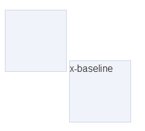
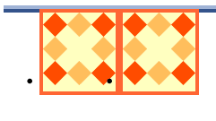

#### 隐式转换的种种规则

[`JavaScript` 中的 == 和 ===](http://hanekaoru.com/?p=1807)


#### 对象的属性可能有哪些特性(attribute)？

[`JavaScript` 中对象的属性的特性](https://www.cnblogs.com/yugege/p/4823863.html)


#### 原型链

[`JavaScript` 中的原型和原型对象](http://hanekaoru.com/?p=2272)

[constructor、__proto__ 和 prototype 区别和关系](http://hanekaoru.com/?p=1880)


#### 类型检测以及异常避免

[`JavaScript` 中的类型检测](http://hanekaoru.com/?p=1677)

#### 工厂模式

[`JavaScript` 笔记(对象)](http://hanekaoru.com/?p=699)


<!-- 正则 -->


#### 事件

[`JavaScript` 中的事件处理](http://hanekaoru.com/?p=266)


#### `JavaScript` 获得随机 unicode 字符

```js
String.fromCharCode(Math.floor(Math.random()*9999));
```


#### call 和 apply 的第一个参数

`call` 和 `apply` 用来改变函数的执行上下文（`this`），它们的第一个参数 `thisArg` 是个对象，即作为函数内的 `this`

在多数时候你传递什么给函数，那么它就是什么

```js
function fun() {
  alert(this);
}

fun.call(1);                // 1

fun.call('a');              // a

fun.call(true);             // true

fun.call({name: 'aaa'});    // [object Object]
```

有两种情况需要注意，传递 `null` 或 `undefined` 时，执行环境会是全局的（`window/global`）

可以参考[规范 15.3.4.4](http://lzw.me/pages/ecmascript/#323)

```js
fun.call(null);       // window
fun.call(undefined);  // window
```

但是在严格模式下，给 `call` 和 `apply` 传入的任何参数不再会转换

```js
'use strict'
function fun() {
  alert(this);
}

fun.call(null);        // null
fun.call(undefined);   // undefined
```


#### bind 简单实现

```js
if (!Function.prototype.bind) {
  Function.prototype.bind = function () {
    var self = this,                        // 保存原函数
      context = [].shift.call(arguments),   // 保存需要绑定的 this 上下文
      args = [].slice.call(arguments);      // 剩余的参数转为数组
    return function () {                    // 返回一个新函数
      self.apply(context,[].concat.call(args, [].slice.call(arguments)));
    }
  }
}
```

## DOM 操作

#### getElementsByClassName

```js
function getElementsByClassName(classname) {
  if (document.querySelectorAll) {
    return document.querySelectorAll('.' + classname);
  } else {
    var elements = document.getElementsByTagName('*');
    var reg = new RegExp('(^|\\s)' + classname + '(\\s|$)');
    var results = [];
    for (let i = 0, length = elements.length; i < length; i++) {
      if (reg.test(elements[i].className)) {
        results.push(elements[i]);
      }
    }
  }

  return results;
}
```

## CSS 操作

## 伪类和伪元素的区别 && 如何操作 CSS 的伪类和伪元素

https://segmentfault.com/a/1190000003711146

http://www.alloyteam.com/2016/05/summary-of-pseudo-classes-and-pseudo-elements/


## 如何检测改浏览器是否支持某个 CSS3 的特性

这个判断的原理是，创建一个节点，判断 `style` 属性是否含有指定的 `CSS3` 属性，有则进一步判断是否支持这个属性的某个值，比如

`text-overflow` 这个属性，`text-flow：clip` 是大部分浏览器都支持的，而 `text-flow：ellipsis` 则在 `firefox` 和 `10.6` 版本以下的 `opera` 上工作不了

判断代码如下

```js
// 创建一个节点
var element = document.createElement('div');

if('textOverflow' in element.style){
  element.style['textOverflow'] = 'ellipsis';
  return element.style['textOverflow'] === 'ellipsis';
}else{
  return false;
}
```

判断是否支持 `ellipsis` 值依靠的是浏览器对于非法 style 值的处理，当遇到不支持的属性值时，浏览器会直接把这个值抛弃

因此这里就可以先给 `textOverflow` 赋值 `'ellipsis'`，如果不支持，则其值肯定为空或者其它不等于 `'ellipsis'` 的值

因此只要判断赋值后的 `textOverflow` 是否等于 `'ellipsis'` 即可


## ajax 操作

#### GET 和 POST 的区别及使用要点 && 跨域

https://github.com/hanekaoru/WebLearningNotes/blob/master/interview/js/39.md


## http 协议（格式、状态码），cookie 操作

[cookie 的 domain 参数详解](https://blog.csdn.net/ni_hao_ya/article/details/21158887)

[Cookie 存取值和域（domain）](https://blog.csdn.net/qq_16559905/article/details/50916140)

[http 403](https://blog.csdn.net/qq_16559905/article/details/80356333)

[Referrer 还是 Referer？](https://imququ.com/post/referrer-or-referer.html)

[http](https://imququ.com/post/referrer-policy.html)


## 性能


----

----

## IE8下，模拟placeholder，input无法点击

解决办法：给 input 加上背景图

```css
background: url(0) no-repeat;
```


## placeholder低版本IE下不兼容相关问题

```html
<input type="text" value="abc" onfocus="if(value=='abc') {value=''}" onblur="if (value=='') {value='abc'}"> 
```


## CSS3边框外发光

```css
.borderOut {
  border: 1px solid #f8f8f8 !important;
  outline: none;
  border-color: rgba(241, 39, 232, .75);
  box-shadow: 0 0 10px rgba(241, 39, 232, .5);
  -moz-box-shadow: 0 0 8px rgba(241, 39, 232, .5);
  -webkit-box-shadow: 0 0 8px rgba(241, 39, 232, 3);
}
```


## 从JS异步回调函数中取值的解决办法

问题如下

```js
function load_val() {
  $.get("url", function (data) {
    // 如何把这里取到的 data 通过 load_val 函数返回出去？
  });
}
```

如果通过一个全局变量来获取，自然也不是不可以。不过这里就涉及到一点：用全局变量获取后，该怎么使用呢？

为什么会有这问题，还是上面这个例子，我们稍微改造一下：

```js

var obj = "";
function load_val() {
  $.get("url", function (data) {
    obj = data; // 此处将 data 赋予全局变量
  });
}

load_val();

function use_val() {
  obj += 1;
  console.log(obj);
}

use_val();
```

上面这个例子很好理解，我们想通过obj这个全局变量获取ajax异步过来的data数据，然后在use_val这个函数中使用obj这个变量。看似没问题，实际上问题很严重：
在use_val()中的obj真的是data的值么？不是的。而是""。为什么，因为就这段代码而言，obj = data是在use_val()执行完才在异步回调函数内实现的。在此之前，obj一直是""。于是又有人说，那我写个延时函数，等待obj = data后再执行呗。那样就太不优雅了。那么该如何解决呢？

```js
function load_val(callback) {// 定义一个回调函数
  $.get('url', function (data) {
    callback(data); // 将返回结果当作参数返回
  });
}

load_val(function (data) {
  obj = data; // 这里可以得到值
  use_val();
});

function use_val() {
  obj += 1;
  console.log(obj);
}
```

也就是在所需要调用的回调函数外加一个函数，这个函数包含一个参数，该参数是个函数，然而这个函数有着依赖于回调函数给出的值的参数。所以经过这两层，就能将原本回调函数里的值给取出来。


## 移动端背景全屏


不仅仅是简单的 background-size: cover 那么简单了，还需要进行小小的处理。先说说我希望实现的效果吧。我希望的效果是整个背景能够填充整个页面，并且在页面元素上下滚动的情况下，背景固定而不随着元素滚动。

放到往常我可能会这么写：

```css
body,html{
  height: 100%;
}

body{
  background: url(bg.png) center 0 no-repeat;
  background-size: cover;
}
```

但是这样的话在移动端会出现比较严重的后果，那就是一旦页面元素的高度大于整个页面后，滚动页面元素的时候，背景也会随之而动。而且背景会被撑开。这不是我所希望的。

这里用到一个小技巧，用上 :before 的方法。

```css
body:before {
  content: "";
  position: fixed;
  z-index: -1;
  top: 0;
  right: 0;
  bottom: 0;
  left: 0;
  background: url(bg.png) center 0 no-repeat;
  background-size: cover;
}
```


## 高度自适应的div，里面有两个div，一个高度100px，希望另一个填满剩下的高度

https://segmentfault.com/q/1010000000762512/a-1020000000762933


## 移动端滑动卡顿

-webkit-overflow-scrolling: touch;


## 判断是否是数组

```js
if (my_value && typeof my_value === "object" &&
  typeof my_value.length === "number" &&
  !(my_value.propertyIsEnumerable("length"))) {
  // my_value 确实是一个数组
}
```

arguments 和 数组

```js
if (my_value && typeof my_value === "object" &&
  typeof my_value.length === "number" &&
  !(my_value.propertyIsEnumerable("length")) &&
  typeof my_value.slice === "function") {
  // 增加 typeof my_value.slice === "function" 判断
  // 从而来辨别 arguments 和 数组
}
```


## 判断是否是数字

```js
typeof value === "number" && isFinite(value);
```


## isArray

```js
var isArray = function (value) {
  return value && typeof value === "object" && value.constructor === "Array";
}
```

上面这个方法在 从不同的窗口（window）（frame）里构造的数组的时候会失败，所以我们不得不考虑更多

```js
var isArray = function (value) {
  return value && typeof value === "object"
    && typeof value.length === "number"
    && typeof value.slice === "function"
    && !(value.propertyIsEnumerable("length"));
}
```

首先，我们要判断这个值是否为真，不接受 null 和 其他为假 的值

其次判断 typeof 运算的结果是否为 object，对于对象，数组和 null 来说，返回的是 true（但是对于对象来说并非如此）

然后判断这个值是否包含一个 splice 的方法，对于数组来说，又将会得到 true

最后判断 length 属性是否是可枚举的，对于数组来说，将得到 false 


## 提取数字中的整数部分

```js
Function.prototype.method = function (name, func) {
  this.prototype[name] = func;
  return this;
}


Number.method("integer", function () {
  return Math[this < 0 ? "ceil" : "floor"](this);
})

alert((-10 / 3).integer())
```


## 正则表达式

去除所有的html

```js
var con = content.replace(/<[^>]+>/g,'');
```

去除空格

```js
var con = content.replace(/\s/g,'');
```

判断输入的是否为数字

```js
var reg=/^\d+(\.\d+)?$/;
​
if(reg.test(title) == true){
  alert("内容不能为纯数字，请从新输入！");
  return false;
}
```

取括号中的数值

```js
/\(([^()]+)\)/g.exec('add(18)')
```


## 实现一个函数clone，可以对JavaScript中的5种主要的数据类型（包括Number、String、Object、Array、Boolean）进行值复制

```js
Object.prototype.clone = function () {
  var o = this.constructor === Array ? [] : {};
  for (var e in this) {
    o[e] = typeof this[e] === "object" ? this[e].clone() : this[e];
  }
  return o;
}
```


## IE10下 file框需要双击

设置 `font-size` 属性 `100px`

## input 不让光标出现

```css
unselectable="on"
```

## line-height:150% 和 line-height:1.5

父元素 line-height:150% -- 根据父元素的字体大小先计算出行高值然后再让子元素继承

子元素字体大小 = 父元素字体大小 * 150%

父元素 line-height:1.5 -- 根据子元素的字体大小动态计算出行高值让子元素继承

子元素字体大小 = 子元素字体大小 * 150%

## -webkit-appearance

其中-webkit-appearance: push-button;就是将按钮设置成iOS中默认原生控件的样式。

通常我们可以在相应的元素上加上

```css
-webkit-appearance : none;
```

来移除原生控件样式。

注意： 360浏览器若是添加该属性，input默认的checkbox框无法显示

兼容性 http://www.css88.com/webkit/-webkit-appearance/


## 清除选中样式

```js
// 改变默认选中的背景颜色 
::-moz-selection{background:#FF0000;color:#FFFFFF;}
::selection {background:#FF0000;color:#FFFFFF;}
code::-moz-selection {background:#FF0000;color:#FFFFFF;}
code::selection {background:#FF0000;color:#FFFFFF;}


// 设置页面禁止选中　　
/*全局*/
html,body{ 
  padding:0px; margin:0px; background:#fff; 
  moz-user-select: -moz-none;
  -moz-user-select: none;
  -o-user-select:none;
  -khtml-user-select:none; /* you could also put this in a class */
  -webkit-user-select:none;/* and add the CSS class here instead */
  -ms-user-select:none;
  user-select:none;/**禁止选中文字*/ 
}
```


## apply/call 在严格模式下的不同

```js
function foo(x, y) {
  'use strict';
  console.log(x, y, this);
}

foo.apply(null);  // undefined undefined null
foo.apply(undefined);  // undefined undefined undefined
```


## querySelector和querySelectorAll

1、querySelector只返回匹配的第一个元素，如果没有匹配项，返回null。 
2、querySelectorAll返回匹配的元素集合，如果没有匹配项，返回空的nodelist(节点数组)。 
3、返回的结果是静态的，之后对document结构的改变不会影响到之前取到的结果。 

这两个方法都可以接受三种类型的参数：id(#)，class(.)，标签，很像jquery的选择器。

```js
var obj = document.querySelector("#id");
var obj = document.querySelector(".classname");
var obj = document.querySelector("div");

var el = document.body.querySelector("style[type='text/css'],style:not([type])");

var elements = document.querySelectorAll("#score>tbody>tr>td:nth-of-type(2)");
var elements = document.querySelectorAll("#id1, #id2, .class1, class2, div a, #list li img");
```

例子

```js
//获取<div>中的所有图像（和getElementsByTaName("img")一样）
var images = document.getElementById("myDiv").querySelectorAll("img");

//获取所有包含“selected”类的元素
var selected = document.querySelectorall(".selected");

//获取所有<p>元素中的<strong>元素
var strongs = document.querySelectorAll("p strong");
```

返回的StaticNodeList对象可以以NodeList一样的方式迭代，使用item()或者是方括号标记来检索单个元素。如下面的例子：

```js
for (var i = 0, len = strongs.length; i < len; i++) {
  var strong = strong[i]; //或strongs.item(i)
  strong.className = "important";
}
```

可以如下面的例子所示，在querySelectorAll()中使用一个命名空间解析器

```js
var svgImages = document.querySelectorAll("svg|svg", function (prefix) {
  switch (prefix) {
      return "http://www.w3.org/2000/svg";
  //此处其它代码
}
});
```

## 火狐专有hack

```css
@-moz-document url-prefix(){.defaultmallsearchbt{padding:0 0 4px 16px;}} 
```


## 五大基本原则

单一职责原则SRP(Single Responsibility Principle)
是指一个类的功能要单一，不能包罗万象。如同一个人一样，分配的工作不能太多，否则一天到晚虽然忙忙碌碌的，但效率却高不起来。

开放封闭原则OCP(Open－Close Principle) 
一个模块在扩展性方面应该是开放的而在更改性方面应该是封闭的。比如：一个网络模块，原来只服务端功能，而现在要加入客户端功能，
那么应当在不用修改服务端功能代码的前提下，就能够增加客户端功能的实现代码，这要求在设计之初，就应当将服务端和客户端分开，公共部分抽象出来。

替换原则(the Liskov Substitution Principle LSP) 
子类应当可以替换父类并出现在父类能够出现的任何地方。比如：公司搞年度晚会，所有员工可以参加抽奖，那么不管是老员工还是新员工，
也不管是总部员工还是外派员工，都应当可以参加抽奖，否则这公司就不和谐了。

依赖原则(the Dependency Inversion Principle DIP) 具体依赖抽象，上层依赖下层。假设B是较A低的模块，但B需要使用到A的功能，
这个时候，B不应当直接使用A中的具体类： 而应当由B定义一抽象接口，并由A来实现这个抽象接口，B只使用这个抽象接口：这样就达到
了依赖倒置的目的，B也解除了对A的依赖，反过来是A依赖于B定义的抽象接口。通过上层模块难以避免依赖下层模块，假如B也直接依赖A的实现，那么就可能造成循环依赖。一个常见的问题就是编译A模块时需要直接包含到B模块的cpp文件，而编译B时同样要直接包含到A的cpp文件。

接口分离原则(the Interface Segregation Principle ISP) 
模块间要通过抽象接口隔离开，而不是通过具体的类强耦合起来


## 深度克隆

```js
// 深复制
var user = {
  name: 'aaa',
  tag: ['tag1', 'tag2'],
  username: 'test',
  password: 'password'
}
function extendDeepCopy(obj, newobj) {
  var newobj = newobj || {};
  for (var i in obj) {
    if (typeof obj[1] == "object") {
      newobj[i] = (obj[i].constructor === Array) ? [] : {};
      extendDeepCopy(obj[i], newobj[i]);
    } else {
      newobj[i] = obj[i];
    }
  }
  return newobj;
}
var user1 = extendDeepCopy(user);
user1.name = 'bbb';
user1.username = 'username1';
user1.password = 'password1';
user1.tag.push('tag3');
```

```js
// 对象的深度克隆
function clone(Obj) {
  var buf;

  if (Obj instanceof Array) {
    // 创建一个空的数组
    buf = []; 
    var i = Obj.length;

    while (i--) {
      buf[i] = clone(Obj[i]);
    }

    return buf;

  } else if (Obj instanceof Object) {
    // 创建一个空对象
    buf = {}; 

    // 为这个对象添加新的属性
    for (var k in Obj) { 
      buf[k] = clone(Obj[k]);
    }
    return buf;

  } else {
    return Obj;
  }
}
```


## 常用设计模式的实现思路


```js
// 常用设计模式的实现思路，单例，工厂，代理，装饰，观察者模式等


// 1) 单例：　任意对象都是单例，无须特别处理
var obj = { name: 'michaelqin', age: 30 };


// 2) 工厂: 就是同样形式参数返回不同的实例
function Person() { this.name = 'Person1'; }
function Animal() { this.name = 'Animal1'; }

function Factory() { }
Factory.prototype.getInstance = function (className) {
  return eval('new ' + className + '()');
}

var factory = new Factory();
var obj1 = factory.getInstance('Person');
var obj2 = factory.getInstance('Animal');
console.log(obj1.name); // Person1
console.log(obj2.name); // Animal1


//3) 代理: 就是新建个类调用老类的接口,包一下
function Person() { }
Person.prototype.sayName = function () { console.log('michaelqin'); }
Person.prototype.sayAge = function () { console.log(30); }

function PersonProxy() {
  this.person = new Person();
  var that = this;
  this.callMethod = function (functionName) {
    console.log('before proxy:', functionName);
    // 代理
    that.person[functionName](); 
    console.log('after proxy:', functionName);
  }
}

var pp = new PersonProxy();
pp.callMethod('sayName'); // 代理调用 Person 的方法 sayName()
pp.callMethod('sayAge');  // 代理调用 Person 的方法 sayAge()


//4) 观察者: 就是事件模式，比如按钮的 onclick 这样的应用
function Publisher() {
  this.listeners = [];
}
Publisher.prototype = {
  'addListener': function (listener) {
    this.listeners.push(listener);
  },

  'removeListener': function (listener) {
    delete this.listeners[listener];
  },

  'notify': function (obj) {
    for (var i = 0; i < this.listeners.length; i++) {
      var listener = this.listeners[i];
      if (typeof listener !== 'undefined') {
        listener.process(obj);
      }
    }
  }
}; 

// 发布者
function Subscriber() { }
// 订阅者
Subscriber.prototype = {
  'process': function (obj) {
    console.log(obj);
  }
};

var publisher = new Publisher();
publisher.addListener(new Subscriber());
publisher.addListener(new Subscriber());
publisher.notify({ name: 'michaelqin', ageo: 30 });          // 发布一个对象到所有订阅者
publisher.notify('2 subscribers will both perform process'); // 发布一个字符串到所有订阅者
```

## link和@import

差别1：老祖宗的差别。link属于XHTML标签，而@import完全是CSS提供的一种方式。
link标签除了可以加载CSS外，还可以做很多其它的事情，比如定义RSS，定义rel连接属性等，@import就只能加载CSS了。


差别2：加载顺序的差别。当一个页面被加载的时候（就是被浏览者浏览的时候），link引用的 CSS会同时被加载，而@import引用的CSS会等到页面全部被下载完再被加载。所以有时候浏览@import加载CSS的页面时开始会没有样式（就 是闪烁），网速慢的时候还挺明显（梦之都加载CSS的方式就是使用@import，我一边下载一边浏览梦之都网页时，就会出现上述问题）。


差别3：兼容性的差别。由于@import是CSS2.1提出的所以老的浏览器不支持，@import只有在IE5以上的才能识别，而link标签无此问题。


差别4：使用dom控制样式时的差别。当使用javascript控制dom去改变样式的时候，只能使用link标签，因为@import不是dom可以控制的。


## 千位分隔符（整数）

```js
var a = "-1234454654645645";

a = a.replace(/(\d)(?=(\d{3})+$)/g,"$1,");

console.log(a);
```


## 异步加载方案

```js
// (1) defer，只支持 IE
// (2) async：
// (3) 创建 script，插入到 DOM 中，加载完毕后 callBack
function loadScript(url, callback) {
  var script = document.createElement("script")
  script.type = "text/javascript";
  // IE
  if (script.readyState) { 
    script.onreadystatechange = function () {
      if (script.readyState == "loaded" ||
        script.readyState == "complete") {
        script.onreadystatechange = null;
        callback();
      }
    };
  } else { 
    // Others: Firefox, Safari, Chrome, and Opera
    script.onload = function () {
      callback();
    };
  }
  script.src = url;
  document.body.appendChild(script);
}
```


## 简易事件模型

定顺序触发相应的响应函数。

大致实现思路就是创建一个类或是匿名函数，在bind和trigger函数外层作用域创建一个字典对象，用于存储注册的事件及响应函数列表，bind时，如果字典没有则创建一个，key是事件名称，value是数组，里面放着当前注册的响应函数，如果字段中有，那么就直接push到数组即可。trigger时调出来依次触发事件响应函数即可。

不过还有很多细节，比如触发响应函数时的上下文应该是什么，触发响应函数的参数列表应该是什么，如果要求把调用trigger的参数列表都传到响应函数中还要考虑到吧arguments对象转化为纯数组才行等等。

*/

```js
var Emitter = function () {
  this._listeners = {};
};

// 注册事件
Emitter.prototype.on = function (eventName, callback) {
  var listeners = this._listeners[eventName] || [];
  listeners.push(callback);
  this._listeners[eventName] = listeners;
}

// 触发事件
Emitter.prototype.emit = function (eventName) {
  var args = Array.prototype.slice.apply(arguments).slice(1),
    listeners = this._listeners[eventName],
    self = this;

  if (!Array.isArray(listeners)) return;

  listeners.forEach(function (callback) {
    try {
      callback.apply(this, args);
    } catch (e) {
      console.error(e);
    }
  });
}

// 实例
var emitter = new Emitter();

emitter.on('event', function (arg1, arg2) {
  console.log('get event', arg1, arg2);
})

console.log('emit event');
emitter.emit('event', 'arg1', 'arg2');
```


## 实例

找出数字数组中最大的元素（使用Match.max函数）

```js
Math.max.apply(null, arr);
```


转化一个数字数组为function数组（每个function都弹出相应的数字）

```js
var arr = [3, 2, 3, 4];
for (var i = 0; i < arr.length; i++) {
  var index = arr[i];
  (function (index) {
    arr[i] = function () {
      alert(index);
    }
  })(index)
}

arr[0]();
```


给object数组进行排序（排序条件是每个元素对象的属性个数）

```js
Object.prototype.getLength = function () {
  var num = 0;
  for (var key in this) {
    if (this.hasOwnProperty(key)) {
      num++;
    }
  }
  return num;
}

var a = {
  name: 'a',
  age: 10,
  location: 'b'
};

var b = {
  name: 'c'
};

var c = {
  name: 'd',
  sex: 'e'
};

var arr = [a, b, c];

arr.sort(function (a, b) {
  return a.getLength() > b.getLength();
})

console.log(arr);
```


利用JavaScript打印出Fibonacci数（不使用全局变量）

```js
// 0, 1, 1, 2, 3, 5, 8, 13, 21, 34, 55, 89, 144, ...
function fn(n) {
  var a = [];
  a[0] = 0, a[1] = 1;
  for (var i = 2; i < n; i++) {
    a[i] = a[i - 1] + a[i - 2];
  }
  for (var i = 0; i < n; i++) {
    console.log(a[i]);
  }
}

fn(20);
```


实现如下语法的功能：var a = (5).plus(3).minus(6);    //2

```js
Number.prototype.plus = function (a) {
  return this + a;
};

Number.prototype.minus = function (a) {
  return this - a;
};

var a = (5).plus(3).minus(6);

console.log(a);
```


实现如下语法的功能：var a = add(2)(3)(4);    //9

```js
function add(a) {
  var temp = function (b) {
    return add(a + b);
  }
  temp.valueOf = temp.toString = function () {
    return a;
  };
  return temp;
}
var ans = add(2)(3)(4);

console.log(ans);
```


## IE和FireFox之间常用兼容方法

0. 鼠标坐标加上滚动条滚过的距离 
IE：event.offsetX和event.offsetY 
FF：event.layerX和event.layerY 
解决办法： 

function mouseDownHandler(event) { 
    var event = event || window.event; 
    //var event = event ? event : window.event; 
    var x = event.offsetX || event.layerX; 
    var y = event.offsetX || event.layerY; 
} 

1.window.event 
IE：有window.event对象 
FF：没有window.event对象，可以通过函数的参数传递event对象。如onclick=clickHandler(event) 
解决办法：var event = event || window.event; 

2. 鼠标当前坐标 
IE：event.x和event.y 
FF：event.pageX和event.pageY 
解决办法：采用通用属性：event.clientX和event.clientY属性; 

3. event.srcElement 
IE：event对象有srcElement属性，但是没有target属性； 
FF：event对象有target属性，但没有srcElement属性 
解决办法：
//使用
obj = event.srcElement ? event.srcElement : event.target;

//来代替IE下的
event.srcElement

//或者FF下的（注意event的兼容性）; 
event.target

4.event.toElement 
IE：event对象有toElement属性，但没有relatedTarget属性 
FF：event对象没有有toElement属性，但有relatedTarget属性 
解决办法：var target = e.relatedTarget || e.toElement; 

5. 标签的x和y的坐标位置，style.posLeft 和 style.posTop 
IE：有 
FF：没有 
解决办法：用通用属性obj.offsetLeft 和 obj.offsetTop 

6. 窗体的高度和宽度 
IE：document.body.offsetWidth 和 document.body.offsetHeight。注意，此时页面一定要有body标签。 
FF：window.innerWidth 和 window.innerHeight，以及 document.documentElement.clientWidth 和 document.documentElement.clientHeight。 
解决办法：通用属性 document.body.clientWidth 和 document.body.clientHeight； 

7. 添加事件 
IE：element.attachEvent('onclick',function) 
FF：element.addEventListener('click',function,true) 
解决办法：element.onclick = function.虽然都可以使用click事件。但onclick和上面两种方法效果是不一样的。onclick只有执行一个过程，而attachEvent 和 addEventListener执行的是一个过程列表，也就是多个过程。 
如：element.attachEvent('onclick',func1); element.attachEvent("onclick", func2)这样func1和func2都会被执行。 

8. 标签的自定义属性 
IE：如果给标签div1定义了一个属性value，可以div1.value 和 div1["value"]取得该值 
FF：不能用div1.value 和div1["value"] 
解决办法：div1.getAttribute('value') 

9. document.form.item 
IE：现有问题，document.formName.item("itemName") 这样的语句，不能在 FF 下运行 
FF：不支持 
解决办法： document.formName.elements["elementName"] 

10. 集合/数组类对象问题 
IE：有许多集合类对象取用时用() 
FF：不能这样取用 
解决办法：改用[]作为下标运算。 
如：document.forms("formName") 改为 document.forms["formName"]。document.getElementsByName("inputName")(1) 改为 document.getElementsByName("inputName")[1] 

11. HTML对象的id作为对象名的问题 
IE：HTML对象的id可以作为document的下属变量名直接使用 
FF：需要用getElementById()方法 
解决办法：用getElementById('idName')代替idName作为对象变量使用 

12. 用idName字符串取得对象的问题 
IE：利用eval(idName)可以取得 id 为 idName 的HTML对象。 
FF：不支持 
解决办法：getElementById(idName) 代替 eval(idName) 

13. 变量名与某 HTML 对象 id 相同的问题 
IE：因为HTML对象id 在IE中直接调用，所以变量名不能和id相同 
FF：可以使用变量名和id相同 
解决办法，声明变量时一律加上 var ，以避免歧义(最好id和变量名不要相同)。 

14. document.getElementsByName() 和 document.all[name] 
IE：getElementsByName()、document.all[name] 均不能用来取得 div 元素 
FF：可以兼容document.all， 但会生成一条警告。 
解决办法：可以用getElementById() 或者 getElementByTagName()来代替 

15. input.type属性问题 
IE：input.type属性为只读 
FF：input.type属性为读写 

16. window.location.href 
IE：（FF2.0以下），可以使用window.location 或 window.location.href ; FF 1.5下只能使用window.location 
解决办法：使用window.location 来代替 window.location.href 

17. 模态和非模态窗口问题 
IE：可以通过 showModalDialog 和 showModelessDialog 打开模态和非模态窗口 
FF：不支持 
解决办法：直接使用window.open(pageURL, name, parameters) 方式打开新窗口，如果需要将子窗口中的参数传递回父窗口，可以在子窗口中使用window.opener来访问父窗口。 
如：var parWin = window.opener; parWin.document.getElementById('title').value = 'My Title'; 

18. body 
IE：body必须在body标签被浏览器完全读入后才存在 
FF：body在body标签没有被浏览器完全读入之前就存在 

19. 事件委托方法 
IE：document.body.onload = init; 
FF：document.body.onload = init(); 
解决办法：统一使用 document.body.onload = new Function('init()'); 或者 docuement.body.onload = function(){/* 这里是代码 */} 

20. 父元素的区别 
IE：obj.parentElement; 
FF ：obj.parentNode 
解决办法：因为FF与IE都支持DOM，所以可以都使用obj.parentNode 

22.innerText在IE中能正常工作，但是innerText在FF中却不行. 需用textContent 

23. FF中设置HTML标签的style时，所有位置性和字体尺寸的值必须后跟px。这个IE也是支持的 

24. 父节点、子节点和删除节点 
IE：parentElement、parement.children，element.romoveNode(true)。 
FF：parentNode、parentNode.childNodes，node.parentNode.removeChild(node)。


## 如何从一个JavaScript对象中删除一个属性

```js
var myJSONObject = { "ircEvent": "PRIVMSG", "method": "newURI", "regex": "^http://.*" };

// ==>

var myJSONObject = { "ircEvent": "PRIVMSG", "method": "newURI" };

// 方法一
delete myJSONObject.regex;

// or,

delete myJSONObject['regex'];

// or,

var prop = "regex";
delete myJSONObject[prop];

// 方法二
var myJSONObject = { "ircEvent": "PRIVMSG", "method": "newURI", "regex": "^http://.*" };

delete myJSONObject.regex;

alert(myJSONObject.regex); // alerts: undefined
```


## 关于 "use strict"

严格模式是`ECMAScript 5`中的一项新特征，允许你把一段程序或功能放置在"strict"工作环境中。这种严格上下文环境防止某些行为被采取并引发更多的异常。


严格的模式有助于几个方面：

* 它捕获了一些常见的编码错误，抛出异常。

* 它阻止，或抛出错误，当相对“不安全”的行为被采用（例如获取全局对象）。 

* 它禁用那些混淆的或者考虑不周的特征

```js
// 非严格的代码...

(function () {
  "use strict";

  // 严格定义你的库...
})();

// 非严格的代码
```


## 检测是否有东西被隐藏

```js
// 检查 display:[none|block], 忽略 visible:[true|false]
$(element).is(":visible");

// 匹配的是隐藏的所有元素
$('element:hidden')

// 匹配所有可见的元素
$('element:visible')
```


## position & left & display & bfc 等等 tips

float也是典型的inline-block化元素，这种元素的inline-block化适用于任何水平的标签。

例如一个div标签默认宽度是100%显示的，但是一旦被absolute属性缠上，则100%默认宽度就会变成自适应内部元素的宽度。
但是，有float:left/position:absolute撑腰的情况下，display属性就是多余的，可以直接回家喝茶了。

```css
span { float:left; width:100px; }
span { position:absolute; width:100px; }
```

动画效果应用到position属性为absolute或fixed的元素上

动画效果应用到position属性为absolute或fixed的元素上，它们不影响其他元素的布局，所它他们只会导致重新绘制，而不是一个完整回流。这样消耗会更低。

百分比是相对单位，比方说translate是自身，width/height是父级，background-position需要尺寸差计算等。

圆角：border-垂直-水平-radius: 水平 垂直

vertical-align的百分比值不是相对于字体大小或者其他什么属性计算的，而是相对于line-height计算的。举个简单的例子，如下CSS代码：

```css
{
  line-height: 30px;
  vertical-align: -10%;
}
```

实际上，等同于：

```css
{
  line-height: 30px;
  vertical-align: -3px;    /* = 30px * -10% */  
}
```

vertical-align  block化就无效了

line boxes 一个inline-block元素，如果里面没有inline内联元素，或者overflow不是visible，则该元素的基线就是其margin底边缘，否则，其基线就是元素里面最后一行内联元素的基线。



在目前的CSS的世界中，所有的高度都是有两个CSS模型产生的，一个是box盒状模型，对应CSS为”height+padding+margin”，另外一个是line box模型，对应样式为”line-height”。前者的height属性分为明显的height值和隐藏的height值，所谓隐藏的height值是指图片的高度，一旦载入一张图片，其内在的height值就会起作用，即使您看不到”height”这个词。而后者针对于文字等这类inline boxes的元素（图片也属于inline boxes，但其height比line-height作用更凶猛，故其inline boxes高度等于其自身高度，对line-height无反应），inline boxes的高度直接受line-height控制（改变line-height文字拉开或重叠就是这个原因），而真正的高度表现则是由每行众多的inline boxes组成的line boxes（等于内部最高的inline box的高度），而这些line boxes的高度垂直堆叠形成了containing box的高度，也就是我们见到的div或是p标签之类的高度了。所以，对于line box模型的元素而言，没有inline boxes，就没有高度了，而浮动却恰恰做了这么龌龊的事情，其直接将元素的inline boxes也破坏了，于是这些元素也就没有了高度。

浮动布局会让父标签高度缺失



清除浮动其实就一个目的，就是解决高度塌陷的问题。为什么会高度塌陷？什么时候会高度塌陷？塌陷原因是：元素含有浮动属性 – 破坏inline box – 破坏line box高度 – 没有高度 – 塌陷。什么时候会塌陷：当标签里面的元素只要样子没有实际高度时会塌陷。所以呢，并不是只要有浮动元素就会坍塌，就要清除的


float与JavaScript
JavaScript可以改变CSS的属性，其他些属性还好，但是这个float值得一说，为何呢，因为float貌似是JavaScript中的一个关键字，不能使用obj.style.float="left";这样的句子。得使用其他写法。

IE浏览器：
```css
obj.style.styleFloat = "left";
```
其他浏览器：
```css
obj.style.cssFloat = "left";
```

CSS的margin塌陷（collapse） 


因为CSS中存在一个margin collapse，即边界塌陷或者说边界重叠。对于上下两个并列的div块而言，上面div的margin-bottom和下面div的margin-top会塌陷，也就是会取上下两者margin里最大值作为显示值，所以从这个意义上说：CSS及浏览器的设计者们希望我们在布局时，如果遇到上下两个并排内容块的安排，最好只设置其中每个块上或下margin的一处即可。
    但对于父块DIV内含子块DIV的情况，就会按另一条CSS惯例来解释了，那就是：对于有块级子元素的元素计算高度的方式,如果元素没有垂直边框和填充,那其高度就是其子元素顶部和底部边框边缘之间的距离。

结论：
    解决父子DIV中顶部margin cllapse的问题，需要给父div设置：
    1、边框，当然可以设置边框为透明;
    2、为父DIV添加padding，或者至少添加padding-top;
    此外，还可以通过over-flow:hidden来解决

    
----

----


## 常用的一些数组/Math/全局/str操作方法


#### hasOwnProperty

是用来判断一个对象是否有你给出名称的属性或对象。不过需要注意的是，此方法无法检查该对象的原型链中是否具有该属性，该属性必须是对象本身的一个成员。

在跨浏览器的设计中，我们不能依赖于for in来获取对象的成员名称，一般使用hasOwnProperty来判断。

```js
var buz = {
  fog: 'stack'
};

for (var name in buz) {
  if (buz.hasOwnProperty(name)) {
    alert("this is fog (" + name + ") for sure. Value: " + buz[name]);
  }
  else {
    alert(name); // toString or something else
  }
}
```

在 Object.prototype 中调用 hasOwnProperty()

```js
// 对象
var man = {
  hands: 2,
  legs: 2,
  heads: 1
};

// 将一个方法添加到对象上
if (typeof Object.prototype.clone === "undefined") {
  Object.prototype.clone = function () {
    // ...
  }
}

// 使用 hasOwnProperty()
for (var i in man) {
  if (Object.prototype.hasOwnProperty.call(man, i)) {  // 过滤
    console.log(i, ":", man[i]);
  }
}
```

在使用 hasOwnProperty() 对 man 对象进行精炼后，可有效的避免命名冲突，也可以使用一个本地变量来缓存比较长的属性名

```js
var i,
  hasOwn = Object.prototype.hasOwnProperty;

for (var i in man) {
  if (hasOwn.call(man, i)) {  // 过滤
    console.log(i, ":", man[i]);
  }
}
```

严格来讲，不使用 hasOwnProperty() 并没有错，依赖具体任务和对代码的自信，可以忽略过该方法并略微加快循环的执行速度，但是当确认不了对象的内容（和原型链）的时候，最好还是加上 hasOwnProperty() 这样安全的检查

#### isPrototypeOf

是用来判断要检查其原型链的对象是否存在于指定对象实例中，是则返回true，否则返回false。

```js
function Fee() {
  // . . .
}

function Fi() {
  // . . .
}
Fi.prototype = new Fee();

function Fo() {
  // . . .
}
Fo.prototype = new Fi();

function Fum() {
  // . . .
}
Fum.prototype = new Fo();


// ---------------------------


var fum = new Fum();
// ...

if (Fi.prototype.isPrototypeOf(fum)) {
  // do something safe
} 
```

#### instanceof

用来测试一个对象在其原型链构造函数上是否具有prototype属性，直白的说就是，用来检测constructor.prototype是否存在于参数 object 的原型链上

```js
// 定义构造函数
function C() { }
function D() { }

var o = new C();

// true，因为 Object.getPrototypeOf(o) === C.prototype
o instanceof C;

// false，因为 D.prototype不在o的原型链上
o instanceof D;

o instanceof Object; // true,因为Object.prototype.isPrototypeOf(o)返回true
C.prototype instanceof Object // true,同上

C.prototype = {};
var o2 = new C();

o2 instanceof C; // true

o instanceof C; // false,C.prototype指向了一个空对象,这个空对象不在o的原型链上.

D.prototype = new C(); // 继承
var o3 = new D();
o3 instanceof D; // true
o3 instanceof C; // true

```


需要注意的是，如果表达式 obj instanceof Foo 返回true，则并不意味着该表达式会永远返回ture，因为Foo.prototype属性的值有可能会改变，改变之后的值很有可能不存在于obj的原型链上，这时原表达式的值就会成为false。

另外一种情况下，原表达式的值也会改变，就是改变对象obj的原型链的情况，虽然在目前的ES规范中，我们只能读取对象的原型而不能改变它，但借助于非标准的__proto__魔法属性，是可以实现的。比如执行obj.__proto__ = {}之后，obj instanceof Foo就会返回false了。

更多详细见： https://developer.mozilla.org/zh-CN/docs/Web/JavaScript/Reference/Operators/instanceof

附：判断一个变量是不是对象。值类型的类型判断用typeof，引用类型的类型判断用instanceof。

```js
var fn = function () { };
console.log(fn instanceof Object);  // true

```


#### typeOf

```js
function show(x) {

  console.log(typeof (x));    // undefined
  console.log(typeof (10));   // number
  console.log(typeof ('abc')); // string
  console.log(typeof (true));  // boolean

  console.log(typeof (function () { }));  //function

  console.log(typeof ([1, 'a', true]));  //object
  console.log(typeof ({ a: 10, b: 20 }));  //object
  console.log(typeof (null));  //object
  console.log(typeof (new Number(10)));  //object

}

show();

```

对于数字类型的值，typeof会返回number，注意：NaN也是一个数字类型，因为它在JavaScript中代表的是特殊非数字值。
对于字符串类型的值，typeof会返回string。
对于布尔类型的值，typeof会返回boolean。
对于对象，数组，null而言，typeof会返回object
对于函数类型而言，typeof返回function
如果运算数没有定义（不存在或未赋值），将会返回undefined。


长按事件

只要长按时间到达1000毫秒，无论是否弹起鼠标，都会触发。反之，如果不到1000毫秒，鼠标弹起的时候会结束

```js
//申明全局变量
var timeStart, timeEnd, time;

//获取此刻时间
function getTimeNow() {
  var now = new Date();
  return now.getTime();
}

//鼠标按下时触发
function holdDown() {
  //获取鼠标按下时的时间
  timeStart = getTimeNow();

  //setInterval会每100毫秒执行一次，也就是每100毫秒获取一次时间
  time = setInterval(function () {
    timeEnd = getTimeNow();

    //如果此时检测到的时间与第一次获取的时间差有1000毫秒
    if (timeEnd - timeStart > 1000) {
      //便不再继续重复此函数 （clearInterval取消周期性执行）
      clearInterval(time);
      //字体变红
      document.getElementById("p1").style.color = "red";
    }
  }, 100);
}
function holdUp() {
  //如果按下时间不到1000毫秒便弹起，
  clearInterval(time);
}
```


如何判断一个对象是否为空

1 最常见的思路，for...in 遍历属性，为真则为“非空数组”；否则为“空数组”

```js
for (var i in obj) { // 如果不为空，则会执行到这一步，返回true
    return true
}
return false // 如果为空,返回false
```

2 通过 JSON 自带的 stringify() 方法来判断

JSON.stringify() 方法用于将 JavaScript 值转换为 JSON 字符串。

```js
if (JSON.stringify(data) === '{}') {
    return false // 如果为空,返回false
}
return true // 如果不为空，则会执行到这一步，返回true
```

这里需要注意为什么不用 toString()，因为它返回的不是我们需要的。

```js
var a = {}
a.toString() // "[object Object]"
```


3 ES6 新增的方法 Object.keys():

Object.keys() 方法会返回一个由一个给定对象的自身可枚举属性组成的数组。

如果我们的对象为空，他会返回一个空数组，如下：

```js
var a = {}
Object.keys(a) // []
```

我们可以依靠Object.keys()这个方法通过判断它的长度来知道它是否为空。

```js
if (Object.keys(object).length === 0) {
    return false // 如果为空,返回false
}
return true // 如果不为空，则会执行到这一步，返回true
```


Javascript命名空间和模块

[Javascript命名空间和模块](https://www.kenneth-truyers.net/2013/04/27/javascript-namespaces-and-modules/)