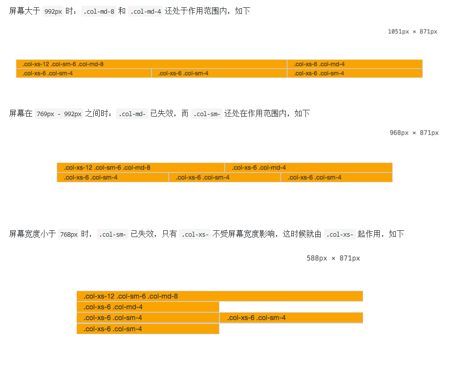

## WEB 标准以及 W3C 的理解与认识

[Web 标准](https://zh.wikipedia.org/wiki/%E7%B6%B2%E9%A0%81%E6%A8%99%E6%BA%96) 不是某一个标准，而是一系列标准的集合，网页主要由三部分组成，结构（`Structure`）、表现（`Presentation`）和行为（`Behavior`）

对应的标准也分三方面，结构化标准语言主要包括 `XHTML` 和 `XML`，表现标准语言主要包括 `CSS`，行为标准主要包括对象模型（如 `W3C DOM`）、`ECMAScript` 等，这些标准大部分由 [万维网联盟](https://zh.wikipedia.org/wiki/%E4%B8%87%E7%BB%B4%E7%BD%91%E8%81%94%E7%9B%9F)（`W3C`）起草和发布，也有一些是其他标准组织制订的标准，比如 `ECMA`（`European Computer Manufacturers Association`）的 `ECMAScript` 标准，之所以使用 `Web` 标准，主要是为了解决因浏览器版本不同、软硬件设备不同导致的需多版本开发的问题

`W3C` 对 `Web` 标准提出了规范化的要求，也就是在实际编程中的一些代码规范，包含如下几点

* 对于结构要求（标签规范可以提高搜索引擎对页面的抓取效率，对 `SEO` 很有帮助）
  * 标签字母要小写
  * 标签要闭合
  * 标签不允许随意嵌套
* 对于 `CSS` 和 `JavaScript` 来说
  * 尽量使用外链 `CSS` 样式表和 `JavaScript` 脚本，是结构、表现和行为分为三块，符合规范，同时提高页面渲染速度，提高用户的体验
  * 样式尽量少用行间样式表，使结构与表现分离，标签的 `id` 和 `class` 等属性命名要做到见文知义，标签越少，加载越快，用户体验提高，代码维护简单，便于改版
  * 不需要变动页面内容，便可提供打印版本而不需要复制内容，提高网站易用性


## 文档类型（DOCTYPE）有哪些，含义是什么

`DOCTYPE` 是 `document type`（文档类型）的简写，用来说明你用的 `XHTML` 或者 `HTML` 是什么版本，在 `HTML 4.01` 中，`<!DOCTYPE>` 声明引用 `DTD`（文档类型定义，里面包含了文档的规则），因为 `HTML 4.01` 基于 `SGML`，`DTD` 规定了标记语言的规则，这样浏览器才能来解释你页面的标识，并正确地呈现内容

`DTD` 可声明三种类型，分别表示严格版本、过渡版本以及基于框架的 `HTML` 文档，注意 `HTML5` 中的 `DOCTYPE` 之所以可以简单的写为 `<!DOCTYPE html>`，是因为 `HTML5` 不是基于 `SGML` 的，所以不需要引用后面的 `DTD`

#### 作用

简单来说，就是声明文档的解析类型（`document.compatMode`），避免浏览器的怪异模式，`document.compatMode` 分为两种

* `BackCompat`，怪异模式，浏览器使用自己的怪异模式解析渲染页面
* `CSS1Compat`，标准模式，浏览器使用 `W3C` 的标准解析渲染页面

这个属性会被浏览器识别并使用，但是如果你的页面没有 `DOCTYPE` 的声明，那么 `compatMode` 默认就是 `BackCompat`，如果你的页面添加了 `<!DOCTYPE html>` 那么，那么就等同于开启了标准模式，那么浏览器就按照 `W3C` 的标准解析渲染页面，这样一来，你的页面在所有的浏览器里显示的就都是一个样子了，下面是一些常用的 `DOCTYPE` 声明

#### HTML 5

```html
<!DOCTYPE html>
```

#### HTML 4.01 Strict

该 `DTD` 包含所有 `HTML` 元素和属性，但不包括展示性的和弃用的元素（比如 `font`），不允许框架集（`Framesets`）

```html
<!DOCTYPE HTML PUBLIC "-//W3C//DTD HTML 4.01//EN" "http://www.w3.org/TR/html4/strict.dtd">
```

#### HTML 4.01 Transitional

该 `DTD` 包含所有 `HTML` 元素和属性，包括展示性的和弃用的元素（比如 `font`），不允许框架集（`Framesets`）

```html
<!DOCTYPE HTML PUBLIC "-//W3C//DTD HTML 4.01 Transitional//EN" 
"http://www.w3.org/TR/html4/loose.dtd">
```

#### HTML 4.01 Frameset

该 `DTD` 等同于 `HTML 4.01 Transitional`，但允许框架集内容

```html
<!DOCTYPE HTML PUBLIC "-//W3C//DTD HTML 4.01 Frameset//EN" 
"http://www.w3.org/TR/html4/frameset.dtd">
```

#### XHTML 1.0 Strict

该 `DTD` 包含所有 `HTML` 元素和属性，但不包括展示性的和弃用的元素（比如 `font`），不允许框架集（`Framesets`），必须以格式正确的 `XML` 来编写标记

```html
<!DOCTYPE html PUBLIC "-//W3C//DTD XHTML 1.0 Strict//EN" 
"http://www.w3.org/TR/xhtml1/DTD/xhtml1-strict.dtd">
```

#### XHTML 1.0 Transitional

该 `DTD` 包含所有 `HTML` 元素和属性，包括展示性的和弃用的元素（比如 `font`），不允许框架集（`Framesets`），必须以格式正确的 `XML` 来编写标记

```html
<!DOCTYPE html PUBLIC "-//W3C//DTD XHTML 1.0 Transitional//EN" "
http://www.w3.org/TR/xhtml1/DTD/xhtml1-transitional.dtd">
```

#### XHTML 1.0 Frameset

该 `DTD` 等同于 `XHTML 1.0 Transitional`，但允许框架集内容

```html
<!DOCTYPE html PUBLIC "-//W3C//DTD XHTML 1.0 Frameset//EN" 
"http://www.w3.org/TR/xhtml1/DTD/xhtml1-frameset.dtd">
```

#### XHTML 1.1

该 `DTD` 等同于 `XHTML 1.0 Strict`，但允许添加模型（例如提供对东亚语系的 `ruby` 支持）

```html
<!DOCTYPE html PUBLIC "-//W3C//DTD XHTML 1.1//EN" "http://www.w3.org/TR/xhtml11/DTD/xhtml11.dtd">
```


## html 和 body 的区别

根据标准定义，`<html>` 是文档的根元素，`<head>`、`<body>` 是 `<html>` 唯一的两个子元素，`<head>` 才是和 `<body>` 相对照、需要加以区别的元素，因此，`<html>` 和 `<body>` 是父子关系，在 HTML 文档中，`:root` 选择符对应 `<html>` 元素

> `:root` 选择符（伪类）的优先级大于 `html` 选择符

两个常见问题

#### background-color

将 `background-color` 应用到 `<body>` 以后，即便 `<body>` 里的元素没有占满视口，背景颜色也会蔓延到整个视口，这时给 `html` 设置 `background-color` 可以解决这个问题

#### height: 100%

一般比较常见的是设置 `html, body {height: 100%}`，这样做是为了兼容各个浏览器

* 处于混杂模式时，`body` 以窗口为高度参照，`body` 设置为 `100%` 就可以使得页面和窗口一样高，`body` 里面的嵌套 `div` 也可以扩展到窗口高度，这样的话可以使布局适应浏览器窗口大小
* 当处于标准模式时，`body` 以 `html` 标签为高度参照，`html` 标签才以窗口为参照，所以仅仅 `body 100%`，并不能使它的子 `div` 也为 `100%` 来占据整个屏幕，还要设置 `html 100%` 使得 `html` 获得窗口大小才行

## 盒子模型

盒模型尺寸基准有两种，分别是默认的 `content-box` 和 `border-box`

#### content-box

默认情况下我们代码中元素的是以 `content-box` 作为标准的盒子，如下图所示


元素框的最内部分是实际的内容，直接包围内容的是内边距，内边距呈现了元素的背景，内边距的边缘是边框，边框以外是外边距，外边距默认是透明的，因此不会遮挡其后的任何元素

#### border-box

`content-box` 和 `border-box` 的主要区别是二者的盒子的宽度是否包含元素的边框和内边距，若想把 `div` 设为 `border-box` 盒模型，我们需要为其添加 `box-sizing: border-box` 属性，这样才能作为 `border-box` 盒模型

当我们设置 `box-sizing: content-box` 时，浏览器对盒模型的解释遵从我们之前认识到的 `W3C` 标准，当它定义 `width` 和 `height` 时，它的宽度不包括 `border` 和 `padding`


## Bootstrap 中的栅格系统


#### 栅格系统的容器

为了寄予栅格系统合适的排列和 `padding`，要把每一行 `"row"` 包含在一个容器中，而这个容器我们用 `class` 名为 `container` 或者 `container-fluid`，这两个 `class` 是 `Bootstrap` 事先为我们设计好的，`.container` 是固定宽度，居中显示

```html
<div class="container-fluid">
  <div class="row">
    ...
  </div>
</div>
```


#### 合适的栅格系统

每一个 `row` 代表一行，而内部的 `col-md-*` 代表一个单元格，`Bootstrap` 把每一行分成 `12` 等份，`col-md-*` 中的 `*` 表示从 `1 - 12` 中取，`*` 等于几，就占几份，合理的选择单元格的数字配置，再往单元格中添加我们想要的内容，这样一个栅格系统就完成了，比如

```html
<div class="row">
  <div class="col-md-4">.col-md-4</div>
  <div class="col-md-4">.col-md-4</div>
  <div class="col-md-4">.col-md-4</div>
</div>

<div class="row">
  <div class="col-md-6">.col-md-6</div>
  <div class="col-md-6">.col-md-6</div>
</div>

<div class="row">
  <div class="col-md-3">.col-md-3</div>
  <div class="col-md-3">.col-md-3</div>
  <div class="col-md-3">.col-md-3</div>
  <div class="col-md-3">.col-md-3</div>
</div>
```


#### 单元格分类

一共有四种
　　　　
* `.c0l-xs-`，无论屏幕宽度如何，单元格都在一行，宽度按照百分比设置，试用于手机
* `.col-sm-`，屏幕大于 `768px` 时，单元格在一行显示，屏幕小于 `768px` 时，独占一行，试用于平板
* `.col-md-`，屏幕大于 `992px` 时，单元格在一行显示，屏幕小于 `992px` 时，独占一行，试用于桌面显示器
* `.col-lg-`，屏幕大于 `1200px` 时，单元格在一行显示，屏幕小于 `1200px` 时，独占一行，适用于大型桌面显示器

以上的情况可以通过下面的代码清晰的理解

```html
<div class="container">
  <div class="row">
    <div class="col-xs-12 col-sm-6 col-md-8">.col-xs-12 .col-sm-6 .col-md-8</div>
    <div class="col-xs-6 col-md-4">.col-xs-6 .col-md-4</div>
  </div>
  <div class="row">
    <div class="col-xs-6 col-sm-4">.col-xs-6 .col-sm-4</div>
    <div class="col-xs-6 col-sm-4">.col-xs-6 .col-sm-4</div>
    <div class="col-xs-6 col-sm-4">.col-xs-6 .col-sm-4</div>
  </div>
</div>
```




## FC

一开始浅显的以为盒子模型就那么回事，了解了相关知识以后才发现水深不见底，这里也只浅显的了解一下 `BFC`、`IFC`、`GFC` 和 `FFC` 等的一些入门知识，想深入了解的可以见下面的规范，里面有详细的描述

`FC` 的全称是 `Formatting Contexts`，是 [W3C CSS2.1 规范](https://www.w3.org/TR/CSS2/) 中的一个概念，它是页面中的一块渲染区域，并且有一套渲染规则，它决定了其子元素将如何定位，以及和其他元素的关系和相互作用，在深入展开 `FC` 相关知识前，我们先来了解一下盒模型

#### 盒子模型的结构


盒子模型其实就是由以下 `4` 个盒子组成

* `content box`，必备，由 `content area` 和 `4` 条 `content/inner edge` 组成
* `padding box`，可选，由 `padding` 和 `4` 条 `padding edge` 组成，若 `padding` 宽度设置为 `0`，则 `padding edge` 与 `content edage` 重叠
* `border box`，可选，由 `border` 和 `4` 条 `border edge` 组成，若 `border` 宽度设置为 `0`，则 `border edge` 与 `padding edage` 重叠
* `margin box`，可选，由 `margin` 和 `4` 条 `margin/outer edge` 组成，若 `margin` 宽度设置为 `0`，则 `margin edge` 与 `border edage` 重叠

一般所说的盒模型有两种情况，一个是标准盒子模型，另一种是怪异盒子模型（`IE` 盒子模型），两者的区别就在于计算 `width` 和 `height` 的时候是否包含 `padding/margin/border`，从上面可以看出，`margin`、`border`、`padding`、`content` 分别定义了元素四种边，然后每种类型的边的四条边定义了一个盒子，分别是 `content box`、`padding box`、`border box`、`margin box`，而决定块盒在包含块中与相邻块盒的垂直间距的便是 `margin-box`，这个 `margin-box` 是始终存在的，即使它的 `margin` 为 `0`

比如一个元素 `<div></div>`，会生成一个块级的元素，同时元素也生成了一个块级盒子，如果不设置 `div` 的 `margin` 值，但是可以在浏览器生成的 `computed style` 中看到它的 `margin` 值仍然为 `0` 的，特别需要注意的是：当 `<div></div>` 标签被浏览器解析后会生成 `div` 元素并添加到 `document tree` 中，但 `CSS` 作用的对象并不是 `document tree`，而是根据 `document tree` 生成的 `render tree`，而盒子模型就是 `render tree` 的节点

* `CSS` 作用的是盒子（`box`）而不是元素（`element`）
* `JavaScript` 无法直接操作盒子

`Box`（盒子模型）是 `CSS` 布局的对象和基本单位，直观点来说，就是一个页面是由很多个 `Box` 组成的，元素的类型和 `display` 属性，决定了这个 `Box` 的类型，不同类型的 `Box`，会参与不同的 `Formatting Context`（一个决定如何渲染文档的容器），因此 `Box` 内的元素会以不同的方式渲染

#### Formatting context

`Formatting context` 是 `W3C CSS2.1` 规范（见开头部分）中的一个概念，它是页面中的一块渲染区域，并且有一套渲染规则，它决定了其子元素将如何定位，以及和其他元素的关系和相互作用，最常见的 `Formatting context` 有 `Block fomatting context`（`BFC`）和 `Inline formatting context`（`IFC`）

`CSS2.1` 中只有 `BFC`（`Block Formatting Contexts`） 和 `IFC`（`Inline Formatting Contexts`）（关于 `BFC` 与 `IFC` 内容见列表）, `CSS3` 中还增加了 `GFC`（`GridLayout Formatting Contexts`） 和 `FFC`（`Flex Formatting Contexts`）


#### GFC

`GFC` 直译为网格布局格式化上下文，当为一个元素设置 `display` 值为 `grid` 的时候，此元素将会获得一个独立的渲染区域，我们可以通过在网格容器（`grid container`）上定义网格定义行（`grid definition rows`）和网格定义列（`grid definition columns`）属性各在网格项目（`grid item`）上定义网格行（`grid row`）和网格列（`grid columns`）为每一个网格项目（`grid item`）定义位置和空间

`GFC` 同 `table` 类似，同样是一个二维的表格，但 `GridLayout` 会有更加丰富的属性来控制行列，控制对齐以及更为精细的渲染语义和控制


#### FFC

`FFC` 直译为自适应格式化上下文，`display` 值为 `flex` 或者 `inline-flex` 的元素将会生成自适应容器（`flex container`），可惜这个属性只有谷歌和火狐支持，`Flex Box` 由伸缩容器和伸缩项目组成，通过设置元素的 `display` 属性为 `flex` 或 `inline-flex` 可以得到一个伸缩容器

设置为 `flex` 的容器被渲染为一个块级元素，而设置为 `inline-flex` 的容器则渲染为一个行内元素，伸缩容器中的每一个子元素都是一个伸缩项目，伸缩项目可以是任意数量的，伸缩容器外和伸缩项目内的一切元素都不受影响，简单地说，`Flexbox` 定义了伸缩容器内伸缩项目该如何布局


## 水平居中

#### text-align

属性规定元素中的文本的水平对齐方式，该属性通过指定行框与哪个点对齐，从而设置块级元素内文本的水平对齐方式，一般情况下设置文本对齐方式的时使用此属性，支持 `justify`，例如

```css
div { text-align: left }
```

#### margin: 0 auto

设置对象四边的外延边距，被称为外补丁或外边距，例如

```css
div { margin: 20px 10px 30px 40px }  // 表示对象外边距，顶 20px、右 10px、下 30px、左 40px
```

在不设置宽度，并且元素中含用 `float:left` 情况下居中可以使用 

```css
ul{
  width: fit-content;
  margin: auto;
}
```

#### 两者的区别

* `text-align: center` 设置文本或 `img` 标签等一些内联对象（或与之类似的元素）的居中
* 而 `margin: 0 auto` 设置块元素（或与之类似的元素）的居中　

**注意**

比如我们设置一个段落 `P`，在段落内存在一个图片 `img` 标签

* 当设置 `body { text-align:center; }`，在 `IE` 中，段落 `P`，图片 `img` 同时实现了居中对齐，也就是说 `text-align: center` 同时作用于元素 `p` 与元素 `img`，而在 `FF` 中，段落 `P`，没有能实现居中对齐，而图片 `img` 实现了居中对齐，也就是说 `text-align: center` 作用于 `img` 标签，而段落 `p` 标签没有起到居中的作用
* 当设置段落 `p { margin: 0 auto; }`，在 `IE` 与 `FF` 中，段落 `P` 均实现了居中对齐，图片 `img` 由于不是作用对象，所以不会居中对齐

有三种情况需要说明

* `margin: 0 auto` 的选择器是作用对象，如 `div`， `p`，而不是 `body`，如果设置 `body { margin: 0 auto; }` 将不会达到任何效果，除非你定义 `body` 的宽度，那将会让 `body` 内的元素产生位置变化，如我们设置 `body` 宽度为 `500px`，对 `p` 段落不作任何设置， 我们最大化窗口将会看到段落并非处于窗口的最左上角
* 设置段落 `p { text-align: center; }` 将要实现的并不是段落本身的对齐方式，而是段落内元素居中对齐
* 设置图片标签 `img { margin: 0 auto; }`，就犯了一个小错误，`img` 类于内联对象，不可以设置图片 `img` 标签的 `margin` 属性，如果一定要设置，那么先将它的属性转变为块元素，如 `img { display: block; margin: 0 auto; }`


## 元素与文本垂直居中

#### position

通过改变元素的 `top` 位置来实现居中

```css
div {
  position: relative;
  top: 50%;
  margin-top: - 1/2 * 元素的高度;
}
```

也可以使用 `css3` 提供的 `transform` 来实现

```css
div {
  position: relative;
  top: 50%;
  transform: translateY(-50%);
}
```


#### flex

也可以使用 `css3` 的弹性布局（`flex`）

```css
body {
  display: flex;
  align-items: center;      /* 定义 body 元素垂直居中 */
  justify-content: center;  /* 定义 body 里面的元素垂直居中 */
}

div {
  width: 100px;
  height: 100px;
  border: 1px solid red;
}
```


#### 文本内容居中

#### 单行文本

如果是单行文本，只需要设置其容器的 `height` 和 `line-height` 并使其相等即可

```css
div {
  height: 20px;
  line-height: 20px;
}
```

#### 多行文本

如果文本容器高度不限定，使用 `padding` 即可

如果父容器高度固定，文本可能是一行或者多行，这时候可以把文字当作图片来处理，使用 `display` 属性

```css
/* 外层 div */
.wrap {
  display: table-cell;
  vertical-align: middle;
}

/* 内部 div */
div {
  display: inline-block;
  font-size: 12px;
  vertical-align: middle;
}
```

另外一种方式

```css
.wrap {
  display: table;
}

.div {
  display: table-cell;
  vertical-align: middle;
}
```


## 响应式布局

总的来说分为以下几点

#### Meta 标签定义

一般会使用如下的标签，大致意思为，设置屏幕宽度为手机的屏幕分辨率，页面缩放值为 `1: 1`，不允许用户进行缩放

```html
<meta name="viewport" content="width=device-width, initial-scale=1.0, maximum-scale=1.0, user-scalable=no">
```

移动设备上的 `viewport` 就是设备的屏幕上能用来显示我们的网页的那一块区域，移动设备上的浏览器都会把自己默认的 `viewport` 设为 `980px` 或 `1024px`（也可能是其它值，这个是由设备自己决定的）


这个时候，我们就需要利用 `meta` 标签对 `viewport` 进行控制，各个属性值如下

* `width`，设置 `layout viewport` 的宽度，为一个正整数，或字符串 `width-device`（手机的屏幕分辨率）
* `initial-scale`，设置页面的初始缩放值，为一个数字，可以带小数
* `minimum-scale`，允许用户的最小缩放值，为一个数字，可以带小数
* `maximum-scale`，允许用户的最大缩放值，为一个数字，可以带小数
* `height`，设置 `layout viewport` 的高度，这个属性对我们并不重要，很少使用
* `user-scalable`，是否允许用户进行缩放，值为 `no` 或 `yes`, `no` 代表不允许，`yes` 代表允许

安卓中还支持 `target-densitydpi` 这个私有属性，它表示目标设备的密度等级，作用是决定 `css` 中的 `1px` 代表多少物理像素

> 当 `target-densitydpi=device-dpi` 时， `css` 中的 `1px` 会等于物理像素中的 `1px`

以后将会被 **废弃**，所以避免使用

```js
target-densitydpi  // 值可以为一个数值或 high-dpi 、 medium-dpi、 low-dpi、 device-dpi 这几个字符串中的一个
```

#### 关于缩放值

在 `iphone` 和 `ipad` 上，无论你给 `viewport` 设的宽的是多少，如果没有指定默认的缩放值，则 `iphone` 和 `ipad` 会自动计算这个缩放值，以达到当前页面不会出现横向滚动条（或者说 `viewport` 的宽度就是屏幕的宽度）的目的


#### 媒体查询 media query

`media query` 是响应式设计的核心，它能够和浏览器进行沟通，告诉浏览器页面如何呈现

```css
// 假如一个终端的分辨率小于 980px，这里面的样式会覆盖掉之前所定义的样式
@media screen and (max-width:980px){
  #head { … }
  #content { … }
  #footer { … }
}
```

还可以针对不同的终端来设置多种视图

```css
/* 判断 ipad */
@media only screen and (min-device-width: 768px) and (max-device-width: 1024px) {
  /* style */
}

/* ipad 横屏 */
/* orientation 用于定义输出设备中的页面可见区域高度是否大于或等于宽度 */
/* orientation：portrait | landscape（除 portrait 值情况外，都是 landscape） */
@media only screen and (min-device-width: 768px) and (max-device-width: 1024px) and (orientation: landscape) {
  /* style */
}

/* ipad 竖屏 */
@media only screen and (min-device-width: 768px) and (max-device-width: 1024px) and (orientation: portrait) {
  /* style */
}

/* 判断 iphone5 */
/* 横屏竖屏判断方法与ipad一样 */
@media only screen and (min-device-width: 320px) and (max-device-width: 568px) {
  /* style */
}

/* 判断 iphone4-iphone4s */
/* 横屏竖屏判断方法与 ipad 一样 */
@media only screen and (min-device-width: 320px) and (max-device-width: 480px) {
  /* style */
}
```


#### 其他需要注意的问题

#### 字体设置

字体可以使用 `CSS3` 提供的 `rem`，和 `em` 类似，对于 `html` 元素，`rem` 更为方便一些，需要注意的是：`rem` 是相对于根元素的，一般会先重置下根元素大小（`html { font-size: 100% }`）


#### 宽度百分比

宽度可以不用写成固定的多少多少像素，可以使用百分比

```css
#head { width: 100% }

#content { width: 50% }
```

#### 图片处理

图片我们都可以通过 `css` 样式 `max-width` 来进行控制图片的最大宽度

```css
#wrap img{
  max-width: 100%;
  height: auto;
}
```

图片会根据 `wrap` 的宽度改变已达到等宽扩充，`height` 为 `auto` 的设置是为了保证图片原始的高宽比例，以至于图片不会失真，对于背景图片一类，可以使用一些 `CSS3` 提供的 `background-*` 属性

```css
#log a{
  display: block;
  width: 100%;
  height: 40px;
  text-indent: 55rem;
  background-img: url(bg.png);
  background-repeat: no-repeat;
  background-size: 100% 100%;
}
```

`background-size` 用于设置背景图片的大小，有两个可选值，第一个值用于指定背景图的 `width`，第 `2` 个值用于指定背景图的 `height`，如果只指定一个值，那么另一个值默认为 `auto`，还有两个可选的官方提供的值 `cover`（等比扩展图片来填满元素） 和 `contain`（等比缩小图片来适应元素的尺寸）


## CSS 中的原生变量

`CSS` 预编译工具 `Sass/Less/Stylus` 的便捷之处就是可以定义变量，方便代码的维护，其实 `css` 也有自己原生的变量 `var`

> 在 `pc` 端支持还不错，`ie` 不支持，移动端也不支持，大概这就是 `css` 变量没有广泛使用的原因吧

* 命名方式，`--*` （以 `--` 开头，`*`代表变量名称）
* 变量名称命名规则，不能以：`$`，`[`，`^`，`(`，`%` 等字符字符开头，可以是数字，但是 `css` 和 `JavaScript` 不能以数字开头，但是可以是中文，日文或者韩文


#### 使用方法和作用域

```css
:root{
  --red: red;
  --blue: blue;
  --yellow: yellow;
}

.div{ 
    background-color: var(--red);
}
```

`css` 变量有自己的作用域，局部声明的只能在内部使用，而 `:root` 下定义的变量的作用域是整个文档

#### 缺省值

`var( <自定义属性名> [, <默认值 ]? )`

如果变量没有定义，则使用默认值（`transparent`），如果是不合法的变量值，则无效

```css
.div { 
  background-color: var(--color, red);
}
```

#### 空格尾随特性

```css
.div {
  --size: 20;
  font-size: var(--size)px;
}
```

字体大小并不是 `20px`，而是是默认的字体大小，因为解析出来是 `font-size:20 px;` 在 `20` 的后边有一个空格，可以使用 `CSS3 calc()` 计算

```css
.div {
  --size: 20;   
  font-size: calc(var(--size) * 1px);
}
```


## calc()

可以理解为一个函数 `function`，使用 `calc()` 给元素的 `border`、`margin`、`pading`、`font-size` 和 `width` 等属性设置动态值，`calc()` 最大的好处就是用在流体布局上，可以通过 `calc()` 计算得到元素的宽度，语法如下，内部可以使用加 （`+`）、减（`-`）、乘（`*`）、除（`/`）

```css
width: calc(50% + 2em)
```

* 使用 `+`、`-`、`*` 和 `/` 四则运算
* 可以使用百分比、`px`、`em`、`rem`等单位
* 可以混合使用各种单位进行计算
* 表达式中有 `+` 和 `-` 时，其前后必须要有空格，如 `"widht: calc(12%+5em)"` 没有空格的写法是错误的
* 表达式中有 `*` 和 `/` 时，其前后可以没有空格，但建议留有空格

#### 实例

```css
.wrap_div {
  width: 300px;
  background: red;
  padding: 3px 0;
}

.div {
  background: red;
  height: 50px;
  padding: 10px;
  border: 5px solid green;
  width:-moz-calc(100% - (10px + 5px) * 2);
  width:-webkit-calc(100% - (10px + 5px) * 2);
  width: calc(100% - (10px + 5px) * 2);
}
```


## absolute 的 containing block（容器块） 计算方式跟正常流有什么不同？

无论属于哪种，都要先找到其祖先元素中最近的 `position` 值不为 `static` 的元素，然后在进行判断

1. 若此元素为 `inline` 元素，则 `containing block` 为能够包含这个元素生成的第一个和最后一个 `inline box` 的 `padding box`（除 `margin`, `border` 外的区域） 的最小矩形
2. 否则，则由这个祖先元素的 `padding box` 构成，如果都找不到，则为 `initial containing block`

补充

1. `static`（默认值）/ `relative`：简单说就是它的父元素的内容框（即去掉 `padding` 的部分）
2. `absolute`: 向上找最近的定位为 `absolute/relative` 的元素
3. `fixed`: 它的 `containing block` 一律为根元素（`html/body`），根元素也是 `initial containing block`


## IE 中的 css hack

* `\9`    `IE8` 以及以下版本浏览器
* `\0`    `IE8` 识别，`IE6`、`IE7` 不能
* `*`     `IE7` 以及以下版本浏览器 
* `_`     `IE6` 浏览器
* `-`     减号是 `IE6` 专有的 `hack`
* `\9\0`  `IE9` 识别

```css
.bb{
  background-color: red;     /* 所有识别 */  
  background-color: red\0;   /* \0 是留给 ie8 的*/
  .background-color: red\9;  /* IE6、7、8 识别 */
  +background-color: red;    /* IE6、7 识别*/
  _background-color: red;    /* IE6 识别 */
}
```


## 如何检测改浏览器是否支持某个 CSS3 的特性

这个判断的原理是，创建一个节点，判断 `style` 属性是否含有指定的 `CSS3` 属性，有则进一步判断是否支持这个属性的某个值，比如 `text-overflow` 这个属性，`text-flow：clip` 是大部分浏览器都支持的，而 `text-flow：ellipsis` 则在 `firefox` 和 `10.6` 版本以下的 `opera` 上工作不了，判断代码如下

```js
// 创建一个节点
var element = document.createElement('div')

if ('textOverflow' in element.style) {
  element.style['textOverflow'] = 'ellipsis'
  return element.style['textOverflow'] === 'ellipsis'
} else {
  return false
}
```

判断是否支持 `ellipsis` 值依靠的是浏览器对于非法 `style` 值的处理，当遇到不支持的属性值时，浏览器会直接把这个值抛弃，因此这里就可以先给 `textOverflow` 赋值 `'ellipsis'`，如果不支持，则其值肯定为空或者其它不等于 `'ellipsis'` 的值，因此只要判断赋值后的 `textOverflow` 是否等于 `'ellipsis'` 即可


## 移动端全屏背景

希望的效果是整个背景能够填充整个页面，并且在页面元素上下滚动的情况下，背景固定而不随着元素滚动，这里不仅仅是简单的 `background-size: cover` 就可以轻松实现的，一般的写法是像下面这样

```css
body, html {
  height: 100%;
}

body {
  background: url(bg.png) center 0 no-repeat;
  background-size: cover;
}
```

但是这样的话在移动端会出现比较严重的后果，那就是一旦页面元素的高度大于整个页面后，滚动页面元素的时候，背景也会随之而动，而且背景会被撑开，这里用到一个小技巧，用上 `:before` 的方法

```css
body:before {
  content: '';
  position: fixed;
  z-index: -1;
  top: 0;
  right: 0;
  bottom: 0;
  left: 0;
  background: url(bg.png) center 0 no-repeat;
  background-size: cover;
}
```


## 移动端原生控件样式 -webkit-appearance

其中 `-webkit-appearance: push-button;` 的作用就是将按钮设置成 `IOS` 中默认原生控件的样式，如果想要移除原生控件样式，可以在相应的元素上加上

```css
-webkit-appearance : none;
```

即可，需要注意的是，360浏览器若是添加该属性，`input` 默认的 `checkbox` 框无法显示，兼容性可见 [-webkit-appearance](http://www.css88.com/webkit/-webkit-appearance/)


## 清除选中样式

```js
// 改变默认选中的背景颜色 
::-moz-selection{ background:#FF0000; color:#FFFFFF; }
::selection { background:#FF0000; color:#FFFFFF; }
code::-moz-selection { background:#FF0000; color:#FFFFFF; }
code::selection { background:#FF0000; color:#FFFFFF; }


// 设置页面禁止选中
html,body{ 
  padding: 0px; 
  margin: 0px; 
  background: #fff; 
  moz-user-select: -moz-none;
  -moz-user-select: none;
  -o-user-select: none;
  -khtml-user-select: none;    /* you could also put this in a class */
  -webkit-user-select: none;   /* and add the CSS class here instead */
  -ms-user-select: none;
  user-select: none;           /* 禁止选中文字 */ 
}
```


## 媒体查询

```js
/* 判断ipad */
@media only screen and (min-device-width: 768px) and (max-device-width: 1024px) { }

/* ipad横屏 */
@media only screen and (min-device-width: 768px) and (max-device-width: 1024px) and (orientation: landscape) { }

/* ipad竖屏 */
@media only screen and (min-device-width: 768px) and (max-device-width: 1024px) and (orientation: portrait) { }

/* 判断iphone5 */
/* 横屏竖屏判断方法与ipad一样 */

@media only screen and (min-device-width: 320px) and (max-device-width: 568px) { }

/* 判断iphone4-iphone4s */
/* 横屏竖屏判断方法与ipad一样 */

@media only screen and (min-device-width: 320px) and (max-device-width: 480px) { }
```


## input、placeholder 和 textarea 默认显示颜色修改

```js
input::-webkit-input-placeholder, textarea::-webkit-input-placeholder { color: red; } 
input:-moz-placeholder, textarea:-moz-placeholder { color: red; } 
input::-moz-placeholder, textarea::-moz-placeholder { color: red; } 
input:-ms-input-placeholder, textarea:-ms-input-placeholder { color: red; } 
```
