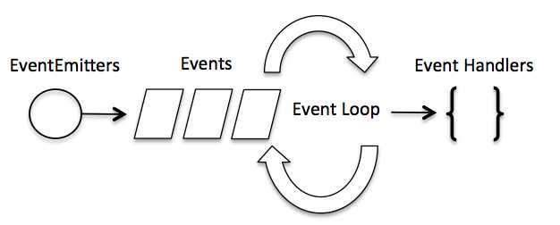

## Node.js 事件循环

`Node.js` 是单进程单线程应用程序，但是通过事件和回调支持并发，所以性能非常高

`Node.js` 的每一个 `API` 都是异步的，并作为一个独立线程运行，使用异步函数调用，并处理并发

`Node.js` 基本上所有的事件机制都是用设计模式中观察者模式实现

`Node.js` 单线程类似进入一个 `while(true)` 的事件循环，直到没有事件观察者退出，每个异步事件都生成一个事件观察者，如果有事件发生就调用该回调函数


#### 事件驱动程序

`Node.js` 使用事件驱动模型，当 `webserver` 接收到请求，就把它关闭然后进行处理，再去服务下一个 `web` 请求

当这个请求完成，它被放回处理队列，当到达队列开头，这个结果被返回给用户

这个模型非常高效可扩展性非常强，因为 `webserver` 一直接受请求而不等待任何读写操作（也就是所谓的事件驱动 `IO`）

在事件驱动模型中，会生成一个主循环来监听事件，当检测到事件时触发回调函数



有点类似于观察者模式，事件相当于一个 `Subject`，而所有注册到这个事件上的处理函数相当于观察者（`Observer`）

```js
// 创建 eventEmitter 对象
var events = require('events');
var eventEmitter = new events.EventEmitter();

// 创建事件处理程序
var connectHandler = function connected() {
  console.log('连接成功');
  // 触发 data_received 事件 
  eventEmitter.emit('data_received');
}

// 绑定 connection 事件处理程序
eventEmitter.on('connection', connectHandler);

// 使用匿名函数绑定 data_received 事件
eventEmitter.on('data_received', function () {
  console.log('数据接收成功。');
});

// 触发 connection 事件 
eventEmitter.emit('connection');
```

如果同时绑定了多个事件监听器，则事件监听器回调函数是会被先后调用，而事件参数则作为回调函数参数传递

一个综合的案例

```js
var events = require('events');
var eventEmitter = new events.EventEmitter();

// 监听器 #1
var listener1 = function listener1() {
  console.log('监听器 listener1 执行');
}

// 监听器 #2
var listener2 = function listener2() {
  console.log('监听器 listener2 执行');
}

// 绑定 connection 事件，处理函数为 listener1 
eventEmitter.addListener('connection', listener1);

// 绑定 connection 事件，处理函数为 listener2
eventEmitter.on('connection', listener2);

var eventListeners = require('events').EventEmitter.listenerCount(eventEmitter, 'connection');
console.log(eventListeners + " 个监听器监听连接事件");

// 处理 connection 事件 
eventEmitter.emit('connection');

// 移除监绑定的 listener1 函数
eventEmitter.removeListener('connection', listener1);
console.log("listener1 不再受监听");

// 触发连接事件
eventEmitter.emit('connection');

eventListeners = require('events').EventEmitter.listenerCount(eventEmitter, 'connection');
console.log(eventListeners + " 个监听器监听连接事件");

console.log("程序执行完毕");
```