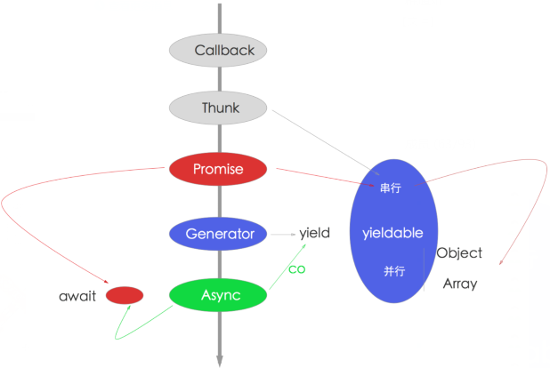
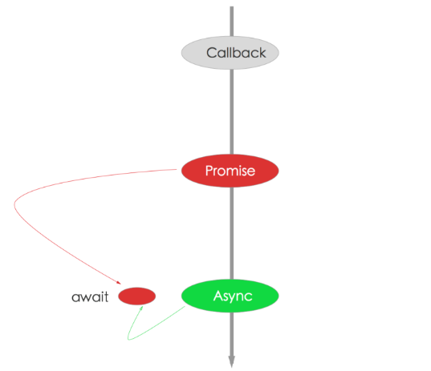

## 什么是 Node.js

* 不是 `JavaScript` 应用，不是语言，也不是框架，而是 `JavaScript` 运行时环境

* 构建在 `Chrome's V8` 的 `JavaScript` 引擎之上（`Chrome V8` 引擎以 `C/C++` 为主，相当于使用`JavaScript` 写法，转成 `C/C++` 调用）

* 特点是事件驱动（`event-driven`），非阻塞 ``I/O`` 模型（`non-blocking `I/O` model`）


#### 基本原理

如下图，简要的介绍了 Node.js 是基于 `Chrome V8`引擎构建的，由事件循环（`Event Loop`）分发 `I/O` 任务

最终工作线程（Work Thread）将任务丢到线程池（Thread Pool）里去执行，而事件循环只要等待执行结果就可以了


#### 核心概念

* `Chrome V8` 引擎

* `Event Loop` 事件循环

* Thread Pool 线程池

简单梳理一下

* `Chrome V8` 是 `JavaScript` 引擎，Node.js 内置 `Chrome V8` 引擎，所以它使用的 `JavaScript` 语法

* `JavaScript` 语言的一大特点就是单线程，也就是说，同一个时间只能做一件事，这就意味着，所有任务需要排队

* 前一个任务结束，才会执行后一个任务，如果前一个任务耗时很长，后一个任务就不得不一直等着

* `CPU` 完全可以不管 `I/O` 设备，挂起处于等待中的任务，先运行排在后面的任务

* 将等待中的 `I/O` 任务放到 `Event Loop` 里

* 由 `Event Loop` 将 `I/O` 任务放到线程池里

* 只要有资源，就尽力执行

换一个维度来看，如下图


#### 核心

* `Chrome V8` 解释并执行 `JavaScript` 代码（这就是为什么浏览器能执行 `JavaScript` 原因）

* 由事件循环和线程池组成，负责所有 `I/O` 任务的分发与执行

在解决并发问题上，异步是最好的解决方案，可以简单的理解为排队和叫号的机制

取号的过程，由 `Event Loop` 来接受处理，而真正执行操作的是具体的线程池里的 `I/O` 任务

之所以说 Node.js 是单线程，就是因为在接受任务的时候是单线程的，它无需进程/线程切换上下文的成本，非常高效，但它在执行具体任务的时候是多线程的


#### Node 核心：异步流程控制

下图是 `Node` 解决异步流程问题的演进



* 红色代表 `Promise`，是使用最多的，无论 `async` 还是 `generator` 都可用

* 蓝色是 `Generator`，过度货

* 绿色是 `Async` 函数，趋势

推荐使用 `Async` 函数加 `Promise` 组合



简单来说，就是以下三点

* `callback`

* `Promise`

* `Async/Await`

下面一个一个来看


## Api写法：Error-first Callback 和 EventEmitter


#### Error-first Callback

两条规则

* 回调函数的第一个参数返回的 `error` 对象，如果 `error` 发生了，它会作为第一个 `err` 参数返回，如果没有，一般做法是返回 `null`

* 回调函数的第二个参数返回的是任何成功响应的结果数据，如果结果正常，没有 `error` 发生，`err` 会被设置为 `null`，并在第二个参数就出返回成功结果数据

```js
function(err, res) {
  // process the error and result
}
```


#### EventEmitter

`Node.js` 使用事件驱动模型，当 `webserver` 接收到请求，就把它关闭然后进行处理，再去服务下一个 `web` 请求

当这个请求完成，它被放回处理队列，当到达队列开头，这个结果被返回给用户

这个模型非常高效可扩展性非常强，因为 `webserver` 一直接受请求而不等待任何读写操作（也就是所谓的事件驱动 `IO`）

在事件驱动模型中，会生成一个主循环来监听事件，当检测到事件时触发回调函数


事件模块是 `Node.js` 内置的对观察者模式发布/订阅（`publish/subscribe`）的实现，通过 `EventEmitter` 属性，提供了一个构造函数

该构造函数的实例具有 `on` 方法，可以用来监听指定事件，并触发回调函数。任意对象都可以发布指定事件，被 `EventEmitter` 实例的 `on` 方法监听到

```js
// 创建 eventEmitter 对象
var events = require('events');
var eventEmitter = new events.EventEmitter();

// 创建事件处理程序
var connectHandler = function connected() {
  console.log('连接成功');
  // 触发 data_received 事件 
  eventEmitter.emit('data_received');
}

// 绑定 connection 事件处理程序
eventEmitter.on('connection', connectHandler);

// 使用匿名函数绑定 data_received 事件
eventEmitter.on('data_received', function () {
  console.log('数据接收成功。');
});

// 触发 connection 事件 
eventEmitter.emit('connection');
```

如果同时绑定了多个事件监听器，则事件监听器回调函数是会被先后调用，而事件参数则作为回调函数参数传递

一个综合的案例

```js
var events = require('events');
var eventEmitter = new events.EventEmitter();

// 监听器 #1
var listener1 = function listener1() {
  console.log('监听器 listener1 执行');
}

// 监听器 #2
var listener2 = function listener2() {
  console.log('监听器 listener2 执行');
}

// 绑定 connection 事件，处理函数为 listener1 
eventEmitter.addListener('connection', listener1);

// 绑定 connection 事件，处理函数为 listener2
eventEmitter.on('connection', listener2);

var eventListeners = require('events').EventEmitter.listenerCount(eventEmitter, 'connection');
console.log(eventListeners + ' 个监听器监听连接事件');

// 处理 connection 事件 
eventEmitter.emit('connection');

// 移除监绑定的 listener1 函数
eventEmitter.removeListener('connection', listener1);
console.log('listener1 不再受监听');

// 触发连接事件
eventEmitter.emit('connection');

eventListeners = require('events').EventEmitter.listenerCount(eventEmitter, 'connection');
console.log(eventListeners + ' 个监听器监听连接事件');

console.log('程序执行完毕');
```


## Promise

`Promise` 对象用于表示一个异步操作的最终状态（完成或失败），以及该异步操作的结果值

#### 定义

```js
var promise = new Promise(function (resolve, reject) {
  // do a thing, possibly `async`, then…

  if (/* everything turned out fine */) {
    resolve('Stuff worked!');
  }
  else {
    reject(Error('It broke'));
  }
});
```

每个`Promise`定义都是一样的，在构造函数里传入一个匿名函数，参数是 `resolve` 和 `reject`，分别代表成功和失败时候的处理


#### 调用

```js
`promise`.then(function (text) {
  // Stuff worked!
  console.log(text)
  return `Promise`.reject(new Error('Error'))
}).catch(function (err) {
  console.log(err)
})
```

它的主要交互方式是通过 `then` 函数，如果 `Promise` 成功执行 `resolve` 了，那么它就会将 `resolve` 的值传给最近的then函数，作为它的 `then` 函数的参数

如果出错 `reject`，那就交给 `catch` 来捕获异常

推荐三个链接

* [Node.js 最新技术栈之 Promise 篇](https://cnodejs.org/topic/560dbc826a1ed28204a1e7de)

* [理解 Promise 的工作原理](https://cnodejs.org/topic/569c8226adf526da2aeb23fd)

* [Promise 迷你书](http://liubin.github.io/promises-book/)


## 终极解决方案：Async/Await

下面是一段 `Koa 2` 应用里的一段代码

```js
exports.list = async (ctx, next) => {
  try {
    let students = await Student.getAllAsync();

    await ctx.render('students/index', {
      students: students
    })
  } catch (err) {
    return ctx.api_error(err);
  }
};
```

它做了三件事

* 通过 `await Student.getAllAsync();` 来获取所有的 `students` 信息

* 通过 `await ctx.render` 渲染页面

* 由于是同步代码，使用 `try/catch` 做的异常处理

综上，比如一个读取文件的操作

```js
const Promise = require('bluebird');
const fs = Promise.promisifyAll(require('fs'));

async function main() {
  const contents = await fs.readFileAsync('myfile.js', 'utf8')
  console.log(contents);
}

main();
```